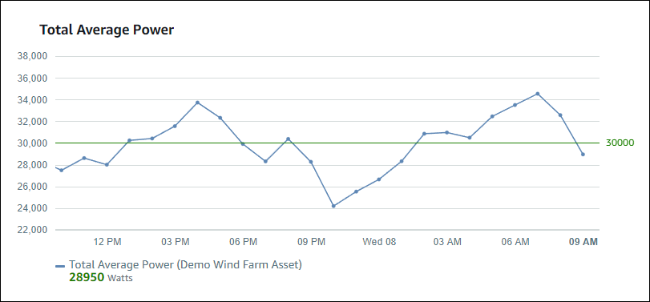
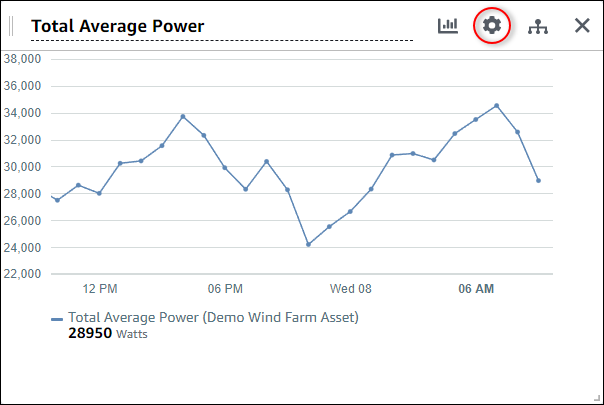
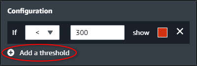
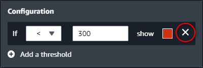

The SiteWise Monitor feature is not available to new customers. Existing customers can continue to
use the service as normal. For more information, see [SiteWise Monitor availability
change](iotsitewise-monitor-availability-change.md "iotsitewise-monitor-availability-change.md")

# Configure thresholds

As a project owner, you can configure thresholds for your visualizations to indicate
when asset properties are outside their normal operating ranges. When you add a threshold,
you define a rule and a color. If at least one of a property's data points crosses the
threshold for a selected time range, the visualization displays that property's legend in
the color that you choose. You can choose if the visualization also displays the property's
data in the color that you choose. You can add multiple thresholds to each visualization,
and choose colors to represent severities.

###### Note

If you add a property with an alarm to a visualization, the visualization
automatically displays the alarm as a threshold.

The threshold in the following example indicates when a wind farm's total power output
is less than **30,000** watts. The visualization displays the legend in
green because the property value meets the threshold.

When multiple thresholds apply to a data point, SiteWise Monitor uses the following rules to
choose which threshold's color to display:

- If the data point is positive or zero, the visualization displays the color of the
  threshold with the greatest value.
- If the data point is negative, the visualization displays the color of the threshold
  with the most negative value.
- If the data point meets multiple thresholds with the same value, the visualization
  displays the color of the last threshold that you added.

###### Note

SiteWise Monitor rounds data points in visualizations but uses the actual value to compare with
thresholds. Consider an example where you have a data point with value
**5.549**. This data point displays as **5.55**, but
the data point won't meet a threshold that checks for data points greater than or equal to
**5.55**.

## Add a threshold to a visualization

As a project owner, you can define thresholds for each visualization.

###### Note

You can add up to six thresholds to each visualization.

###### To add a threshold to a visualization

1. Choose the **Configuration** icon for the visualization to
   change.

 2. If the visualization already has a threshold, choose **Add a
threshold** to add a new threshold.

 3. Choose one of the following comparison operators:

    * **<** – Highlight properties that have at least one
     data point less than the specified value.
    * **>** – Highlight properties that have at least one
     data point greater than the specified value.
    * **≤** – Highlight properties that have at least one
     data point less than or equal to the specified value.
    * **≥** – Highlight properties that have at least one
     data point greater than or equal to the specified value.
    * **=** – Highlight properties that have at least one
     data point equal to the specified value.

4. Enter a threshold value to compare data points with the specified operator.
5. Choose a threshold color. The visualization displays property legends in this
   color for properties with at least one data point that meets the threshold rule. When
   you enable **Color breached values**, the visualization also colors
   data that meets the threshold rule. You can use the color picker, enter a hexadecimal
   color code, or enter color component values.
6. (Optional) Toggle **Color breached values**. When you enable this
   option, the visualization displays the data in color when it meets the
   threshold.
7. After you finish editing the dashboard, choose **Save dashboard** to
   save your changes. The dashboard editor closes. If you try to close a dashboard that has
   unsaved changes, you're prompted to save them.

## Remove a threshold from a visualization

As a project owner, you can remove a threshold from a visualization if you no longer
need it.

###### To remove a threshold from a visualization

1. Choose the **Configuration** icon for the visualization to
   change.
2. Choose the **X** icon for the threshold to remove.

 3. After you finish editing the dashboard, choose **Save dashboard** to
save your changes. The dashboard editor closes. If you try to close a dashboard that has
unsaved changes, you're prompted to save them.
