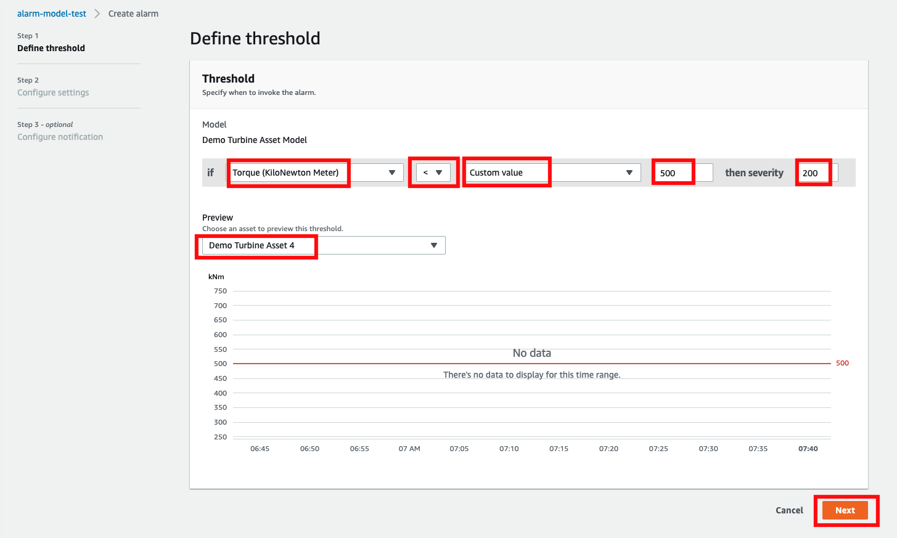
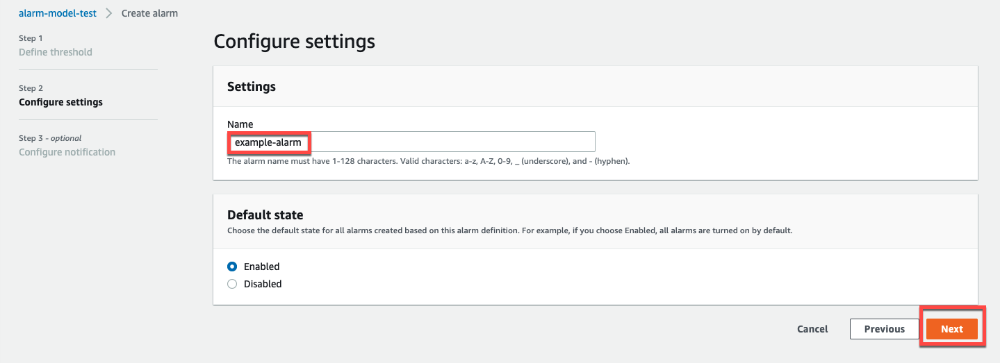
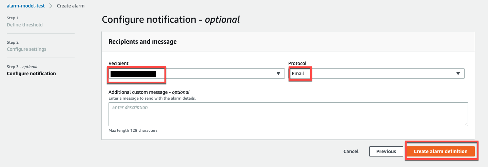

The SiteWise Monitor feature will no longer be open to new customers starting November 7, 2025 . If you would like to use SiteWise Monitor,
sign up prior to that date. Existing customers can continue to use the service as normal. For more information, see
[SiteWise Monitor availability change](iotsitewise-monitor-availability-change.md "iotsitewise-monitor-availability-change.md")

# Create alarm definitions

On the **Models** page, you can create AWS IoT Events alarms on models to monitor properties
associated with the models. The alarms can also send notifications to you and members of your organization.

###### Note

- Your IT administrator must enable the alarms feature for your portal before you can create alarms.
- If you want to send alarm notifications, your IT administrator must use IAM Identity Center for the portal authentication service.
  For more information, see [Enabling alarms for your SiteWise Monitor portals](../userguide/monitor-additional-features.md "../userguide/monitor-additional-features.md")
  in the _AWS IoT SiteWise User Guide_.

###### To create an alarm definition

1.  In the navigation bar, choose the **Models** icon.
2.  Choose a model in the **Models** hierarchy.
3.  Choose the **Alarms** tab for the model.
4.  Choose **Create an alarm definition**.
5.  On the **Define threshold** page, you define when the alarm
    is invoked and the severity of the alarm. Do the following:

        1. Choose the property on which the alarm monitors. Each time
         this property receives a new value, AWS IoT SiteWise sends the value to AWS IoT Events to evaluate
         the state of the alarm.
        2. Select the operator to use to compare the property with
         the threshold value. Choose from the following options:

        	* **< less than**
        	* **<= less than or equal**
        	* **== equal**
        	* **!= not equal**
        	* **>= greater than or equal**
        	* **> greater than**
        3. Choose the property or custom value to use as the threshold.
         AWS IoT Events compares the value of the property with the
         value of this attribute.

        ###### Note

        If you choose **Custom value**, enter a number.
        4. Enter the **Severity** of the alarm. Use an integer that your
         team understands to reflect the severity of this alarm.
        5. Choose an asset to preview this threshold.
        6. Choose **Next**.

    

6.  On the **Configuration settings** page, you enter a name and choose
    the default state for this alarm definition. Do the following:

        1. Enter a unique alarm name.
        2. Specify the **Default state** for this alarm definition.
         You can enable or disable all alarms created based on this alarm definition.
         You can enable or disable individual alarms associated with model in a later step.
        3. Choose **Next**.

    

7.  On the **Configure notification** page, you configure the notification recipient,
    the message protocol, and the custom message to send when this alarm is invoked. Do the following:

        1. For **Recipient**, choose the recipient.

        ###### Note

        Your IT administrator must add IAM Identity Center users in the current AWS Region before you can add recipients for this alarm.
        2. For **Protocol**, choose from the following options:

        	* **Email and text** – The alarm notifies IAM Identity Center
        	 users with an SMS message and an email.
        	* **Email** – The alarm notifies IAM Identity Center users with an
        	 email.
        	* **Text** – The alarm notifies IAM Identity Center users with an
        	 SMS message.
        3. For **Additional custom message**, you specify the custom message to send
         in addition to the default state change message. For example, you can specify a message
         that helps your team understand how to address this alarm.
        4. Choose **Create alarm definition**.

    
