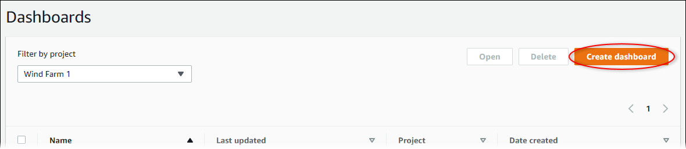

The SiteWise Monitor feature is not available to new customers. Existing customers can continue to
use the service as normal. For more information, see [SiteWise Monitor availability
change](iotsitewise-monitor-availability-change.md "iotsitewise-monitor-availability-change.md")

# Create dashboards in an AWS IoT SiteWise Monitor project

As a project owner, you create dashboards in AWS IoT SiteWise Monitor to provide a shared view of
asset properties and alarms to your project viewers. You can create a dashboard from the
**Dashboards** page or while viewing a project's details.

###### To create a dashboard from the dashboards page

1. In the navigation bar, choose the **Dashboards** icon.

 2. On the **Dashboards** page, choose **Create
dashboard**.

 3. In the dashboard editor, change the dashboard name from the default, `New
 dashboard`, to something that describes the content.

 4. Add one or more visualizations. For more information, see [Add visualizations in AWS IoT SiteWise Monitor](add-visualizations.md "add-visualizations.md"). 5. After you finish editing the dashboard, choose **Save dashboard** to
save your changes. The dashboard editor closes. If you try to close a dashboard that has
unsaved changes, you're prompted to save them.

###### To create a dashboard while viewing a project's details

1. In the navigation bar, choose the **Projects** icon.

 2. On the **Projects** page, choose the project in which you want to
create a dashboard.

 3. In the **Dashboards** section, choose **Create
dashboard**.

 4. In the dashboard editor, change the dashboard name from the default, `New
 dashboard`, to something that describes the content.

 5. Add one or more visualizations. For more information, see [Add visualizations in AWS IoT SiteWise Monitor](add-visualizations.md "add-visualizations.md"). 6. After you finish editing the dashboard, choose **Save dashboard** to
save your changes. The dashboard editor closes. If you try to close a dashboard that has
unsaved changes, you're prompted to save them.
