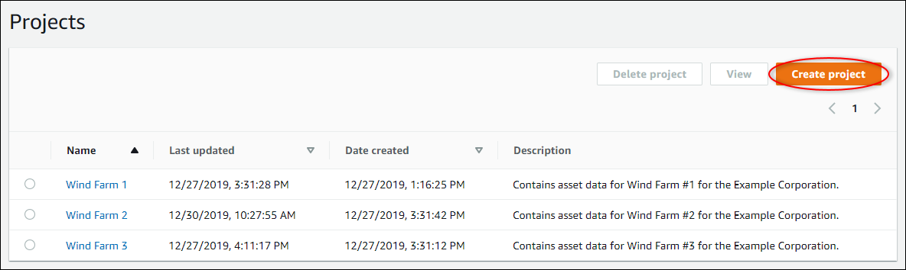
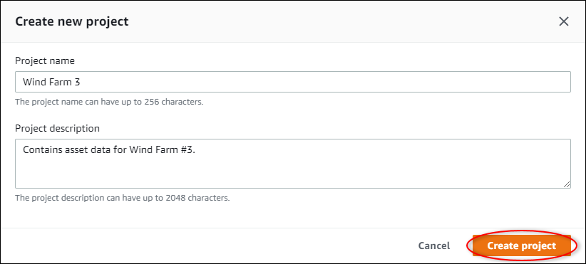

The SiteWise Monitor feature is not available to new customers. Existing customers can continue to
use the service as normal. For more information, see [SiteWise Monitor availability
change](iotsitewise-monitor-availability-change.md "iotsitewise-monitor-availability-change.md")

# Create projects in an AWS IoT SiteWise Monitor portal

As a portal administrator, you select a set of assets and then create a project for those
assets (see [Add assets to a new project](add-assets-to-projects-sd.md#add-assets-new-project-sd "add-assets-to-projects-sd.md#add-assets-new-project-sd")). You can also create an empty project and add
assets later.

## Create a new project

Follow this procedure to create a new project.

###### To create a new project

1. In the navigation bar, choose the **Projects** icon.

 2. On the **Projects** page, choose **Create
project**

 3. In the **Create new project** dialog box, enter a **Project
name** and **Project description**. Use a description that
informs users about the assets and visualizations in the project.

###### Note

Make sure that the project name and description don't contain confidential information.

 4. Choose **Finish** to create the new project.

Next, you might [assign project owners](assign-project-owners.md "assign-project-owners.md") and
[add assets to the project](add-assets-to-projects-sd.md#add-assets-existing-project-sd "add-assets-to-projects-sd.md#add-assets-existing-project-sd"). Until you
add assets to the project, the project owner can't create dashboards and
visualizations.
