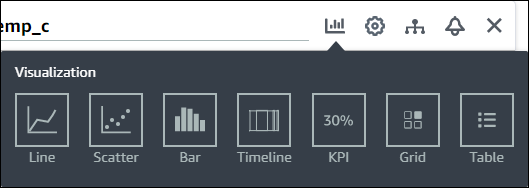
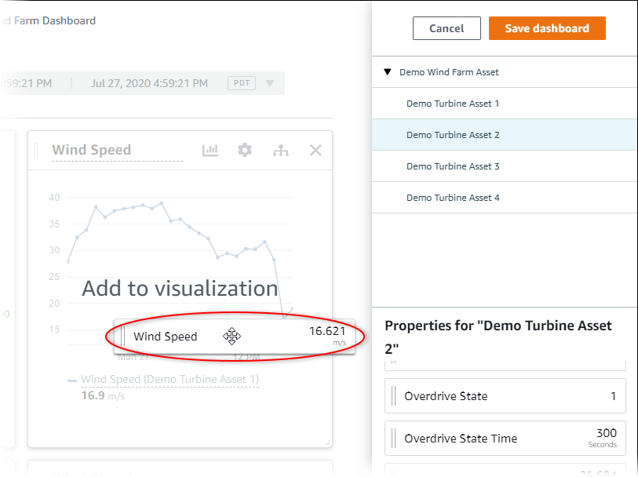
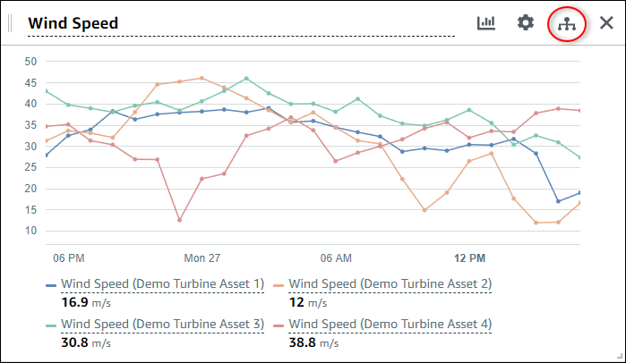
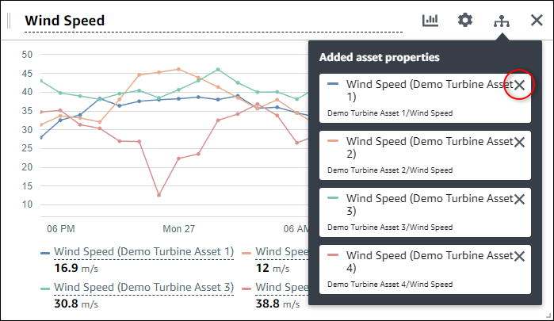
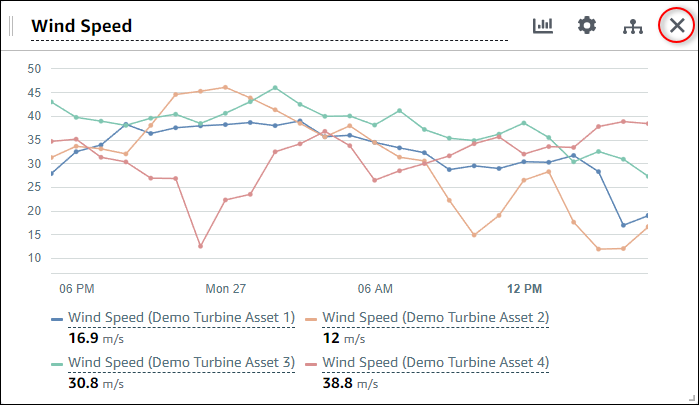

The SiteWise Monitor feature will no longer be open to new customers starting November 7, 2025 . If you would like to use SiteWise Monitor,
sign up prior to that date. Existing customers can continue to use the service as normal. For more information, see
[SiteWise Monitor availability change](iotsitewise-monitor-availability-change.md "iotsitewise-monitor-availability-change.md")

# Customize visualizations

As a project owner, you can choose how to best view the asset properties and alarms that
you add to your dashboard. You can control the visualization type and customize the
visualization.

###### Topics

- [Change visualization types](#changing-visualization-types "#changing-visualization-types")
- [Add data to a visualization](#adding-data-to-visualization "#adding-data-to-visualization")
- [Remove data from a visualization](#removing-data-from-visualization "#removing-data-from-visualization")
- [Delete a visualization](#deleting-visualizations "#deleting-visualizations")
- [Choose visualization types](choose-visualization-types.md "choose-visualization-types.md")
- [Configure thresholds](configure-thresholds.md "configure-thresholds.md")
- [Configure trend lines](configure-trend-lines.md "configure-trend-lines.md")

## Change visualization types

As the project owner, you decide how each asset property or alarm is best
represented.

###### To change the visualization type

1. Choose the **Visualization type** icon for the visualization to
   change.

 2. In the visualization type bar, choose the icon for the type of visualization to
apply.

For more information, see [Choose visualization types](choose-visualization-types.md "choose-visualization-types.md"). 3. After you finish editing the dashboard, choose **Save dashboard** to
save your changes. The dashboard editor closes. If you try to close a dashboard that has
unsaved changes, you're prompted to save them.

## Add data to a visualization

As a project owner, you might want to show multiple asset properties and alarms in the
same visualization. For example, you might show the temperature of all of your pumps, or the
performance and efficiency for a single asset.

###### To add data to a visualization

1. Drag the asset property or alarm that you want to add to a visualization. When you
   add a property that has an alarm, you also automatically add that alarm as a
   threshold.

 2. After you finish editing the dashboard, choose **Save dashboard** to
save your changes. The dashboard editor closes. If you try to close a dashboard that has
unsaved changes, you're prompted to save them.

## Remove data from a visualization

You can remove asset properties and alarms from visualizations to no longer display
them.

###### To remove data from a visualization

1. Choose the **Added assets** icon for the visualization to
   change.

 2. Choose the **X** icon on an asset property or alarm to remove it
from the visualization.

 3. After you finish editing the dashboard, choose **Save dashboard** to
save your changes. The dashboard editor closes. If you try to close a dashboard that has
unsaved changes, you're prompted to save them.

## Delete a visualization

As a project owner, if you decide that a visualization isn't needed, you can easily
remove it from a dashboard.

###### To delete a visualization

1. Choose the **X** icon for the visualization to remove.

 2. After you finish editing the dashboard, choose **Save dashboard** to
save your changes. The dashboard editor closes. If you try to close a dashboard that has
unsaved changes, you're prompted to save them.
