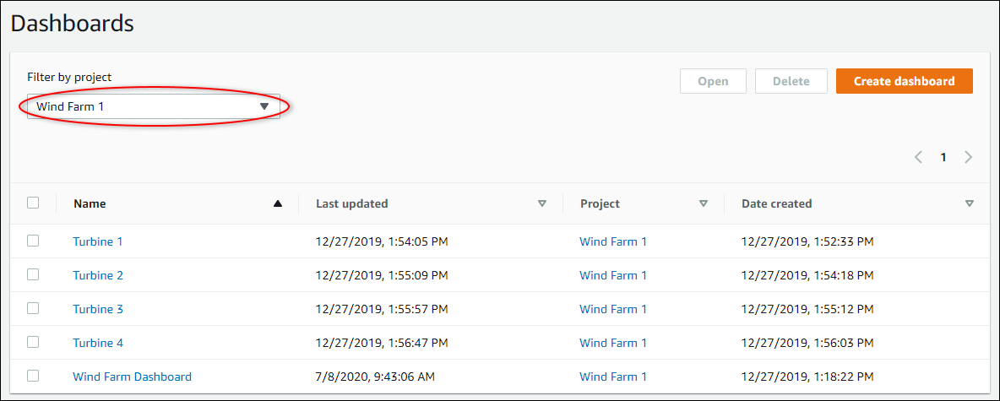

The SiteWise Monitor feature will no longer be open to new customers starting November 7, 2025 . If you would like to use SiteWise Monitor,
sign up prior to that date. Existing customers can continue to use the service as normal. For more information, see
[SiteWise Monitor availability change](iotsitewise-monitor-availability-change.md "iotsitewise-monitor-availability-change.md")

# Delete dashboards in AWS IoT SiteWise Monitor

You must be a project owner or portal administrator to delete dashboards. You can delete a
dashboard from the **Dashboards** page or from the list of dashboards in a
specific project.

###### To delete a dashboard from the dashboards page

1. In the navigation bar, choose the **Dashboards** icon.

 2. In the **Projects** drop-down list, choose the project whose
dashboards you want to delete.

You can sort the list of dashboards by using the column headings.

###### Note

If you can't find a particular project, you might not have been invited to view that
project. Contact the project owner to request an invitation. 3. Select the check boxes for the dashboards to delete, and then choose
**Delete**. 4. In the **Delete dashboards** dialog box, choose
**Confirm**.

###### Important

Deleting a dashboard deletes all visualizations and settings. You can't undo this
action. Delete a dashboard only when you are certain that you no longer need it.

###### To delete a dashboard from a project

1. In the navigation bar, choose the **Projects** icon.

 2. On the **Projects** page, choose the project whose dashboards you
want to delete.

 3. In the **Dashboards** section, select the check boxes for the
dashboards to delete, and then choose **Delete**. 4. In the **Delete dashboards** dialog box, choose
**Confirm**.

###### Important

Deleting a dashboard deletes all visualizations and settings. You can't undo this
action. Delete a dashboard only when you are certain that you no longer need it.
