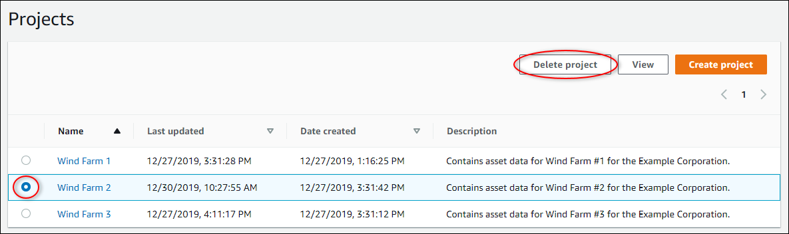

The SiteWise Monitor feature is not available to new customers. Existing customers can continue to
use the service as normal. For more information, see [SiteWise Monitor availability
change](iotsitewise-monitor-availability-change.md "iotsitewise-monitor-availability-change.md")

# Delete projects in AWS IoT SiteWise Monitor

As a portal administrator, you can delete any project that you don't need. To delete a
project, you must first delete or remove all dashboards, associated assets, project owners,
and project viewers.

###### To delete a project

1. In the navigation bar, choose the **Projects** icon.

 2. On the **Projects** page, select the check box for the project to
delete.

 3. Choose **Delete project**. 4. In the **Delete resource** confirmation dialog, choose
**Confirm**.

###### Important

This action can't be undone.
