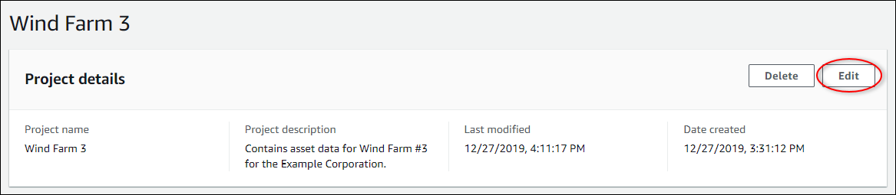

The SiteWise Monitor feature is not available to new customers. Existing customers can continue to
use the service as normal. For more information, see [SiteWise Monitor availability
change](iotsitewise-monitor-availability-change.md "iotsitewise-monitor-availability-change.md")

# Change project details

As a portal administrator, you can change your project name or project owner. If you add a
project owner, the new owner receives an email that invites them to the project. If you remove
an owner, no email is sent, so you should notify them of the ownership change.

###### Note

You must be a portal administrator to change project details.

1. In the navigation bar, choose the **Projects** icon.

 2. On the **Projects** page, choose the project to update.

 3. In the **Project details** section of the project details page,
choose **Edit**.

 4. In the **Project details** dialog box, update the **Project
name** and **Project description**. 5. Choose **Update project** to save your changes.
