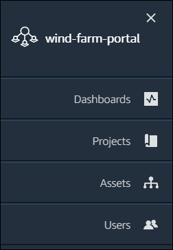

The SiteWise Monitor feature will no longer be open to new customers starting November 7, 2025 . If you would like to use SiteWise Monitor,
sign up prior to that date. Existing customers can continue to use the service as normal. For more information, see
[SiteWise Monitor availability change](iotsitewise-monitor-availability-change.md "iotsitewise-monitor-availability-change.md")

# Get started with AWS IoT SiteWise Monitor

You use AWS IoT SiteWise Monitor portals to view, analyze, and share access to your operational data.
Each AWS IoT SiteWise Monitor portal is a managed web application that is created from the AWS IoT SiteWise console.
When you are given access to a portal, you receive an email that contains a link to the portal.
The topics in this section help you understand what you can do in the portal.

Depending on your role, you might have different tasks to perform.

| Roles and tasks for AWS IoT SiteWise Monitor | Role                                                                                                                                                                                                                          | Tasks                                                                                                                              | Getting started                                                                                                                                                                                                                                                                                                                                                                                                                                                                                                                                                                                                                                                                                                                                                                                                                                                                                                                                                                                                                                                                                                                                                                                                                                                                                                                                                                                                                                                                                                                                                                                                                                                                                                                                                                                                                                                                                                                                                                                                                                                                                                                                                                                                                                                                                                                                                                                                                                                                                        |
| -------------------------------------------- | ----------------------------------------------------------------------------------------------------------------------------------------------------------------------------------------------------------------------------- | ---------------------------------------------------------------------------------------------------------------------------------- | ------------------------------------------------------------------------------------------------------------------------------------------------------------------------------------------------------------------------------------------------------------------------------------------------------------------------------------------------------------------------------------------------------------------------------------------------------------------------------------------------------------------------------------------------------------------------------------------------------------------------------------------------------------------------------------------------------------------------------------------------------------------------------------------------------------------------------------------------------------------------------------------------------------------------------------------------------------------------------------------------------------------------------------------------------------------------------------------------------------------------------------------------------------------------------------------------------------------------------------------------------------------------------------------------------------------------------------------------------------------------------------------------------------------------------------------------------------------------------------------------------------------------------------------------------------------------------------------------------------------------------------------------------------------------------------------------------------------------------------------------------------------------------------------------------------------------------------------------------------------------------------------------------------------------------------------------------------------------------------------------------------------------------------------------------------------------------------------------------------------------------------------------------------------------------------------------------------------------------------------------------------------------------------------------------------------------------------------------------------------------------------------------------------------------------------------------------------------------------------------------------ |
| Portal administrator                         |  • Accept invitation to the portal and log in  • Explore assets and their data  • Create projects to share data  • Assign owners to projects  • Add assets to projects                                         | [Set up a portal administrator for AWS IoT SiteWise Monitor](portal-admin-getting-started.md "portal-admin-getting-started.md")    |
| Project owner                                |  • Accept invitation to the project and log in  • Explore project assets and their data  • Create dashboards to visualize data  • Configure visualizations to understand data  • Invite viewers to the project | [Get started as an AWS IoT SiteWise Monitor project owner](project-owner-getting-started.md "project-owner-getting-started.md")    |
| Project viewer                               |  • Accept invitation to the project and log in  • Explore shared dashboards  • View and understand organizational data                                                                                               | [Get started as an AWS IoT SiteWise Monitor project viewer](project-viewer-getting-started.md "project-viewer-getting-started.md") | If you don't have an AWS IoT SiteWise Monitor portal, contact your AWS administrator. For information about how to create a portal, see [Getting started with AWS IoT SiteWise Monitor](../userguide/monitor-getting-started.md "../userguide/monitor-getting-started.md") in the _AWS IoT SiteWise User Guide_. ## Sign in to an AWS IoT SiteWise Monitor portal Whether you're a portal administrator, a project owner, or a viewer, your first step is to sign in to the AWS IoT SiteWise Monitor application with your enterprise email and password, or AWS Identity and Access Management (IAM) credentials. SiteWise Monitor validates your credentials with AWS IAM Identity Center or IAM to ensure that only authorized users can access your company assets. You can choose one of the following to sign in to the AWS IoT SiteWise Monitor portal:  • Use your IAM Identity Center identity. 1. Open the email that contains the link to the portal and open the web portal. 2. In the dialog box, for **Email**, enter your enterprise email address. 3. For **Password**, enter your enterprise password. 4. Choose **Sign in**. IAM Identity Center validates your credentials and, if valid, opens the portal so that you can perform the tasks allowed for your role.  • Use your IAM identity. + ###### If you use an IAM user, do the following: 1. Open the link to the portal and open the web portal. You might have received an email that contains the link. 2. In the dialog box, enter your **IAM user name**. 3. For **Password**, enter your IAM password. 4. Choose **Sign in**. IAM validates your credentials and, if valid, opens the portal so that you can perform the tasks allowed for your role. + ###### If you want to assume an IAM role, do the following: 1. Sign in to the IAM with federation. 2. Assume an IAM role. 3. Open the the link to the portal and open the web portal. You might have received an email that contains the link. If the IAM role was added to the portal, you automatically sign in to the portal. You can now perform the tasks allowed for your role. ## Navigate in the AWS IoT SiteWise Monitor portal You use the left navigation bar to navigate within the AWS IoT SiteWise Monitor portal.  When the bar is collapsed, only the icons are shown. ###### Note Only portal administrators see all four icons. |
