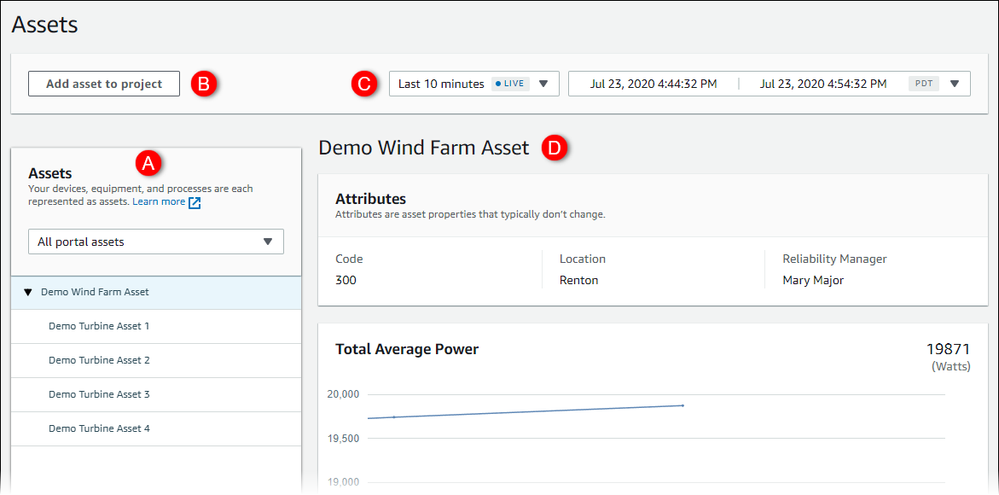
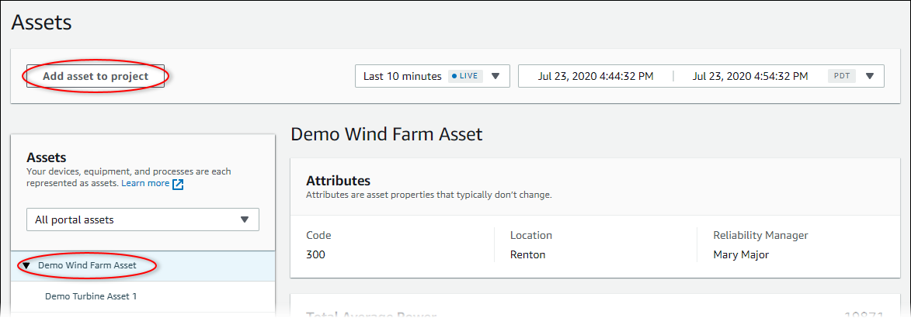
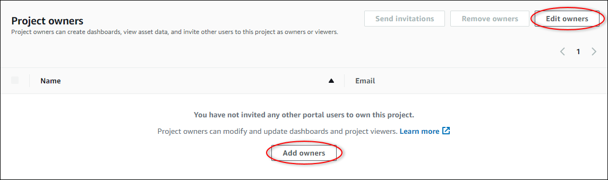

The SiteWise Monitor feature is not available to new customers. Existing customers can continue to
use the service as normal. For more information, see [SiteWise Monitor availability
change](iotsitewise-monitor-availability-change.md "iotsitewise-monitor-availability-change.md")

# Set up a portal administrator for AWS IoT SiteWise Monitor

As the portal administrator, you create projects and associate assets with those projects.
You specify an owner for each project. The project owner can then create dashboards with
visualizations of the property values and alarms. Only portal administrators can create
projects, assign owners, and change the list of assets associated with each project. As the
portal administrator, you can do the following tasks:

- [Sign in to a portal](getting-started.md#portal-login "getting-started.md#portal-login")
- [Explore asset data and adding assets to
  projects](#portal-admin-exploring-assets "#portal-admin-exploring-assets")
- [Assign owners to the project](#portal-admin-inviting-owners "#portal-admin-inviting-owners")
- [Get started as a project
  owner](project-owner-getting-started.md "project-owner-getting-started.md")

## Explore asset data and adding assets to

projects

You can explore the list of assets to which you have access to view their properties and
alarms. As the portal administrator, you can add assets to a project to make them available
to the project owner. The project owner can then create dashboards to give other subject
matter experts a common view of the asset properties and alarms.

The following procedure assumes that you signed in the AWS IoT SiteWise Monitor portal.

###### To explore asset data and add asset to projects

1. In the navigation bar, choose the **Assets** icon.

The **Assets** page
appears.

See the following areas of the page.

| Callout | Description                                                                                                                                                             |
| ------- | ----------------------------------------------------------------------------------------------------------------------------------------------------------------------- |
| A       | Browse the asset hierarchy to find the assets to view or add to a project.                                                                                           |
| B       | Add assets to a project so you and your project owners can create dashboards and visualizations that provide a common way of looking at your organizational data. |
| C       | Select the time range for the data shown for the properties of the selected asset.                                                                                   |
| D       | View the values for the properties of the selected asset. View, configure, and respond to the alarms for the selected asset.                                         |

2. Choose an asset in the **Assets** hierarchy, and then choose
   **Add asset to project**.

###### Note

You can add only a single node hierarchy (an asset and all assets that are subordinate
to that asset) to a project. To create a dashboard to compare two assets that are children
of a common parent asset, add that common parent to the project. 3. In the **Add assets to project** dialog box, choose **Create
new project**, then choose **Next**.

 4. In **Project name**, enter a name for your project. If you plan to
create multiple projects, each with a distinct set of assets, choose a descriptive
name.

 5. In **Project description**, enter a description of the project and its
contents.

You can add project owners after you create the project. 6. Choose **Add asset to project**.

The **Create new project** dialog box closes, and the new project's
page opens. 7. When you're ready to share your project, you can add owners to your project to
create dashboards and invite viewers. You can see and change who you invited to the
project on the project details page.

## Assign owners to the project

As a portal administrator, after you create a project, you can
assign project owners. Project owners create dashboards to provide a consistent way to view your
asset data. You can send an invitation email to assigned project owners when you are ready for
them to work with the project.

###### To assign owners to a project

1. In the navigation bar, choose the **Projects** icon.

 2. On the **Projects** page, choose the project to which to assign project
owners.

 3. In the **Project owners** section of the project details page, choose
**Add owners** if the project has no owners, or **Edit
owners**.

 4. In the **Project owners** dialog box, select the check boxes for the
users to be owners for this project.

###### Note

You can only add project owners if they're portal users. If you don't see a user
listed, contact your AWS administrator to add them to the list of portal users. 5. Choose the **>>** icon to add those users as project
owners. 6. Choose **Save** to save your changes.

Next, you can send emails to your project owners so they
can sign in and start managing the project.

###### To send email invitations to project owners

1. In the navigation bar, choose the **Projects** icon.

 2. On the **Projects** page, choose the project for which to invite
project owners.

 3. In the **Project owners** section of the project details page, select
the check boxes for the project owners to receive an email, and then choose **Send
invitations**.

 4. Your preferred email client opens, prepopulated with the recipients and the email body
with details from your project. You can customize the email before you send it to the
project owners.
