The SiteWise Monitor feature is not available to new customers. Existing customers can continue to
use the service as normal. For more information, see [SiteWise Monitor availability
change](iotsitewise-monitor-availability-change.md "iotsitewise-monitor-availability-change.md")

# Get started as an AWS IoT SiteWise Monitor project

owner

Each portal in the AWS IoT SiteWise Monitor contains one or more projects. A project is the unit of
sharing. If you invite viewers to your project, they can see all dashboards that you created
in that project, as well as explore the assets that are associated with the project. If you
want viewers to have access to different subsets of your dashboards, you must ask your portal
administrator to split the project. As the owner of one or more projects, you can do the
following tasks:

- [Sign in to a portal](getting-started.md#portal-login "getting-started.md#portal-login")
- [Explore project assets and their
  data](#project-owner-exploring-assets "#project-owner-exploring-assets")
- [Create dashboards to visualize
  data](#project-owner-creating-dashboards "#project-owner-creating-dashboards")
- [Configure visualizations to
  understand data](#project-owner-configuring-visualizations "#project-owner-configuring-visualizations")
- [Assign viewers to the project](#project-owner-inviting-viewers "#project-owner-inviting-viewers")

## Explore project assets and their

data

You can explore the list of assets to which you have access to view their properties. If
you need additional assets in your project, you must contact your portal
administrator.

###### Note

As a project owner, you can view only those assets that are contained in projects to
which you have access.

The following procedure assumes that you signed in the AWS IoT SiteWise Monitor portal.

###### To explore project assets and their data

- In the navigation bar, choose the **Assets** icon.

The **Assets** page
appears.

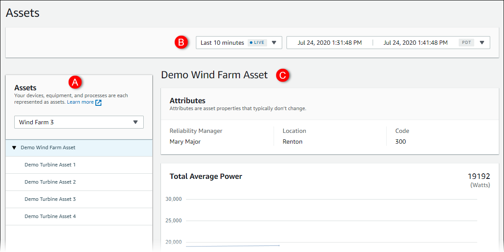

See the following areas of the page.

| Callout | Description                                                                                                                     |
| ------- | ------------------------------------------------------------------------------------------------------------------------------- |
| A       | Browse the asset hierarchy to find assets to view.                                                                              |
| B       | Select the time range for the data shown for the properties of the selected asset.                                           |
| C       | View the values for the properties of the selected asset. View, configure, and respond to the alarms for the selected asset. |

## Create dashboards to visualize

data

The primary activity for a project owner is to create dashboards that contain one or
more visualizations that show the values of asset properties and alarms. Creating a
dashboard is quick and easy.

###### To create dashboards

1. In the navigation bar, choose the **Projects** icon.

 2. On the **Projects** page, choose the project in which you want to
create a dashboard.

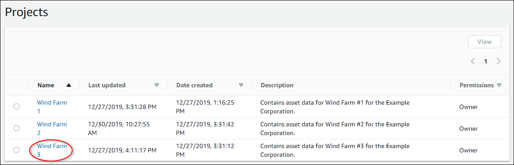 3. In the **Dashboards** section, choose **Create
dashboard**.

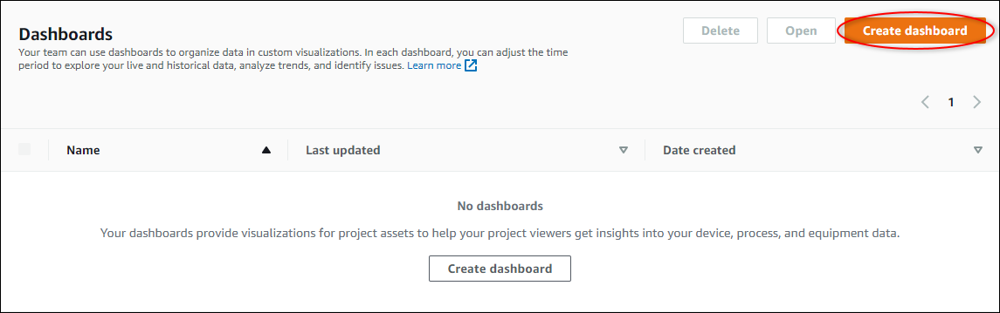

Next, you add one or more visualizations of asset properties and alarms to your
dashboard.

## Configure visualizations to

understand data

Each dashboard can display one or more visualizations of the values of the asset
properties and alarms in your project. You can add a visualization for any property or
alarm, and customize the details of the visualization.

###### To configure visualizations

1. In the dashboard editor, change the dashboard name from the default, `New
dashboard`, to something that describes the content.

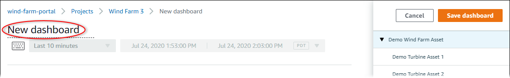 2. Browse the list of project assets on the right side of the dashboard. When you find a
property or alarm to visualize, drag it to the dashboard.

    * The default visualization type for properties is the [line chart](choose-visualization-types.md#line-charts "choose-visualization-types.md#line-charts").
    * The default visualization type for alarms is the [status grid widget](choose-visualization-types.md#status-grid-chart "choose-visualization-types.md#status-grid-chart").

###### Note

You can drag multiple properties and alarms onto a single visualization.

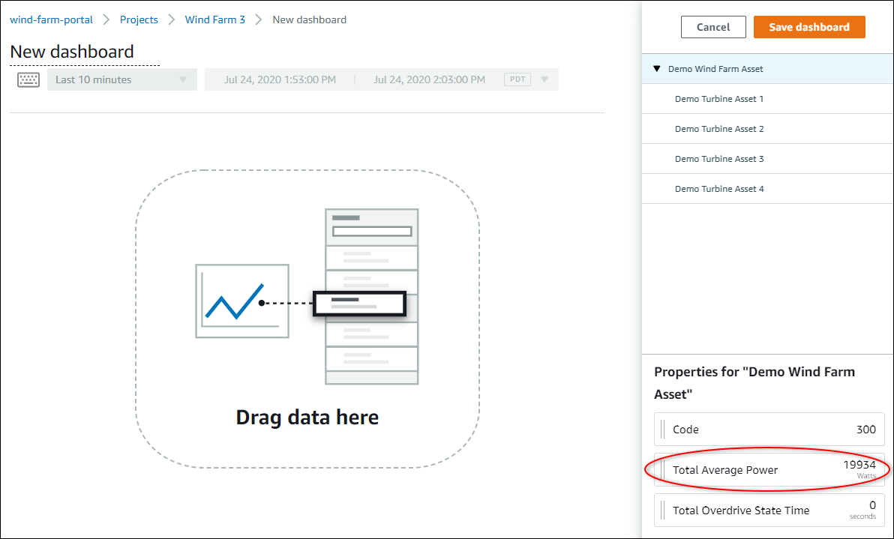 3. To change how your data displays, choose the visualization type.

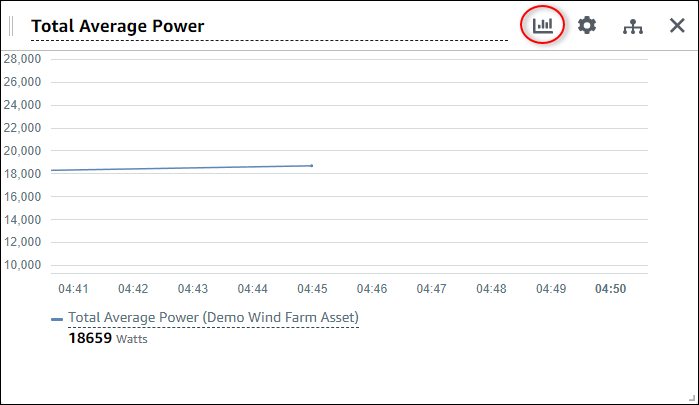

For more information about the available visualization types, see [Choose visualization types](choose-visualization-types.md "choose-visualization-types.md"). To
customize details of the visualization, see [Customize visualizations](customize-visualizations.md "customize-visualizations.md"). 4. To add thresholds to your property, choose the visualization configuration icon. If you
add a property that has an alarm, the visualization displays that alarm's threshold. For
more information, see [Configure thresholds](configure-thresholds.md "configure-thresholds.md").

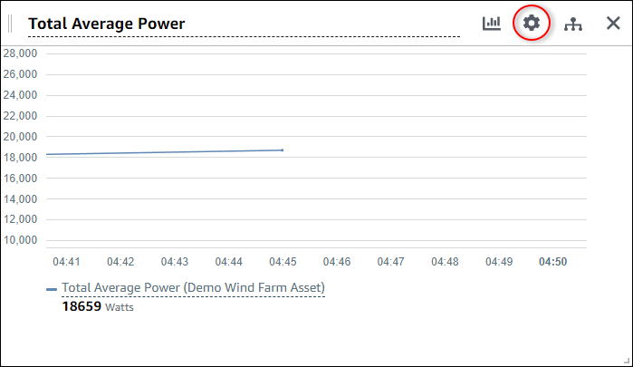 5. To move a visualization, choose the control icon in the upper left and then drag the
visualization to a new location.

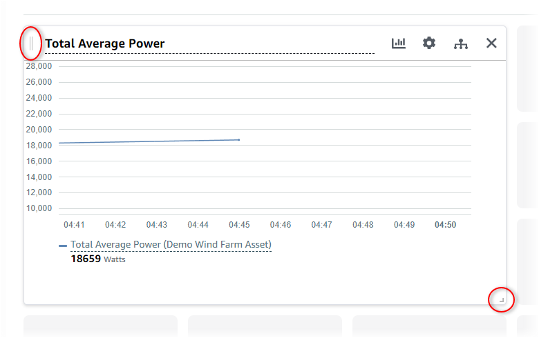 6. To change the size of a visualization, use the resize control in the lower right.
Drag the corner to a new size and shape. Visualizations snap to the grid when resized,
so you only have coarse control over the size. 7. After you finish editing the dashboard, choose **Save dashboard** to
save your changes. The dashboard editor closes. If you try to close a dashboard that has
unsaved changes, you're prompted to save them. 8. Repeat these steps to add and configure more visualizations to the dashboard. 9. When you finish making changes, choose **Save dashboard** in the
upper-right corner.

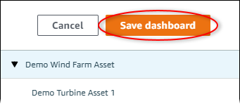

When you're ready to share your dashboard, you can add viewers to your project to
explore dashboards. You can see and change who you invited to the project on the project
details page.

## Assign viewers to the project

You can assign viewers to your project from the project details page.

###### To assign viewers to a project

1. In the navigation bar, choose the **Projects** icon.

 2. On the **Projects** page, choose the project to which to assign
viewers.

 3. In the **Project viewers** section of the project details page, choose
**Add viewers** if the project has no viewers, or **Edit
viewers**.

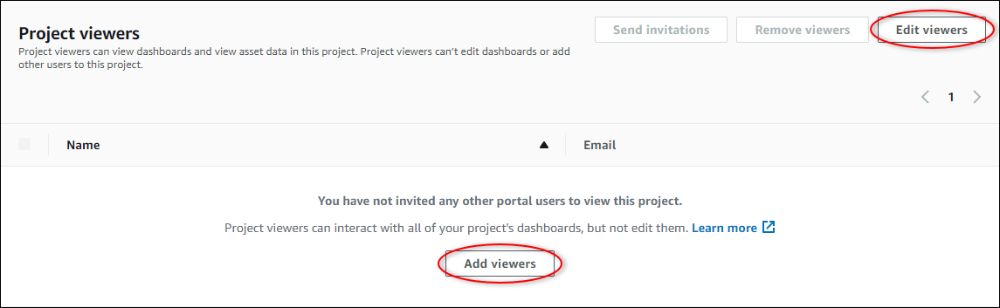 4. In the **Project viewers** dialog box, select the check boxes for the
users to be viewers for this project.

###### Note

You can only add viewers if they're portal users. If you don't see a user listed,
contact your AWS administrator to add them to the list of portal users. 5. Choose the **>>** icon to add those users as project
viewers. 6. Choose **Save** to save your changes.

Next, you can send emails to your project viewers so they
can sign in and start exploring the dashboards in the project.

###### To send email invitations to project viewers

1. In the navigation bar, choose the **Projects** icon.

 2. On the **Projects** page, choose the project to which to invite project
viewers.

 3. In the **Project viewers** section of the project details page, select
the check boxes for the project viewers to receive an email, and then choose **Send
invitations**.

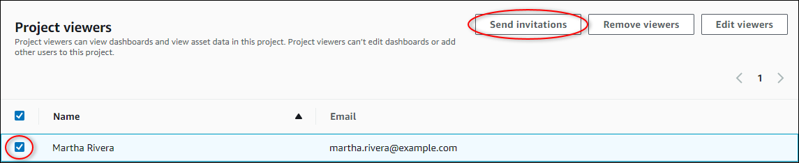 4. Your preferred email client opens, prepopulated with the recipients and the email body
with details from your project. You can customize the email before you send it to the
project viewers.
