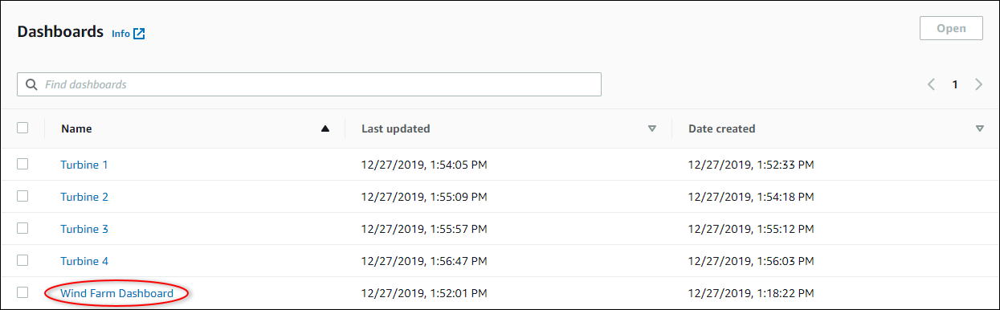
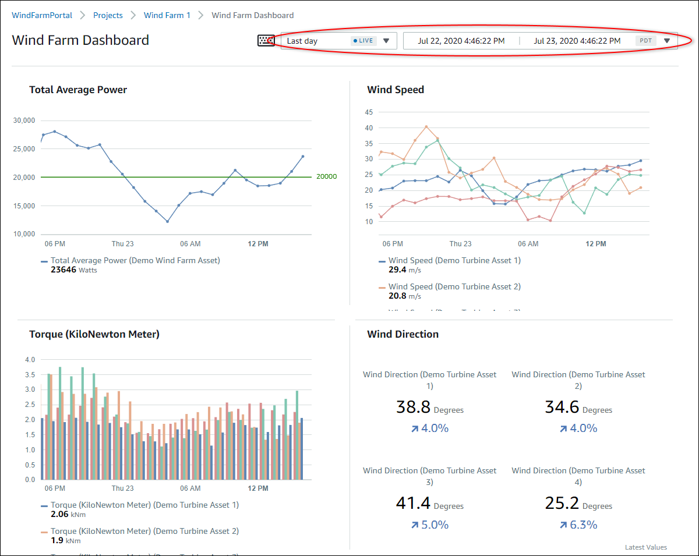

The SiteWise Monitor feature is not available to new customers. Existing customers can continue to
use the service as normal. For more information, see [SiteWise Monitor availability
change](iotsitewise-monitor-availability-change.md "iotsitewise-monitor-availability-change.md")

# Get started as an AWS IoT SiteWise Monitor project

viewer

When you're invited to a project as a viewer, someone in your organization has set up a
project and a set of dashboards to provide you with a consistent way to view data for your
company's devices, equipment, and processes. In AWS IoT SiteWise, those devices, equipment, and
processes are referred to as assets. You can use AWS IoT SiteWise Monitor to view the properties and
alarms for a set of assets. Because the project owner has set up dashboards to visualize those
properties, everyone who views the project has the dahboard view to draw insights from the
data. As a project viewer, you can view all of the dashboards in the project. You can adjust
the time range for the data shown in the dashboard. And you can explore the properties and
alarms of individual assets to see a property or alarm that isn't on the dashboard.

You can only view the assets that are associated with the project to which you've been
invited. To request additional assets, contact your project owner. The project owner can also
update the dashboards to change the visualizations or show additional properties and
alarms.

As a project viewer, you can do the following tasks:

- [Sign in to a portal](getting-started.md#portal-login "getting-started.md#portal-login")
- [Explore shared dashboards](#project-viewer-exploring-dashboards "#project-viewer-exploring-dashboards")
- [Explore project assets and their
  data](#project-viewer-exploring-assets "#project-viewer-exploring-assets")

## Explore shared dashboards

As a viewer for one or more AWS IoT SiteWise Monitor projects, you can view the dashboards to
understand the data for your devices, equipment, and processes. You can adjust the time
range for the visualizations in each dashboard to gain insights into your data.

The following procedure assumes that you are signed in the AWS IoT SiteWise Monitor portal.

###### To explore shared dashboards

1. In the navigation bar, choose the **Projects** icon.

 2. On the **Projects** page, choose the project whose dashboards you
want to view.

 3. In the **Dashboards** section of the project details page, choose
the name of the dashboard to view. You can also select the check box next to the
dashboard, and then choose **Open**.

 4. You can browse the visualizations in the dashboard.

Do any of the following actions to adjust the displayed time range for your
data:

    * Click and drag a time range on one of the
     line or bar charts to zoom in to the selected time range.
    * Double-click on a time range to zoom in on the
     selected point.
    * Press **Shift** and then
     double-click on a time range to zoom out from the selected point.
    * Press **Shift** and then drag the
     mouse on a time range to shift the range left or right.
    * Use the drop-down list to choose a predefined
     time range to view.
    * Use the time range control to open the calendar and specify a start and end time for
     your range.

Each visualization shows the latest reported value for the selected time
range. 5. If you're a project owner or portal administrator, you can modify the dashboard. For
more information see [Add visualizations in AWS IoT SiteWise Monitor](add-visualizations.md "add-visualizations.md").

## Explore project assets and their

data

While you will typically use the dashboards that the project owner prepared for you, you
can also view properties and alarms for the assets included in a project. For example, you
might check the model, install date, or location for a piece of equipment.

###### Note

As a project viewer, you can view only those assets that are contained in projects to
which you have access.

The following procedure assumes that you signed in the AWS IoT SiteWise Monitor portal.

###### To explore project assets and their data

- In the navigation bar, choose the **Assets** icon.

The **Assets** page
appears.

See the following areas of the page.

| Callout | Description                                                                                                         |
| ------- | ------------------------------------------------------------------------------------------------------------------- |
| A       | Browse the asset hierarchy to find assets to view.                                                                  |
| B       | Select the time range for the data shown for the properties of the selected assets.                              |
| C       | View the values for the properties of the selected asset. View and respond to the alarms for the selected asset. |
