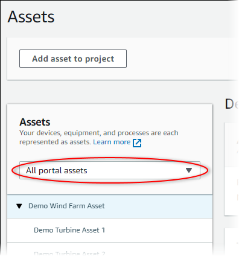

The SiteWise Monitor feature is not available to new customers. Existing customers can continue to
use the service as normal. For more information, see [SiteWise Monitor availability
change](iotsitewise-monitor-availability-change.md "iotsitewise-monitor-availability-change.md")

# Respond to alarms in AWS IoT SiteWise

On the **Assets** page, you can respond to an alarm so that your team
knows that you see the alarm. When you respond to an alarm, you can leave a note with details
about the alarm or the actions that you took. If you don't acknowledge an active alarm before
it becomes inactive, the alarm becomes latched. The latched state indicates that the alarm
became active and wasn't acknowledged. You might need to check on the equipment or process and
acknowledge the latched alarm.

You can do the following to respond to an alarm:

- Acknowledge an alarm to indicate that you are handling the issue.
- Snooze an alarm to disable it temporarily.

###### Topics

- [Acknowledge alarms](#acknowledge-alarms "#acknowledge-alarms")
- [Snooze alarms](#snooze-alarms "#snooze-alarms")

## Acknowledge alarms

When an alarm is active or latched, you can acknowledge it to indicate to your team that
you are handling the issue. You can leave a note about the alarm when you acknowledge
it.

You can acknowledge alarms that have the following states:

- **Active**
- **Latched**

###### Note

Your team can configure alarms that don't support the acknowledge option. You can't
acknowledge these alarms, and these alarms can't have the
**Acknowledged** or **Latched** states.

###### To acknowledge an alarm

1. In the navigation bar, choose the **Assets** icon.

 2. (Optional) Choose a project in the projects drop-down list to show only assets from a
specific project.

 3. Choose an asset in the **Assets** hierarchy.

###### Tip

Choose the arrow next to an asset to view all children of that asset. 4. Choose the **Alarms** tab for the asset. 5. Select the alarm to acknowledge. 6. Choose **Acknowledge**.

A modal opens where you can enter a comment. 7. (Optional) Enter a **Comment** about the alarm or the action you
will take to acknowledge it. 8. Choose **Acknowledge**.

The alarm's state changes to **Acknowledged**.

## Snooze alarms

You can snooze an alarm to temporarily disable it. While the alarm is snoozed, it won't
detect any changes. You might want to do this if you're aware that an equipment or process
is broken or malfunctioning, so you don't need an alarm to go off. You can leave a note
about the alarm when you snooze it.

You can snooze alarms that have the following states:

- **Normal**
- **Active**
- **Acknowledged**
- **Latched**
- **Snoozed**

###### To snooze an alarm

1. In the navigation bar, choose the **Assets** icon.

 2. (Optional) Choose a project in the projects drop-down list to show only assets from a
specific project.

 3. Choose an asset in the **Assets** hierarchy.

###### Tip

Choose the arrow next to an asset to view all children of that asset. 4. Choose the **Alarms** tab for the asset. 5. Select the alarm to snooze. 6. Choose **Snooze**.

A modal opens where you can specify the snooze duration and enter a comment. 7. Enter the **Snooze duration** to snooze the alarm. 8. (Optional) Enter a **Comment** about the alarm. 9. Choose **Snooze**.

The alarm's state changes to **Snoozed**. The alarm stays
**Snoozed** for the duration that you specify.
