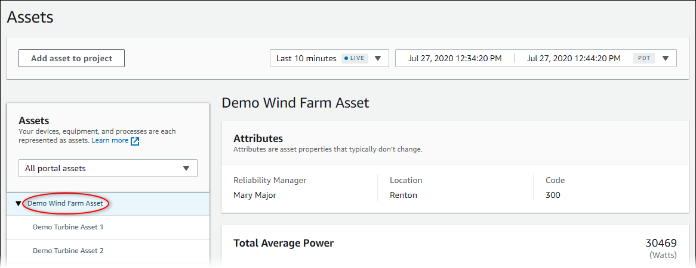
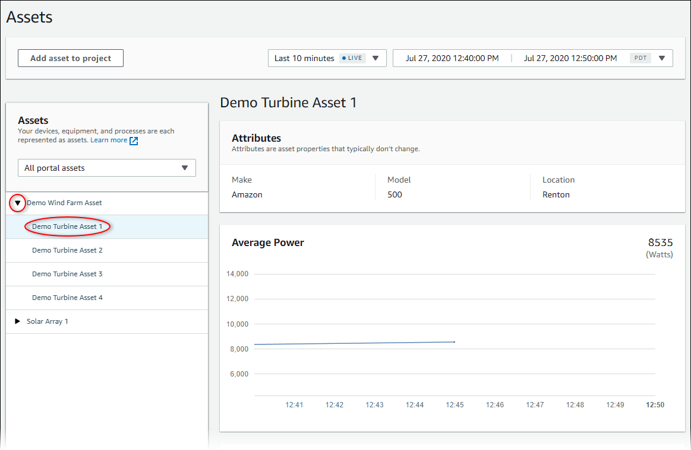

The SiteWise Monitor feature is not available to new customers. Existing customers can continue to
use the service as normal. For more information, see [SiteWise Monitor availability
change](iotsitewise-monitor-availability-change.md "iotsitewise-monitor-availability-change.md")

# View asset data in AWS IoT SiteWise Monitor

On the **Assets** page, you can view all properties and alarms of any
asset that is associated with the projects to which you have access. Portal administrators
have access to all assets in the portal and can use the **Assets** page to
explore individual assets before adding them to projects. Dashboards provide a common
visualization for all project viewers.

The following procedures describe how to view asset data on the
**Assets** page and how to view asset data from a project page. For
information about viewing asset data in dashboards, see [View dashboards in AWS IoT SiteWise](view-dashboards.md "view-dashboards.md").

###### To view asset data on the Assets page

1. Log in to your AWS IoT SiteWise Monitor portal. For more information, see [Sign in to an AWS IoT SiteWise Monitor portal](getting-started.md#portal-login "getting-started.md#portal-login").
2. In the navigation bar, choose the **Assets** icon.

 3. (Optional) Choose a project in the projects drop-down list to show only assets from a
specific project.

 4. Choose an asset in the **Assets** hierarchy.

Some assets might have a few static properties, called attributes. For example, a
factory's properties, such as location, have only a single value and typically don't
change over time.

 5. Choose the arrow next to an asset to view all children of that asset, then choose an
equipment asset. AWS IoT SiteWise Monitor shows attributes, such as installation date, and time
series data, such as availability or overall equipment effectiveness (OEE).

 6. Do any of the following actions to adjust the displayed time range for your
data:

    * Click and drag a time range on one of the
     line or bar charts to zoom in to the selected time range.
    * Double-click on a time range to zoom in on the
     selected point.
    * Press **Shift** and then
     double-click on a time range to zoom out from the selected point.
    * Press **Shift** and then drag the
     mouse on a time range to shift the range left or right.
    * Use the drop-down list to choose a predefined
     time range to view.
    * Use the time range control to open the calendar and specify a start and end time for
     your range.

7. Choose the **Alarms** tab to view the alarms for an asset.
8. Choose an alarm to view the alarm details and its state data as a time series.
