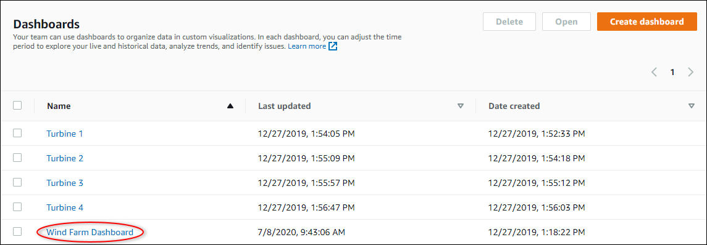
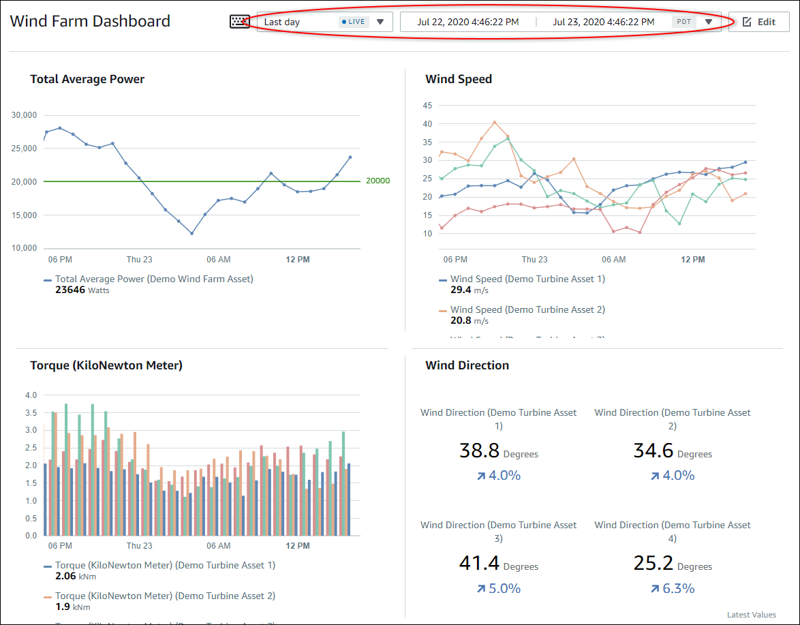
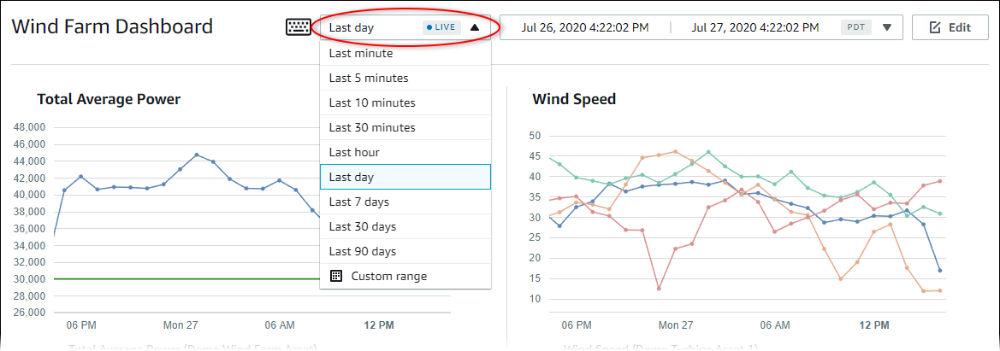
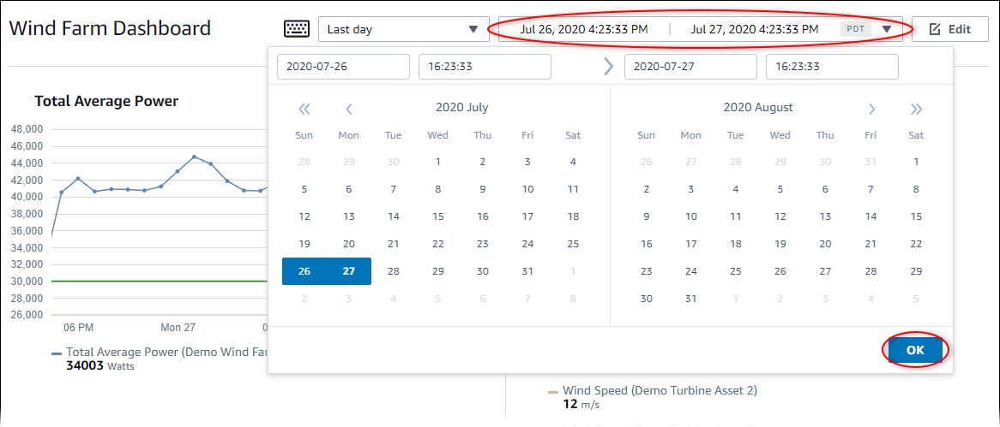

The SiteWise Monitor feature is not available to new customers. Existing customers can continue to
use the service as normal. For more information, see [SiteWise Monitor availability
change](iotsitewise-monitor-availability-change.md "iotsitewise-monitor-availability-change.md")

# View dashboards in AWS IoT SiteWise

With AWS IoT SiteWise Monitor, you can provide consistent views of your asset data to the right set
of people. Portal administrators, project owners, and project viewers can view all dashboards
that are defined for their projects. You can view all of your dashboards in one place on the
**Dashboards** page or you can view dashboards from a project page.

###### To view a dashboard from the dashboards page

1. In the navigation bar, choose the **Dashboards** icon.

 2. In the **Filter by project** drop-down list, choose the project whose
dashboards you want to view.

You can sort the list of dashboards by using the column headings.

###### Note

If you can't find a particular project, you might not have been invited to view that
project. Contact the project owner to request an invitation. 3. In the **Dashboards** list, choose a dashboard to view.

###### To view a dashboard from a project page

1. In the navigation bar, choose the **Projects** icon.

 2. On the **Projects** page, choose the project whose dashboards you
want to view.

 3. In the **Dashboards** section of the project details page, choose
**Open in dashboards** for the dashboard to view. You can also select
the check box next to the dashboard, and then choose **Open**.

 4. You can browse the visualizations available in the dashboard.

 5. You can [adjust the time range for your
data](#adjust-dashboard-time-range "#adjust-dashboard-time-range"). If you're a project owner or portal administrator, you can modify the
dashboard. For more information, see [Add visualizations in AWS IoT SiteWise Monitor](add-visualizations.md "add-visualizations.md").

## Adjusting the dashboard time range

When you view a dashboard, you can change the time range of the displayed data. With
this feature, you can compare recent behavior with past behavior or focus on a specific time
range. You can choose from a set of predefined time ranges, or you can specify the exact
start and end of the time range to view. You can also restore the view to show live
data.

###### Note

Each dashboard page has its own **Time range**. If you change the
**Time range** for one dashboard, this doesn't change it for other
dashboards. All visualizations on a dashboard use the time range you choose.

###### To use a predefined time range

- In the time range drop-down list, choose a time range to view.

###### To use a custom time range

1. Choose the time range control to open the calendar.

 2. Choose the start and end for your time range. In the example screen capture, the
start date is July 26 and the end date is July 27. 3. Choose **OK** to apply your changes.

###### To zoom in or out in a visualization

1. Click and drag a time range on one of the
   line or bar charts to zoom in to the selected time range.
2. Double-click on a time range to zoom in on the
   selected point.
3. Press **Shift** and then
   double-click on a time range to zoom out from the selected point.

###### To shift the selected time range

- Press **Shift** and then drag the
  mouse on a time range to shift the range left or right.
