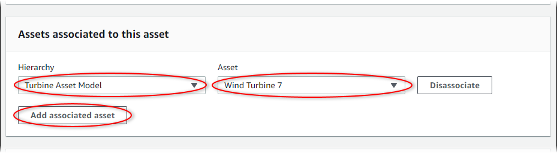
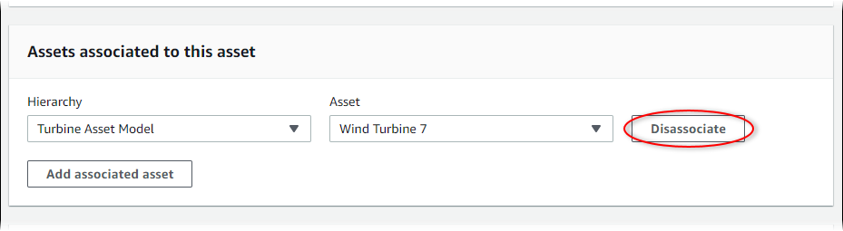

# Associate and disassociate assets

If your asset's model defines any child asset model hierarchies, you can associate child
assets to your asset. Parent assets can access and aggregate data from associated assets. For
more information about hierarchical asset models, see [Define asset model hierarchies](define-asset-hierarchies.md "define-asset-hierarchies.md"). If you're using interfaces, hierarchies defined in the interface are enforced on the asset models that implement the interface. For more information about interfaces, see [Asset model interfaces](model-interfaces.md "model-interfaces.md").

###### Topics

- [Associate and disassociate assets
  (console)](#associate-asset-console "#associate-asset-console")
- [Associate and disassociate assets (AWS CLI)](#associate-asset-cli "#associate-asset-cli")

## Associate and disassociate assets

(console)

You can use the AWS IoT SiteWise console to associate and disassociate assets.

###### To associate an asset (console)

1. Navigate to the [AWS IoT SiteWise console](https://console.aws.amazon.com/iotsitewise/ "https://console.aws.amazon.com/iotsitewise/").
2. In the navigation pane, choose **Assets**.
3. Choose the parent asset for which you want to associate a child asset.

###### Tip

You can choose the arrow icon to expand an asset hierarchy to find your
asset. 4. Choose **Edit**. 5. In **Assets associated to this asset**, choose **Add
associated
asset**.

 6. For **Hierarchy**, choose the hierarchy that defines the
relationship between the parent asset and the child asset. 7. For **Asset**, choose the child asset to associate. 8. Choose **Save**.

###### To disassociate an asset (console)

1. Navigate to the [AWS IoT SiteWise console](https://console.aws.amazon.com/iotsitewise/ "https://console.aws.amazon.com/iotsitewise/").
2. In the navigation pane, choose **Assets**.
3. Choose the parent asset for which you want to disassociate a child asset.

###### Tip

You can choose the arrow icon to expand an asset hierarchy to find your
asset. 4. Choose **Edit**. 5. In **Assets associated to this asset**, choose
**Disassociate** for the asset.

 6. Choose **Save**.

## Associate and disassociate assets (AWS CLI)

You can use the AWS Command Line Interface (AWS CLI) to associate and disassociate assets.

For this procedure, you must know the ID of the hierarchy (`hierarchyId`) in
the parent asset model that defines the relationship to the child asset model. Use the
[DescribeAsset](../APIReference/API_DescribeAsset.md "../APIReference/API_DescribeAsset.md")
operation to find the hierarchy ID in the response.

###### To find a hierarchy ID

- Run the following command to describe the parent asset. Replace
  `parent-asset-id` with the parent asset's ID or external ID.

```
aws iotsitewise describe-asset --asset-id `parent-asset-id`
```

The operation returns a response that contains the asset's details. The response
contains an `assetHierarchies` list that has the following structure:

```
{
  ...
  "assetHierarchies": [
    {
      "id": "`String`",
      "name": "`String`"
    }
  ],
  ...
}
```

The hierarchy ID is the `id` value for a hierarchy in the list of asset
hierarchies.

After you have the hierarchy ID, you can associate or disassociate an asset with that
hierarchy.

To associate a child asset to a parent asset, use the [AssociateAssets](../APIReference/API_AssociateAssets.md "../APIReference/API_AssociateAssets.md") operation. To disassociate
a child asset from a parent asset, use the [DisassociateAssets](../APIReference/API_DisassociateAssets.md "../APIReference/API_DisassociateAssets.md") operation. Specify
the following parameters, which are the same for both operations:

- `assetId` – The parent asset's ID or external ID.
- `hierarchyId` – The hierarchy ID or external ID in the parent
  asset.
- `childAssetId` – The child asset's ID or external ID.

###### To associate an asset (AWS CLI)

- Run the following command to associate a child asset to a parent asset. Replace
  `parent-asset-id`, `hierarchy-id`,
  and `child-asset-id` with the respective IDs:

```
aws iotsitewise associate-assets \
  --asset-id `parent-asset-id` \
  --hierarchy-id `hierarchy-id` \
  --child-asset-id `child-asset-id`
```

###### To disassociate an asset (AWS CLI)

- Run the following command to disassociate a child asset from a parent asset. Replace
  `parent-asset-id`, `hierarchy-id`, and
  `child-asset-id` with the respective IDs:

```
aws iotsitewise disassociate-assets \
  --asset-id `parent-asset-id` \
  --hierarchy-id `hierarchy-id` \
  --child-asset-id `child-asset-id`
```
