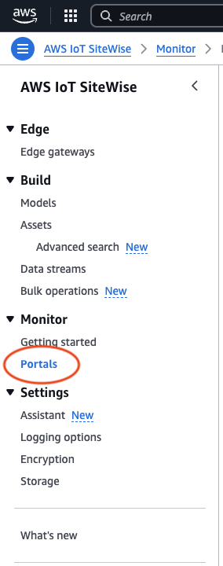

# Administer your portals

###### Note

The SiteWise Monitor feature will no longer be open to new customers starting November 7, 2025 . If you would like to use SiteWise Monitor,
sign up prior to that date. Existing customers can continue to use the service as normal. For more information, see
[SiteWise Monitor availability change](../appguide/iotsitewise-monitor-availability-change.md "../appguide/iotsitewise-monitor-availability-change.md").

You have the ability to manage and configure various aspects of the portal. This includes
adding and removing administrators, setting permissions and roles, customizing the
name, description, setting up support email, and inviting to portal administrators.

1. Sign in to the [AWS IoT SiteWise
   console](https://console.aws.amazon.com/iotsitewise/home "https://console.aws.amazon.com/iotsitewise/home").
2. In the navigation pane, choose **Monitor**,
   **Portals**.

 3. Choose a portal, and then choose **Open portal** (or choose the
portal's **Name**). 4. You can perform any of the following administrative tasks:

    * [Edit portal attributes](portal-change-details-ai.md "portal-change-details-ai.md")
    * [Add or remove portal administrators](portal-change-admins-ai.md "portal-change-admins-ai.md")
    * [Send email invitations to portal
     administrators](send-email-invitations-to-portal.md "send-email-invitations-to-portal.md")
    * [Delete a portal in AWS IoT SiteWise](portal-delete-portal.md "portal-delete-portal.md")
