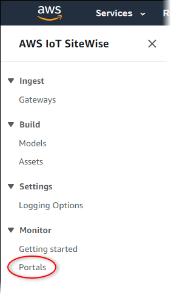

# Administer your SiteWise Monitor portals

###### Note

The SiteWise Monitor feature will no longer be open to new customers starting November 7, 2025 . If you would like to use SiteWise Monitor,
sign up prior to that date. Existing customers can continue to use the service as normal. For more information, see
[SiteWise Monitor availability change](../appguide/iotsitewise-monitor-availability-change.md "../appguide/iotsitewise-monitor-availability-change.md").

You have the ability to manage and configure various aspects of the portal. This includes
adding and removing users or administrators, setting user permissions and roles, customizing the
portal's URL, name, setting a support contact information, and sending email invitations to portal administrators.

1. Sign in to the [AWS IoT SiteWise
   console](https://console.aws.amazon.com/iotsitewise/home "https://console.aws.amazon.com/iotsitewise/home").
2. In the navigation pane, choose **Monitor**,
   **Portals**.

 3. Choose a portal, and then choose **View details** (or choose the
portal's **Name**). 4. You can perform any of the following administrative tasks:

    * [Change portal details in AWS IoT SiteWise](portal-change-details.md "portal-change-details.md")
    * [Add or remove portal administrators in AWS IoT SiteWise](portal-change-admins.md "portal-change-admins.md")
    * [Send email invitations to portal
     administrators](send-email-invitations-to-portal.md "send-email-invitations-to-portal.md")
    * [Add or remove portal users in AWS IoT SiteWise](portal-change-users.md "portal-change-users.md")
    * [Delete a portal in AWS IoT SiteWise](portal-delete-portal.md "portal-delete-portal.md")

For information about how to create a portal, see [Get started with AWS IoT SiteWise Monitor (Classic)](monitor-getting-started.md "monitor-getting-started.md").

###### Topics

- [Change portal details in AWS IoT SiteWise](portal-change-details.md "portal-change-details.md")
- [Add or remove portal administrators in AWS IoT SiteWise](portal-change-admins.md "portal-change-admins.md")
- [Send email invitations to portal
  administrators](send-email-invitations-to-portal.md "send-email-invitations-to-portal.md")
- [Add or remove portal users in AWS IoT SiteWise](portal-change-users.md "portal-change-users.md")
- [Delete a portal in AWS IoT SiteWise](portal-delete-portal.md "portal-delete-portal.md")
