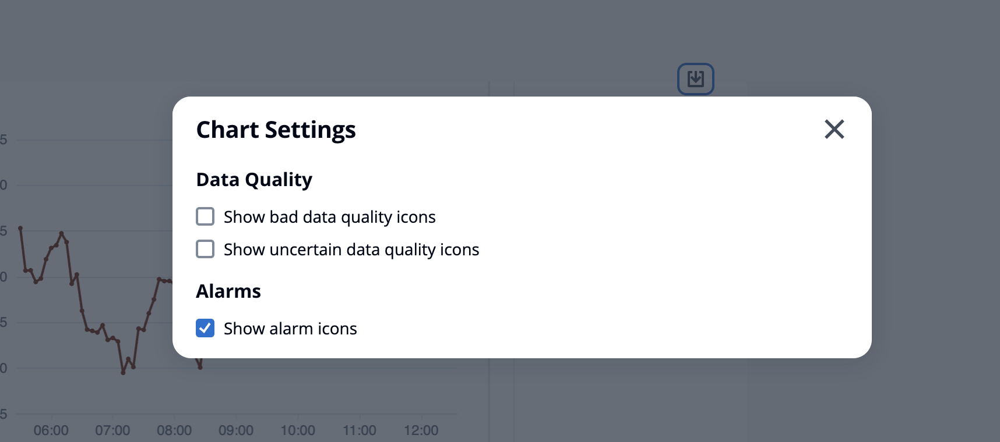
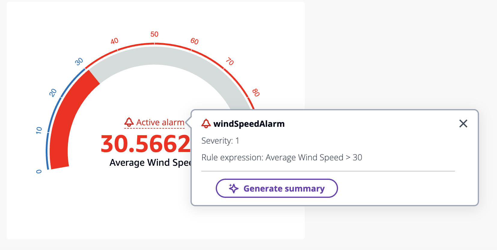
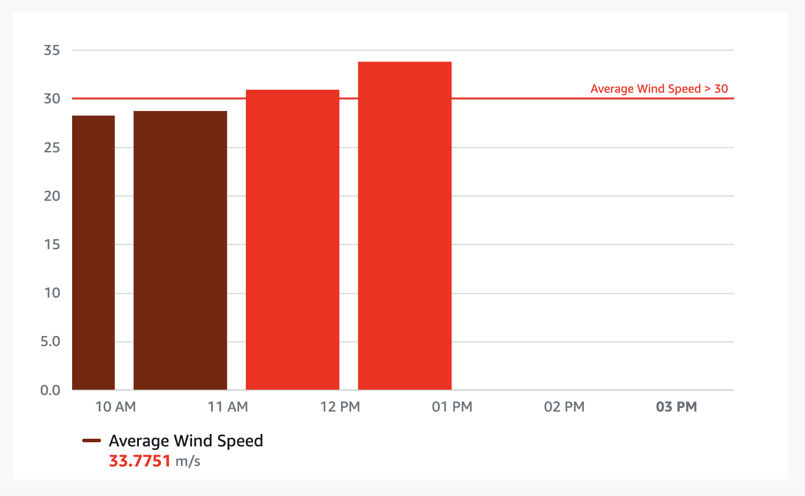

# Alarms in different widgets

###### Note

The SiteWise Monitor feature is no longer available to new customers. Existing customers can continue to use the service as normal. For more information, see
[SiteWise Monitor availability change](../appguide/iotsitewise-monitor-availability-change.md "../appguide/iotsitewise-monitor-availability-change.md").

For all widgets:

- Data stream property settings are dependent on what type of property is added to a widget.
  Data stream properties have full property setting support while alarm properties do not currently allow property setting configurations.
- If you add an alarm data stream, its associated input property data stream is added to the chart as well. If you remove the alarm data stream, then its input property is also removed.
- To individually control the input property data stream of an alarm, you must **add them both** separately.
  The below examples state how some widgets use alarms.

- **Line Chart**
  - The alarm and its input property data stream are added to the chart.
  - You can see alarm state in the chart legend, and as icons hovering over the data stream when the alarm changes state.
  - You can toggle off alarm icons from the chart settings.

- **KPI** and **Gauge**
  - The alarm and its input property data stream are added to the chosen widget.
  - The alarm threshold is added to the widget, which changes color based on its configuration.
  - You can select the alarm state on the widget, see the alarm details, and click **Generate summary** to call the AWS IoT SiteWise to get an alarm summary.

- **Table**
  - The alarm and its input property are added as a row on the table.

- **Bar chart**
  - The alarm is added as a threshold to the chart, which changes the color of any data stream breaching the threshold.
  - You can add any associated data streams separately.
  - You cannot interact with the AWS IoT SiteWise Assistant from the widget.

- **Status timeline**
  - The alarm is added as a threshold to the timeline.
  - Adding the alarm state and its input property data to the timeline is work in progress.
  - You cannot interact with the AWS IoT SiteWise Assistant from the widget.
