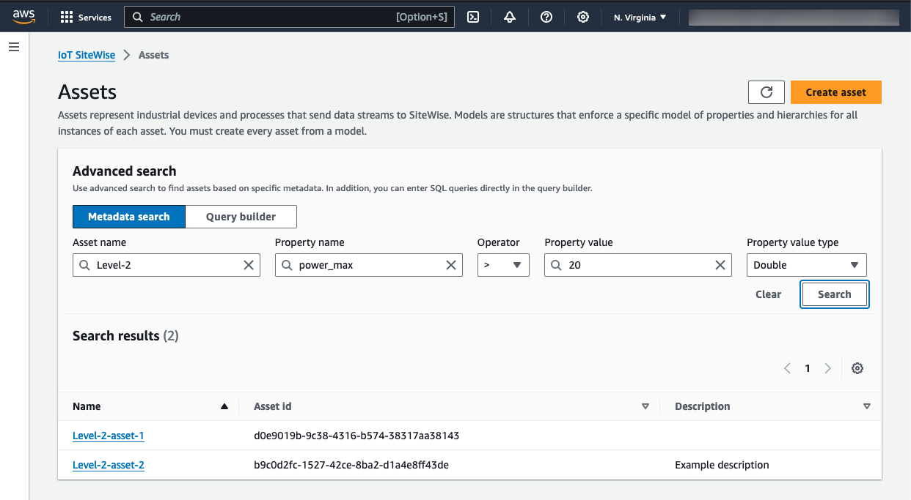
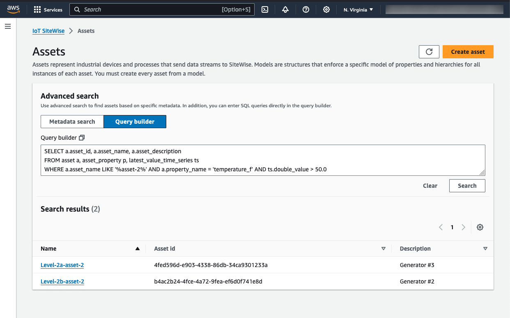

# Search assets on AWS IoT SiteWise console

Use the AWS IoT SiteWise console search functionality to find assets based on metadata and real-time property value filters.

## Prerequisites

AWS IoT SiteWise requires permissions to integrate with AWS IoT TwinMaker to better organize, and model industrial data.
If you have granted permissions to AWS IoT SiteWise, use the
[ExecuteQuery](../APIReference/API_ExecuteQuery.md "../APIReference/API_ExecuteQuery.md") API.
If you have not granted permissions to AWS IoT SiteWise, and need assistance getting started, see
[Integrate AWS IoT SiteWise and AWS IoT TwinMaker](integrate-tm.md "integrate-tm.md").

## Advanced search on AWS IoT SiteWise console

### Metadata search

1. Navigate to the [AWS IoT SiteWise console](https://console.aws.amazon.com/iotsitewise/ "https://console.aws.amazon.com/iotsitewise/").
2. In the navigation pane, choose **Advanced search** under **Assets**.
3. Under **Advanced search** choose the **Metadata search** option.
4. Fill in the parameters. Fill in as many fields as possible for an efficient search.
   1. **Asset name** — Enter a full asset name, or a partial name for a wide search.
   2. **Property name** — Enter a full property name, or a partial name for a wide search.
   3. **Operator** — Choose an operator from:
      - **=**
      - **<**
      - **>**
      - **<=**
      - **>=**

   4. **Property value** — This value is compared with the property's latest value.
   5. **Property value type** — The data type of the property. Choose from the following:
      - **Double**
      - **Integer**
      - **String**
      - **Boolean**

5. Choose **Search**.
6. From the **Search results** table, choose the asset from the
   **Name** column. This takes you to the detailed asset page for that asset.

#### Partial search

All parameters do not need to be provided for an asset search. Here are some examples of partial searches
using the Metadata search option:

- Find assets by their name:
  - Enter a value in the **Asset name** field alone.
  - The **Property name** and **Property value** fields are empty.

- Find assets containing properties with a specific name:
  - Enter a value in the **Property name** field alone.
  - The **Asset name** and **Property value** fields are empty.

- Find assets based on the latest values of their properties:
  - Enter values in the **Property name** and **Property value** fields.
  - Select an **Operator** and **Property value type**.

### Query builder search

1. Navigate to the AWS IoT SiteWise console.
2. In the navigation pane, choose **Advanced search** under **Assets**.
3. Under **Advanced search** choose the **Query builder** option.
4. In the **Query builder** pane, write your SQL query to retrieve an
   `asset_name`, `asset_id` and `asset_description`.
5. Choose **Search**.
6. From the **Search results** table, choose the asset from the
   **Name** column. This takes you to the detailed asset page for that asset.

###### Note

- The `SELECT` clause in the SQL query must include the `asset_name` and `asset_id` fields
  to ensure a valid asset in the **Search results** table.
- The **Query builder** only displays the **Name**,
  **Asset id**, and **Description** in the results table.
  Adding more fields to the `SELECT` clause does not add more columns to the results table
