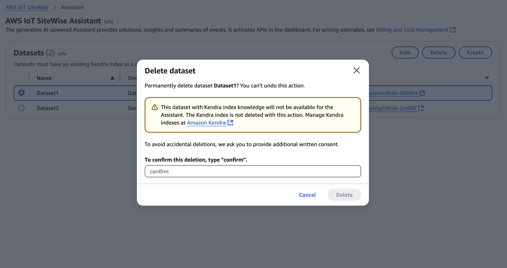

# Delete a dataset

###### Note

The SiteWise Monitor feature will no longer be open to new customers starting November 7, 2025 . If you would like to use SiteWise Monitor,
sign up prior to that date. Existing customers can continue to use the service as normal. For more information, see
[SiteWise Monitor availability change](../appguide/iotsitewise-monitor-availability-change.md "../appguide/iotsitewise-monitor-availability-change.md").

Console

###### Delete a dataset

1. Datasets are displayed in the **Datasets** section of the **Assistant** page.
   Choose a dataset. Choose **Delete**.
2. Type **confirm** in the popup to confirm the delete.

 3. Choose **Delete**.

AWS CLI

###### Delete a dataset

- Delete the dataset with `datasetId`.

```
aws iotsitewise delete-dataset --region us-east-1 --dataset-id <UUID>
```
