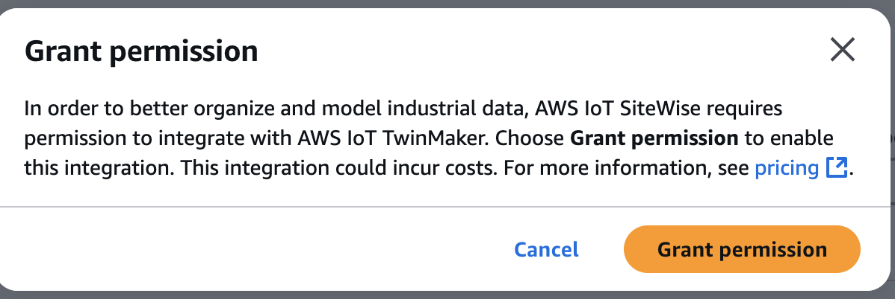
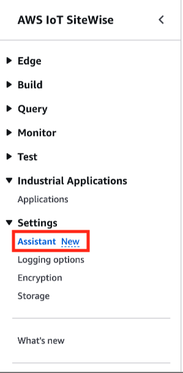

# Configure the AWS IoT SiteWise Assistant

###### Note

The SiteWise Monitor feature will no longer be open to new customers starting November 7, 2025 . If you would like to use SiteWise Monitor,
sign up prior to that date. Existing customers can continue to use the service as normal. For more information, see
[SiteWise Monitor availability change](../appguide/iotsitewise-monitor-availability-change.md "../appguide/iotsitewise-monitor-availability-change.md").

###### AWS IoT SiteWise Assistant configuration

1. Sign in to the [AWS IoT SiteWise
   console](https://console.aws.amazon.com/iotsitewise/home "https://console.aws.amazon.com/iotsitewise/home").

###### Note

Grant permissions to enable integration with AWS IoT TwinMaker service. This is required for the AWS IoT SiteWise Assistant, and the
dashboard to execute SQL queries in AWS IoT SiteWise resources. See
[Integrate AWS IoT SiteWise and AWS IoT TwinMaker](integrate-tm.md#it-enable "integrate-tm.md#it-enable").

 2. Choose **Assistant** from the left navigation panel.

