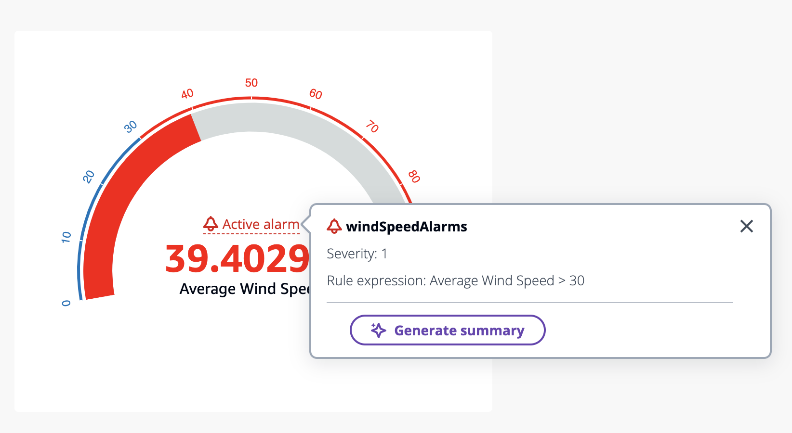

# Use case - Alarm summaries

###### Note

The SiteWise Monitor feature will no longer be open to new customers starting November 7, 2025 . If you would like to use SiteWise Monitor,
sign up prior to that date. Existing customers can continue to use the service as normal. For more information, see
[SiteWise Monitor availability change](../appguide/iotsitewise-monitor-availability-change.md "../appguide/iotsitewise-monitor-availability-change.md").

Summarize the current alarm for a selected panel on the dashboard.
Alarms are supported by **Line, KPI, Gauge** and **Table** widgets.
Choose a widget with an alarm and summarize it.

- Select **Active alarm** on widget.
- The **Severity** and **Rule expression** is displayed for the alarm.
- Choose **Generate summary** to generate a summary.

