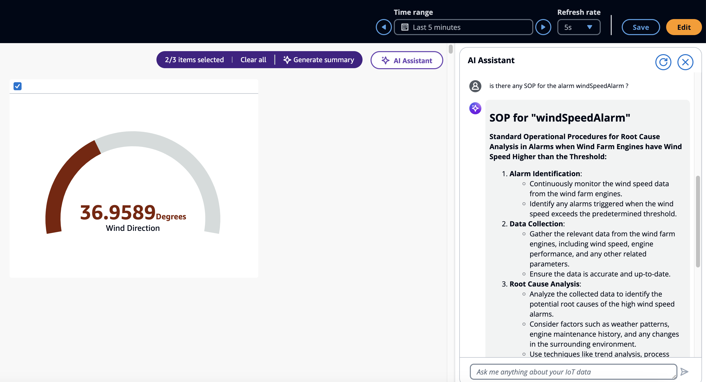

# Use case - Deep dive summaries

###### Note

The SiteWise Monitor feature is no longer available to new customers. Existing customers can continue to use the service as normal. For more information, see
[SiteWise Monitor availability change](../appguide/iotsitewise-monitor-availability-change.md "../appguide/iotsitewise-monitor-availability-change.md").

This is the use case where the user can do a deep dive, and access SOPs (Standard Operation Procedure), manuals, documentation, and
consider next steps of action. For the example in the previous section, if the user chooses to learn more about the SOP for this property, ask the
Assistant about the SOP for this property. This displays the deep dive information about SOP to the user.

The example below displays the answer for "**Is there any SOP for the alarm windSpeedAlarm?**"

