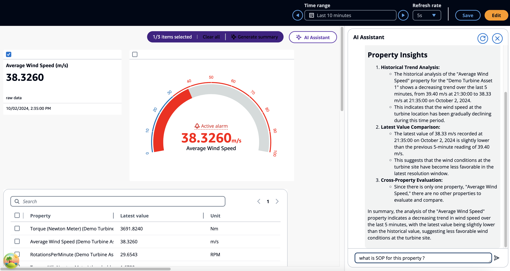

# Use case - Situational summaries

###### Note

The SiteWise Monitor feature will no longer be open to new customers starting November 7, 2025 . If you would like to use SiteWise Monitor,
sign up prior to that date. Existing customers can continue to use the service as normal. For more information, see
[SiteWise Monitor availability change](../appguide/iotsitewise-monitor-availability-change.md "../appguide/iotsitewise-monitor-availability-change.md").

Select up to three widgets to summarize. They can be a combination of
widgets and properties. If more than three are selected, the Assistant returns an error.

###### Generate a situation summary with AWS IoT SiteWise Assistant

1. Click on **AI Assistant**. It displays a menu with three options.
   1. **Items selected** – Select only three. You cannot select more than three.
   2. **Clear all** – Clear your selection.
   3. **Generate summary** – Generate a summary about items selected.

2. Choose **Generate summary** to generate the summary about the selected items.

The image below has a widget selected and a summary from the AWS IoT SiteWise Assistant.

