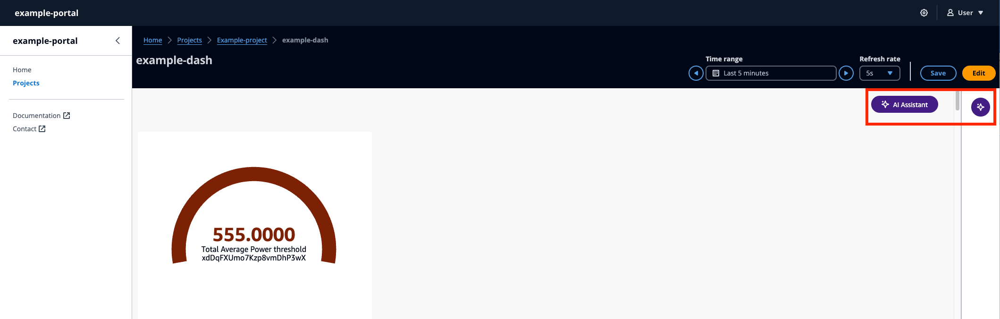

# AWS IoT SiteWise Assistant use in widgets

###### Note

The SiteWise Monitor feature is no longer available to new customers. Existing customers can continue to use the service as normal. For more information, see
[SiteWise Monitor availability change](../appguide/iotsitewise-monitor-availability-change.md "../appguide/iotsitewise-monitor-availability-change.md").

The AWS IoT SiteWise Assistant is a generative AI-powered assistant. It allows users like plant managers, quality engineers, and maintenance technicians to gain insights,
solve problems, and take actions directly from their operational and enterprise data. The AWS IoT SiteWise Assistant consolidates information from AWS IoT data, asset models,
manuals and documentation into understandable summaries of critical events. It also enables interactive deep dive question and answer sessions for easy diagnosis,
root cause explorations and guided recommendations.

The AWS IoT SiteWise Assistant button is on the top right corner of the dashboard. Click on it to activate the Assistant.
Can only be used with the **Preview** mode of the dashboard.

Use the AWS IoT SiteWise Assistant in the following scenarios:

###### Topics

- [Use case - Alarm summaries](assistant-widgets-alarm.md "assistant-widgets-alarm.md")
- [Use case - Situational summaries](assistant-widgets-situation.md "assistant-widgets-situation.md")
- [Use case - Deep dive summaries](assistant-widgets-deepdive.md "assistant-widgets-deepdive.md")
