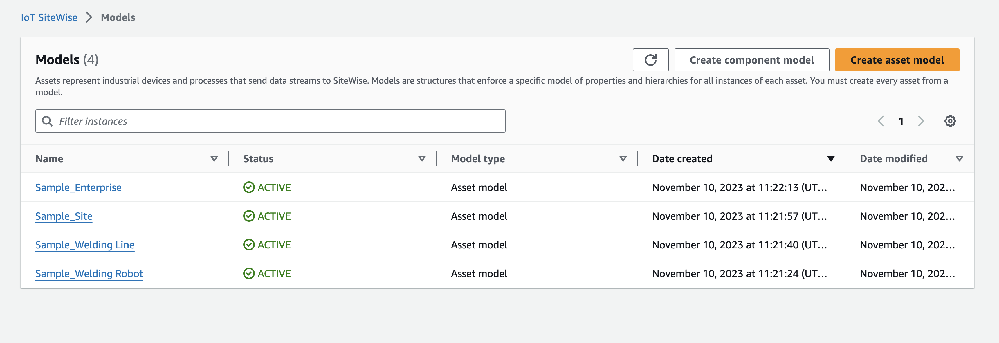
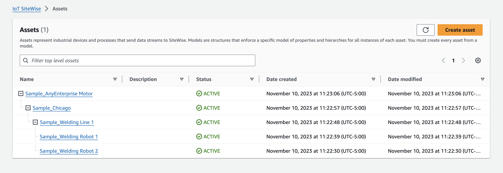
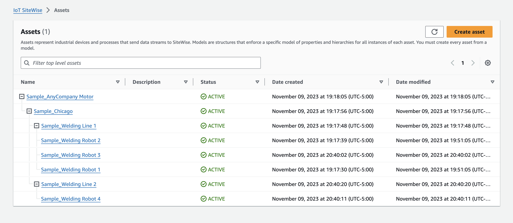

# Import metadata examples

This section shows how to create metadata files to import asset models and assets with a single bulk import
operation.

## Example of a bulk import

You can import many asset models and assets with a single bulk import operation. The following example shows
how to create a metadata file to do this.

In this example scenario, you have various work sites that contain industrial robots in work cells.

The example defines two asset models:

- `RobotModel1`: This asset model represents a particular type of robot that you have in your
  work sites. The robot has a measurement property, `Temperature`.
- `WorkCell`: This asset model represents a collection of robots within one of your work sites.
  The asset model defines a hierarchy, `robotHierarchyOEM1`, to represent the relationship that a
  work cell contains robots.

The example also defines some assets:

- `WorkCell1`: a work cell within your Boston site
- `RobotArm123456`: a robot within that work cell
- `RobotArm987654`: another robot within that work cell

The following JSON metadata file defines these asset models and assets. Running a bulk import with this
metadata creates the asset models and assets within AWS IoT SiteWise, including their hierarchical relationships.

```
{
    "assetModels": [
        {
            "assetModelExternalId": "Robot.OEM1.3536",
            "assetModelName": "RobotModel1",
            "assetModelProperties": [
                {
                    "dataType": "DOUBLE",
                    "externalId": "Temperature",
                    "name": "Temperature",
                    "type": {
                        "measurement": {
                            "processingConfig": {
                                "forwardingConfig": {
                                    "state": "ENABLED"
                                }
                            }
                        }
                    },
                    "unit": "fahrenheit"
                }
            ]
        },
        {
            "assetModelExternalId": "ISA95.WorkCell",
            "assetModelName": "WorkCell",
            "assetModelProperties": [],
            "assetModelHierarchies": [
                {
                    "externalId": "workCellHierarchyWithOEM1Robot",
                    "name": "robotHierarchyOEM1",
                    "childAssetModelExternalId": "Robot.OEM1.3536"
                }
            ]
        }
    ],
    "assets": [
        {
            "assetExternalId": "Robot.OEM1.3536.123456",
            "assetName": "RobotArm123456",
            "assetModelExternalId": "Robot.OEM1.3536"
        },
        {
            "assetExternalId": "Robot.OEM1.3536.987654",
            "assetName": "RobotArm987654",
            "assetModelExternalId": "Robot.OEM1.3536"
        },
        {
            "assetExternalId": "BostonSite.Area1.Line1.WorkCell1",
            "assetName": "WorkCell1",
            "assetModelExternalId": "ISA95.WorkCell",
            "assetHierarchies": [
                {
                    "externalId": "workCellHierarchyWithOEM1Robot",
                    "childAssetExternalId": "Robot.OEM1.3536.123456"
                },
                {
                    "externalId": "workCellHierarchyWithOEM1Robot",
                    "childAssetExternalId": "Robot.OEM1.3536.987654"
                }
            ]
        }
    ]
}
```

## Example of initial on-boarding of models and assets

In this example scenario, you have various work sites that contain industrial robots in a company.

The example defines multiple asset models:

- `Sample_Enterprise` – This asset model represents the company that the sites are part
  of. The asset model defines a hierarchy, `Enterprise to Site`, to represent the relationship of
  the sites to the enterprise.
- `Sample_Site` – This asset model represents the manufacturing sites within the
  company. The asset model defines a hierarchy, `Site to Line`, to represent the relationship of
  the lines to the site.
- `Sample_Welding Line` – This asset model represents an assembly line within work
  sites. The asset model defines a hierarchy, `Line to Robot`, to represent the relationship of the
  robots to the line.
- `Sample_Welding Robot` – This asset model represents a particular type of robot in
  your work sites.

The example also defines assets based on the asset models.

- `Sample_AnyCompany Motor` – This asset is created from `Sample_Enterprise`
  asset model.
- `Sample_Chicago` – This asset is created from `Sample_Site` asset
  model.
- `Sample_Welding Line 1` – This asset is created from `Sample_Welding Line`
  asset model.
- `Sample_Welding Robot 1` – This asset is created from `Sample_Welding
Robot` asset model.
- `Sample_Welding Robot 2` – This asset is created from `Sample_Welding
Robot` asset model.

The following JSON metadata file defines these asset models and assets. Running a bulk import with this
metadata creates the asset models and assets within AWS IoT SiteWise, including their hierarchical relationships.

```

{
    "assetModels": [
        {
            "assetModelExternalId": "External_Id_Welding_Robot",
            "assetModelName": "Sample_Welding Robot",
            "assetModelProperties": [
                {
                    "dataType": "STRING",
                    "externalId": "External_Id_Welding_Robot_Serial_Number",
                    "name": "Serial Number",
                    "type": {
                        "attribute": {
                            "defaultValue": "-"
                        }
                    },
                    "unit": "-"
                },
                {
                    "dataType": "DOUBLE",
                    "externalId": "External_Id_Welding_Robot_Cycle_Count",
                    "name": "CycleCount",
                    "type": {
                        "measurement": {}
                    },
                    "unit": "EA"
                },
                {
                    "dataType": "DOUBLE",
                    "externalId": "External_Id_Welding_Robot_Joint_1_Current",
                    "name": "Joint 1 Current",
                    "type": {
                        "measurement": {}
                    },
                    "unit": "Amps"
                },
                {
                    "dataType": "DOUBLE",
                    "externalId": "External_Id_Welding_Robot_Joint_1_Max_Current",
                    "name": "Max Joint 1 Current",
                    "type": {
                        "metric": {
                            "expression": "max(joint1current)",
                            "variables": [
                                {
                                    "name": "joint1current",
                                    "value": {
                                        "propertyExternalId": "External_Id_Welding_Robot_Joint_1_Current"
                                    }
                                }
                            ],
                            "window": {
                                "tumbling": {
                                    "interval": "5m"
                                }
                            }
                        }
                    },
                    "unit": "Amps"
                }
            ]
        },
        {
            "assetModelExternalId": "External_Id_Welding_Line",
            "assetModelName": "Sample_Welding Line",
            "assetModelProperties": [
                {
                    "dataType": "DOUBLE",
                    "externalId": "External_Id_Welding_Line_Availability",
                    "name": "Availability",
                    "type": {
                        "measurement": {}
                    },
                    "unit": "%"
                }
            ],
            "assetModelHierarchies": [
                {
                    "externalId": "External_Id_Welding_Line_TO_Robot",
                    "name": "Line to Robot",
                    "childAssetModelExternalId": "External_Id_Welding_Robot"
                }
            ]
        },
        {
            "assetModelExternalId": "External_Id_Site",
            "assetModelName": "Sample_Site",
            "assetModelProperties": [
                {
                    "dataType": "STRING",
                    "externalId": "External_Id_Site_Street_Address",
                    "name": "Street Address",
                    "type": {
                        "attribute": {
                            "defaultValue": "-"
                        }
                    },
                    "unit": "-"
                }
            ],
            "assetModelHierarchies": [
                {
                    "externalId": "External_Id_Site_TO_Line",
                    "name": "Site to Line",
                    "childAssetModelExternalId": "External_Id_Welding_Line"
                }
            ]
        },
        {
            "assetModelExternalId": "External_Id_Enterprise",
            "assetModelName": "Sample_Enterprise",
            "assetModelProperties": [
                {
                    "dataType": "STRING",
                    "name": "Company Name",
                    "externalId": "External_Id_Enterprise_Company_Name",
                    "type": {
                        "attribute": {
                            "defaultValue": "-"
                        }
                    },
                    "unit": "-"
                }
            ],
            "assetModelHierarchies": [
                {
                    "externalId": "External_Id_Enterprise_TO_Site",
                    "name": "Enterprise to Site",
                    "childAssetModelExternalId": "External_Id_Site"
                }
            ]
        }
    ],
    "assets": [
        {
            "assetExternalId": "External_Id_Welding_Robot_1",
            "assetName": "Sample_Welding Robot 1",
            "assetModelExternalId": "External_Id_Welding_Robot",
            "assetProperties": [
                {
                    "externalId": "External_Id_Welding_Robot_Serial_Number",
                    "attributeValue": "S1000"
                },
                {
                    "externalId": "External_Id_Welding_Robot_Cycle_Count",
                    "alias": "AnyCompany/Chicago/Welding Line/S1000/Count"
                },
                {
                    "externalId": "External_Id_Welding_Robot_Joint_1_Current",
                    "alias": "AnyCompany/Chicago/Welding Line/S1000/1/Current"
                }
            ]
        },
        {
            "assetExternalId": "External_Id_Welding_Robot_2",
            "assetName": "Sample_Welding Robot 2",
            "assetModelExternalId": "External_Id_Welding_Robot",
            "assetProperties": [
                {
                    "externalId": "External_Id_Welding_Robot_Serial_Number",
                    "attributeValue": "S2000"
                },
                {
                    "externalId": "External_Id_Welding_Robot_Cycle_Count",
                    "alias": "AnyCompany/Chicago/Welding Line/S2000/Count"
                },
                {
                    "externalId": "External_Id_Welding_Robot_Joint_1_Current",
                    "alias": "AnyCompany/Chicago/Welding Line/S2000/1/Current"
                }
            ]
        },
        {
            "assetExternalId": "External_Id_Welding_Line_1",
            "assetName": "Sample_Welding Line 1",
            "assetModelExternalId": "External_Id_Welding_Line",
            "assetProperties": [
                {
                    "externalId": "External_Id_Welding_Line_Availability",
                    "alias": "AnyCompany/Chicago/Welding Line/Availability"
                }
            ],
            "assetHierarchies": [
                {
                    "externalId": "External_Id_Welding_Line_TO_Robot",
                    "childAssetExternalId": "External_Id_Welding_Robot_1"
                },
                {
                    "externalId": "External_Id_Welding_Line_TO_Robot",
                    "childAssetExternalId": "External_Id_Welding_Robot_2"
                }
            ]
        },
        {
            "assetExternalId": "External_Id_Site_Chicago",
            "assetName": "Sample_Chicago",
            "assetModelExternalId": "External_Id_Site",
            "assetHierarchies": [
                {
                    "externalId": "External_Id_Site_TO_Line",
                    "childAssetExternalId": "External_Id_Welding_Line_1"
                }
            ]
        },
        {
            "assetExternalId": "External_Id_Enterprise_AnyCompany",
            "assetName": "Sample_AnyEnterprise Motor",
            "assetModelExternalId": "External_Id_Enterprise",
            "assetHierarchies": [
                {
                    "externalId": "External_Id_Enterprise_TO_Site",
                    "childAssetExternalId": "External_Id_Site_Chicago"
                }
            ]
        }
    ]
}

```

The following screenshot is of models that display in the AWS IoT SiteWise console after you run the previous code
example.



The following screenshot is of models, assets, and hierarchies that display in the AWS IoT SiteWise console after you run the
previous code example.



## Example of onboarding additional assets

This example defines additional assets to import to an existing asset model in your account:

- `Sample_Welding Line 2` – This asset is created from `Sample_Welding Line`
  asset model.
- `Sample_Welding Robot 3`– This asset is created from `Sample_Welding Robot`
  asset model.
- `Sample_Welding Robot 4`– This asset is created from `Sample_Welding Robot`
  asset model.

To create the initial assets for this example, see [Example of initial on-boarding of models and assets](#example-scenario1 "#example-scenario1").

The following JSON metadata file defines these asset models and assets. Running a bulk import with this
metadata creates the asset models and assets within AWS IoT SiteWise, including their hierarchical relationships.

```

{
    "assets": [
        {
            "assetExternalId": "External_Id_Welding_Robot_3",
            "assetName": "Sample_Welding Robot 3",
            "assetModelExternalId": "External_Id_Welding_Robot",
            "assetProperties": [
                {
                    "externalId": "External_Id_Welding_Robot_Serial_Number",
                    "attributeValue": "S3000"
                },
                {
                    "externalId": "External_Id_Welding_Robot_Cycle_Count",
                    "alias": "AnyCompany/Chicago/Welding Line/S3000/Count"
                },
                {
                    "externalId": "External_Id_Welding_Robot_Joint_1_Current",
                    "alias": "AnyCompany/Chicago/Welding Line/S3000/1/Current"
                }
            ]
        },
        {
            "assetExternalId": "External_Id_Welding_Robot_4",
            "assetName": "Sample_Welding Robot 4",
            "assetModelExternalId": "External_Id_Welding_Robot",
            "assetProperties": [
                {
                    "externalId": "External_Id_Welding_Robot_Serial_Number",
                    "attributeValue": "S4000"
                },
                {
                    "externalId": "External_Id_Welding_Robot_Cycle_Count",
                    "alias": "AnyCompany/Chicago/Welding Line/S4000/Count"
                },
                {
                    "externalId": "External_Id_Welding_Robot_Joint_1_Current",
                    "alias": "AnyCompany/Chicago/Welding Line/S4000/1/Current"
                }
            ]
        },
        {
            "assetExternalId": "External_Id_Welding_Line_1",
            "assetName": "Sample_Welding Line 1",
            "assetModelExternalId": "External_Id_Welding_Line",
            "assetHierarchies": [
                {
                    "externalId": "External_Id_Welding_Line_TO_Robot",
                    "childAssetExternalId": "External_Id_Welding_Robot_1"
                },
                {
                    "externalId": "External_Id_Welding_Line_TO_Robot",
                    "childAssetExternalId": "External_Id_Welding_Robot_2"
                },
                {
                    "externalId": "External_Id_Welding_Line_TO_Robot",
                    "childAssetExternalId": "External_Id_Welding_Robot_3"
                }
            ]
        },
        {
            "assetExternalId": "External_Id_Welding_Line_2",
            "assetName": "Sample_Welding Line 2",
            "assetModelExternalId": "External_Id_Welding_Line",
            "assetHierarchies": [
                {
                    "externalId": "External_Id_Welding_Line_TO_Robot",
                    "childAssetExternalId": "External_Id_Welding_Robot_4"
                }
            ]
        },
        {
            "assetExternalId": "External_Id_Site_Chicago",
            "assetName": "Sample_Chicago",
            "assetModelExternalId": "External_Id_Site",
            "assetHierarchies": [
                {
                    "externalId": "External_Id_Site_TO_Line",
                    "childAssetExternalId": "External_Id_Welding_Line_1"
                },
                {
                    "externalId": "External_Id_Site_TO_Line",
                    "childAssetExternalId": "External_Id_Welding_Line_2"
                }
            ]
        }
    ]
}

```

The following screenshot is of models, assets, and hierarchies that display in the AWS IoT SiteWise console after you run the
previous code example.



## Example of onboarding new properties

This example defines new properties on existing asset models. See [Example of onboarding additional assets](#example-scenario2 "#example-scenario2") to onboard additional assets and models.

- `Joint 1 Temperature` – This property is added to the `Sample_Welding
Robot` asset model. This new property will also propagate to each asset created from the
  `Sample_Welding Robot` asset model.

To add a new property to an existing asset model, see the following JSON metadata file example. As shown in
the JSON, the entire existing `Sample_Welding Robot` asset model definition must be provided along
with the new property. If the entire property list from the existing definition is not provided, AWS IoT SiteWise deletes
the omitted properties.

This example adds a new property `Joint 1 Temperature` to the asset model.

```

{
    "assetModels": [
        {
            "assetModelExternalId": "External_Id_Welding_Robot",
            "assetModelName": "Sample_Welding Robot",
            "assetModelProperties": [
                {
                    "dataType": "STRING",
                    "externalId": "External_Id_Welding_Robot_Serial_Number",
                    "name": "Serial Number",
                    "type": {
                        "attribute": {
                            "defaultValue": "-"
                        }
                    },
                    "unit": "-"
                },
                {
                    "dataType": "DOUBLE",
                    "externalId": "External_Id_Welding_Robot_Cycle_Count",
                    "name": "CycleCount",
                    "type": {
                        "measurement": {}
                    },
                    "unit": "EA"
                },
                {
                    "dataType": "DOUBLE",
                    "externalId": "External_Id_Welding_Robot_Joint_1_Current",
                    "name": "Joint 1 Current",
                    "type": {
                        "measurement": {}
                    },
                    "unit": "Amps"
                },
                {
                    "dataType": "DOUBLE",
                    "externalId": "External_Id_Welding_Robot_Joint_1_Max_Current",
                    "name": "Max Joint 1 Current",
                    "type": {
                        "metric": {
                            "expression": "max(joint1current)",
                            "variables": [
                                {
                                    "name": "joint1current",
                                    "value": {
                                        "propertyExternalId": "External_Id_Welding_Robot_Joint_1_Current"
                                    }
                                }
                            ],
                            "window": {
                                "tumbling": {
                                    "interval": "5m"
                                }
                            }
                        }
                    },
                    "unit": "Amps"
                },
                {
                    "dataType": "DOUBLE",
                    "externalId": "External_Id_Welding_Robot_Joint_1_Temperature",
                    "name": "Joint 1 Temperature",
                    "type": {
                        "measurement": {}
                    },
                    "unit": "degC"
                }
            ]
        }
    ]
}

```

## Example of managing data streams

This example shows two ways of managing data streams associated with an asset property. When renaming an asset property alias,
there are two options for the historical data currently stored in the asset property's data stream.

- Option one – Keep the current data stream and rename the alias alone,
  allowing the historical data to be accessible with the new alias.

In the JSON metadata file example, the asset property with ID `External_Id_Welding_Robot_Cycle_Count` changes its alias to `AnyCompany/Chicago/Welding Line/S3000/Count-Updated`.
The historical data for this asset property remains the same after this change.

- Option two – Assign a new data stream to the asset property which is accessible with the new alias.
  The old data stream along with its historical data is still accessible with the old alias, but not associated with any asset property.

In the JSON metadata file example, the asset property with ID `External_Id_Welding_Robot_Joint_1_Current` changes its alias to `AnyCompany/Chicago/Welding Line/S4999/1/Current`.
This time the additional value `retainDataOnAliasChange` is present and set to `False`. With this setting, the original data stream
is disassociated from the asset property, and a new data stream is created containing no historical data.

To access the old data stream with the original historical data, in the AWS Console Home, go to the _Data Streams_ page and search for the old alias `AnyCompany/Chicago/Welding Line/S3000/1/Current`.

```

{
    "assetExternalId": "External_Id_Welding_Robot_3",
    "assetName": "Sample_Welding Robot 3",
    "assetModelExternalId": "External_Id_Welding_Robot",
    "assetProperties": [
        {
            "externalId": "External_Id_Welding_Robot_Serial_Number",
            "attributeValue": "S3000"
        },
        {
            "externalId": "External_Id_Welding_Robot_Cycle_Count",
            "alias": "AnyCompany/Chicago/Welding Line/S3000/Count-Updated"
        },
        {
            "externalId": "External_Id_Welding_Robot_Joint_1_Current",
            "alias": "AnyCompany/Chicago/Welding Line/S4999/1/Current",
            "retainDataOnAliasChange": "FALSE"
        }
    ]
}

```
