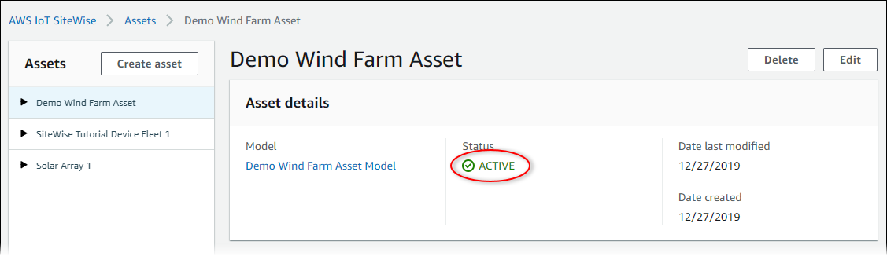

# Check the status of an asset

You can use the AWS IoT SiteWise console or API to check the status of an asset.

###### Topics

- [Check the status of an asset
  (console)](#check-asset-status-console "#check-asset-status-console")
- [Check the status of an asset (AWS CLI)](#check-asset-status-cli "#check-asset-status-cli")

## Check the status of an asset

(console)

Use the following procedure to check the status of an asset in the AWS IoT SiteWise
console.

###### To check the status of an asset (console)

1. Navigate to the [AWS IoT SiteWise console](https://console.aws.amazon.com/iotsitewise/ "https://console.aws.amazon.com/iotsitewise/").
2. In the navigation pane, choose **Assets**.
3. Choose the asset to check.

###### Tip

You can choose the arrow icon to expand an asset hierarchy to find your
asset. 4. Find **Status** in the **Asset details**
panel.



## Check the status of an asset (AWS CLI)

You can use the AWS Command Line Interface (AWS CLI) to check the status of an asset.

To check the status of an asset, use the [DescribeAsset](../APIReference/API_DescribeAsset.md "../APIReference/API_DescribeAsset.md") operation with the
`assetId` parameter.

###### To check the status of an asset (AWS CLI)

- Run the following command to describe the asset. Replace
  `asset-id` with the asset's ID or external ID. The external ID is a
  user-defined ID. For more information, see [Reference objects with external IDs](object-ids.md#external-id-references "object-ids.md#external-id-references") in the _AWS IoT SiteWise User Guide_.

```
aws iotsitewise describe-asset --asset-id `asset-id`
```

The operation returns a response that contains the asset's details. The response
contains an `assetStatus` object that has the following structure:

```
{
    `...`
    "assetStatus": {
      "state": "`String`",
      "error": {
         "code": "`String`",
         "message": "`String`"
      }
    }
  }
```

The asset's state is in `assetStatus.state` in the JSON object.
