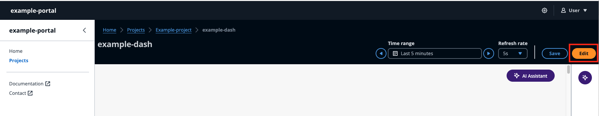

# Configure dashboard

###### Note

The SiteWise Monitor feature will no longer be open to new customers starting November 7, 2025 . If you would like to use SiteWise Monitor,
sign up prior to that date. Existing customers can continue to use the service as normal. For more information, see
[SiteWise Monitor availability change](../appguide/iotsitewise-monitor-availability-change.md "../appguide/iotsitewise-monitor-availability-change.md").

The **Dashboards** section lists the dashboards in the project. Select a dashboard from the list. The **Edit** mode allows you to configure your dashboard by adding widgets and configuring them. The **Preview**
button lets you visualize your changes.

Steps to configure your dashboard:

- Drag and drop different type of data widgets to the dashboard canvas for data visualization.
- Add data to the desired widgets, from the **Resource explorer** on the left. The **Resource explorer** consists of
  **Modeled**, **Unmodeled**, and **Dynamic assets** sections. Search by asset name or property name.
  Select the property to add and choose **Add**.
- Fine tune the layout and style by changing the **Configurations** on widgets.
  Configure components including title, thresholds and other configuration specifics.
- Configure the time range over which data is displayed.
  - Choose the time range over which data is displayed. Choose a **Time range** and
    **Refresh rate** from the top right hand corner, and personalize the range.
    Choose a rate at which the data is to be refreshed from the menu.
  - Select the **Time range** on a widget, by using your trackball mouse scroll wheel or Right-click.
    This moves the time range of display.

- Choose **Save**.

###### Topics

- [Resource explorer](resource-exp.md "resource-exp.md")
- [Widgets](dashboard-widgets.md "dashboard-widgets.md")
- [Configure widgets](dashboard-widgets-conf.md "dashboard-widgets-conf.md")
- [Use widgets](dashboard-widgets-manip.md "dashboard-widgets-manip.md")
- [Alarms in widgets](alarm-widgets.md "alarm-widgets.md")
- [AWS IoT SiteWise Assistant use in widgets](assistant-widgets.md "assistant-widgets.md")
- [Sample questions to ask AWS IoT SiteWise Assistant](assistant-questions.md "assistant-questions.md")
