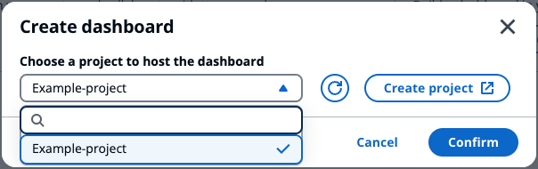
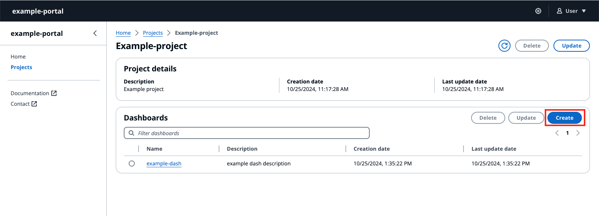
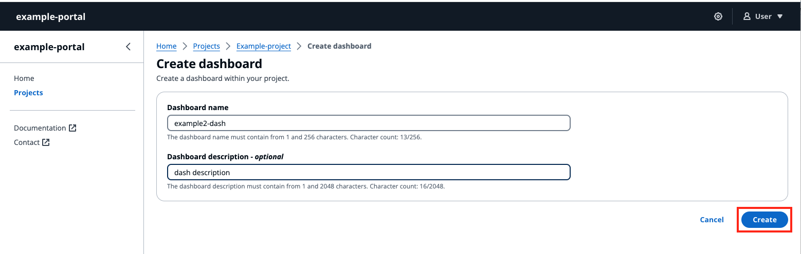

# Create a dashboard

###### Note

The SiteWise Monitor feature will no longer be open to new customers starting November 7, 2025 . If you would like to use SiteWise Monitor,
sign up prior to that date. Existing customers can continue to use the service as normal. For more information, see
[SiteWise Monitor availability change](../appguide/iotsitewise-monitor-availability-change.md "../appguide/iotsitewise-monitor-availability-change.md").

###### Create a dashboard

1.  Create a dashboard in two ways:
    1.  Create a dashboard from **Build a dashboard** in the **Home** page.

            1. To create the dashboard in an existing project, choose a project name from the drop down menu in the **Choose a project to host the dashboard**.
            2. If you don’t have a project, choose **Create project** and select **Confirm**.

        

    2.  Create a dashboard from a project in the **Projects** section, under **Dashboards**.

    

2.  Select **Create** in the upper right corner.
3.  Enter a **Dashboard name**, and give an optional **Dashboard description**.
4.  Select **Create**.

 5. Configure your newly created dashboard.
