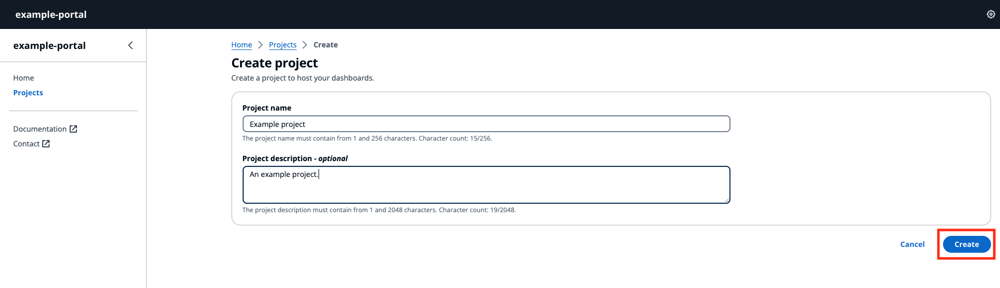

# Create a project

###### Note

The SiteWise Monitor feature is no longer available to new customers. Existing customers can continue to use the service as normal. For more information, see
[SiteWise Monitor availability change](../appguide/iotsitewise-monitor-availability-change.md "../appguide/iotsitewise-monitor-availability-change.md").

###### Create project

1. A project is created in two ways:
   1. In the Home page, in the **Welcome** section under **Quick start**, choose **Create project**.
   2. From the left navigation pane, choose **Projects**. Choose **Create** in the top
      right hand corner to create a project.

2. In the **Create Projects** section, enter a **Project name**, and give an optional **Description**.
3. Choose **Create**.

