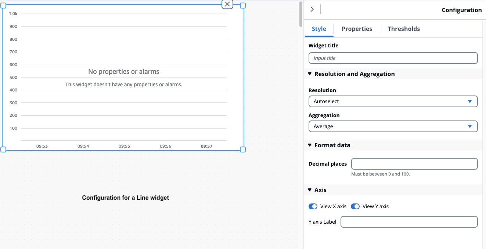
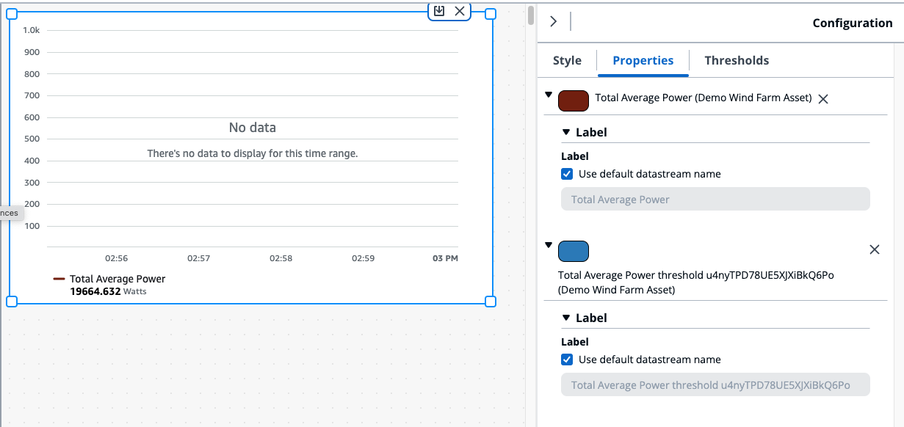
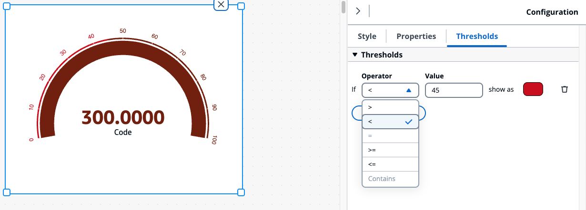

# Configure widgets

###### Note

The SiteWise Monitor feature will no longer be open to new customers starting November 7, 2025 . If you would like to use SiteWise Monitor,
sign up prior to that date. Existing customers can continue to use the service as normal. For more information, see
[SiteWise Monitor availability change](../appguide/iotsitewise-monitor-availability-change.md "../appguide/iotsitewise-monitor-availability-change.md").

Once the widget is added to the dashboard, you can configure the widget by choosing the **Configuration** icon in the right panel.

- **Style** – Add a title in the **Widget title**. Different widgets have different configurations. A few examples
  are listed below.
  - **Bar** widget :
    - **Resolution and Aggregation** – Set values for resolution and aggregation here.
    - **Format data** – Set **Decimal places** to the number of decimals to display.
    - **Display style** – Select values to display.
    - **Axis** – Choose to display the axis.

  - **Line** widget :
    - **Resolution and Aggregation** – Set values for resolution and aggregation here.
    - **Format data** – Set **Decimal places** to the number of decimals to display.
    - **Y-axis** – Add a **Label**, and **Min** and **Max**values.
    - **Widget style** – Select **Line type**, **Line style**, **Line thickness**, and **Data point shape**values.
    - **Legend** – Choose **Alignment**, and **Display**.

  - **Gauge** widget :
    - **Resolution and Aggregation** – Set values for resolution and aggregation here.
    - **Format data** – Set **Decimal places** to the number of decimals to display.
    - **Display style** – Select values to display.
    - **Y-axis** – Add a **Label**, and **Min** and **Max** values.
    - **Fonts** – Select **Font size**, **Unit font size**, and **Label font size** values.

- **Properties** – All the properties of widgets are listed in this section. Different widgets have different properties. A few examples
  are listed below.
  - **Line** widget :
    - **Label** – Choose to use the default datastream name or give a new name.
    - **Style** – Set **Line type**, **Line style** to the number of decimals to display.
    - **Y-axis** – Select values to default style, show Y-axis controls and set the **Min** and **Max** values.

  - **Table** widget :
    - **Label** – Choose to use the default datastream name or give a new name.

  - **Table** widget :
    - **Label** – Choose to use the default datastream name or give a new name.

- **Thresholds** – Add a **Threshold** for a widget. Different widgets have different configurations. A few examples
  are listed below.
  - **Bar chart** widget :
    - Choose **Add a threshold** to add to the widget.
    - Choose **Operator** and give a **Value** for the threshold. Customize the threshold with a color from the color palette.
    - You can choose to apply the threshold across all data.

  - **Line** widget :
    - Choose **Add a threshold** to add to the widget.
    - Choose **Operator** and give a **Value** for the threshold. Customize the threshold with a color from the color palette.
    - Choose how to **Show thresholds** from the drop down menu.

  - **Gauge** widget :
    - Choose **Add a threshold** to add to the widget.
    - Choose **Operator** and give a **Value** for the threshold. Customize the threshold with a color from the color palette.

