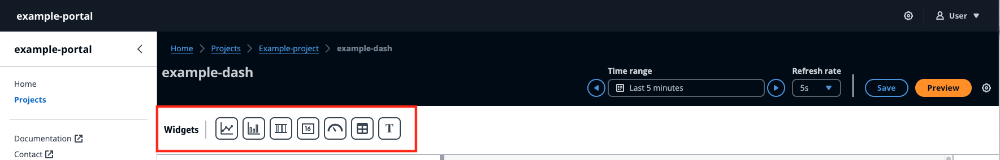

# Widgets

###### Note

The SiteWise Monitor feature is no longer available to new customers. Existing customers can continue to use the service as normal. For more information, see
[SiteWise Monitor availability change](../appguide/iotsitewise-monitor-availability-change.md "../appguide/iotsitewise-monitor-availability-change.md").

Widgets supports a wide range of features, including alarms, high-performance live-streaming, and smooth synchronization with other IoT App Kit components. The dashboard supports the following widgets:

- **Line** –
  The Line widget is a visualization widget that displays trends and changes
  over time. It consists of a series of data points, each represented by a dot or marker,
  connected by straight line segments to create a line graph. It supports a wide range of features,
  including alarms, thresholds, high-performance live-streaming, and smooth synchronization with other IoT App Kit components.
  This widget is customizable to communicate complex data clearly and concisely.
- **Bar chart** –
  The Bar chart is a powerful visualization tool that displays time-series data. It supports a wide range of features,
  including alarms, high-performance live-streaming, and smooth
  synchronization with other IoT App Kit components.
- **Timeline** –
  The Timeline widget provides a way to visualize and navigate time series data from data sources. It is unique
  for displaying data stream values are distinct colors on the timeline.
  It supports a rich set of features including alarms,
  high performance live-streaming and smooth syncing across other IoT App Kit components. It is best used
  for displaying non-numerical data types/
- **KPI** –
  The Key Performance Indicator (KPI) component provides a compact representation of an overview of your asset properties.
  It supports alarms and thresholds. This overview provides critical insights into the overall performance of your devices, equipment, and
  processes. KPI only supports a single data stream or alarm, and not multiple data streams.
- **Gauge** –
  The Gauge component provides a compact representation of an overview of
  your asset properties. It is used to visualize critical insights into the overall
  performance of your devices, equipment, or processes. It is functionally the same as KPI, but visually different.
  Gauge displays the data stream value, threshold, and range of values.
  You can interact with AWS IoT data from one or more data sources with Gauge.
- **Table** –
  The Table component provides a compact form for viewing one or more data streams from one or more time series data sources. It displays assets
  with **Property**, **Latest value** and **Unit** in a tabular form. Supports AWS IoT SiteWise alarms.
- **Text** –
  The Text widget helps write text with various colors and fonts. You can create a link by associating a text with an URL.
  The **Properties** and **Thresholds** fields are not enabled for this widget.

