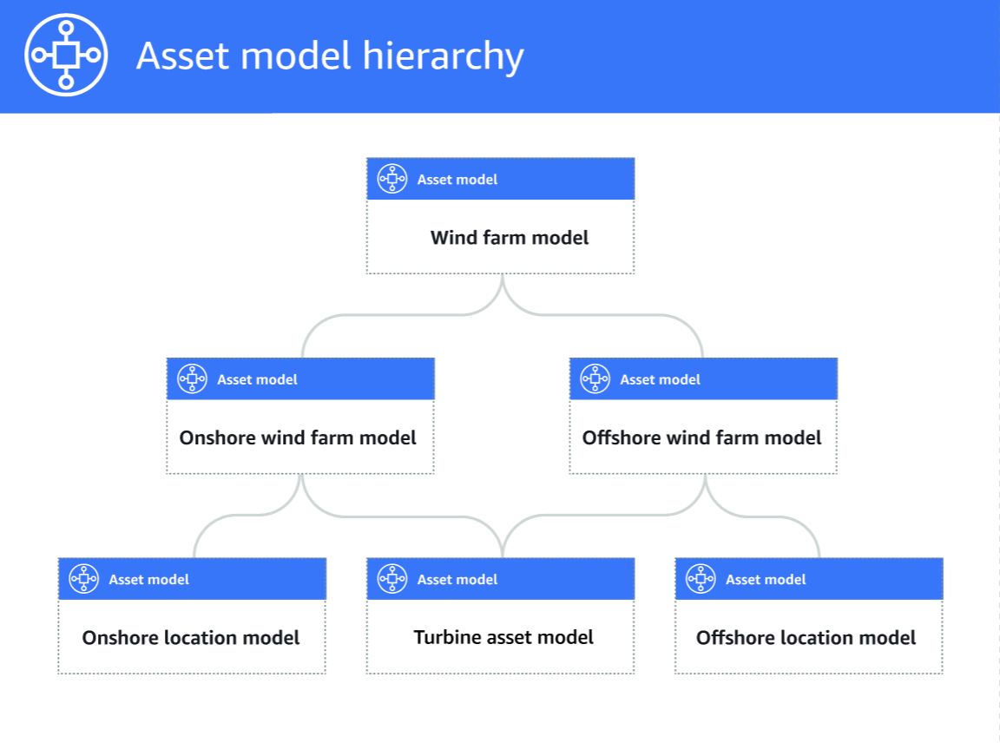

# Define asset model hierarchies

You can define asset model hierarchies to create logical associations between the
asset models in your industrial operation. For example, you can define a wind farm composed of
onshore and offshore wind farms. An onshore wind farm contains a turbine and onshore location.
An offshore wind farm contains a turbine and offshore location.


When you associate a child asset model to a parent asset model through a hierarchy,
the parent asset model's metrics can input data from the child asset model's metrics. You
can use asset model hierarchies and metrics to calculate statistics that provide insight
to your operation or a subset of your operation. For more information, see [Aggregate data from properties and other assets (metrics)](metrics.md "metrics.md").

Each hierarchy defines a relationship between a parent asset model and a child asset
model. In a parent asset model, you can define multiple hierarchies to the same child
asset model. For example, if you have two different types of wind turbines in your wind
farms, where all wind turbines are represented by the same asset model, you can define a
hierarchy for each type. Then, you can define metrics in the wind farm model to calculate
independent and combined statistics for each type of wind turbine.

A parent asset model can be associated with multiple child asset models. For example,
if you have an onshore wind farm and an offshore wind farm that are represented by two
different asset models, you can associate these asset models with the same parent wind
farm asset model.

A child asset model can also be associated with multiple parent asset models. For
example, if you have two different types of wind farms, where all wind turbines are

represented by the same asset model, you can associate the wind turbine asset model with
different wind farm asset models.

###### Note

When you define an asset model hierarchy, the child asset model must be
`ACTIVE` or have a previous `ACTIVE` version. For more
information, see [Asset and model states](asset-and-model-states.md "asset-and-model-states.md").

After you define hierarchical asset models and create assets, you can associate the
assets to complete the parent-child relationship. For more information, see [Create assets for asset models in AWS IoT SiteWise](create-assets.md "create-assets.md") and [Associate and disassociate assets](add-associated-assets.md "add-associated-assets.md").

###### Topics

- [Define asset model hierarchies
  (console)](#define-asset-hierarchies-console "#define-asset-hierarchies-console")
- [Define asset hierarchies (AWS CLI)](#define-asset-hierarchies-cli "#define-asset-hierarchies-cli")

## Define asset model hierarchies

(console)

When you define a hierarchy for an asset model in the AWS IoT SiteWise console, you specify the
following parameters:

- **Hierarchy name** – The hierarchy's name, such as
  `Wind Turbines`.
- **Hierarchy model** – The child asset model.
- **Hierarchy External ID** (Optional) – This is a
  user-defined ID. For more information, see [Reference objects with external IDs](object-ids.md#external-id-references "object-ids.md#external-id-references") in the _AWS IoT SiteWise User Guide_.

For more information, see [Create an asset model (console)](create-asset-models.md#create-asset-model-console "create-asset-models.md#create-asset-model-console").

## Define asset hierarchies (AWS CLI)

When you define a hierarchy for an asset model with the AWS IoT SiteWise API, you specify the
following parameters:

- `name` – The hierarchy's name, such as `Wind
Turbines`.
- `childAssetModelId` – The ID or the external ID of the child asset
  model for the hierarchy. You can use the [ListAssetModels](../APIReference/API_ListAssetModels.md "../APIReference/API_ListAssetModels.md") operation to find
  the ID of an existing asset model.

###### Example hierarchy definition

The following example demonstrates an asset model hierarchy that represents a wind
farm's relationship to wind turbines. This object is an example of an [AssetModelHierarchy](../APIReference/API_AssetModelHierarchy.md "../APIReference/API_AssetModelHierarchy.md"). For more information, see [Create an asset model (AWS CLI)](create-asset-models.md#create-asset-model-cli "create-asset-models.md#create-asset-model-cli").

```
{
  `...`
  "assetModelHierarchies": [
    {
      "name": "`Wind Turbines`",
      "childAssetModelId": "`a1b2c3d4-5678-90ab-cdef-11111EXAMPLE`"
    },
  ]
}
```
