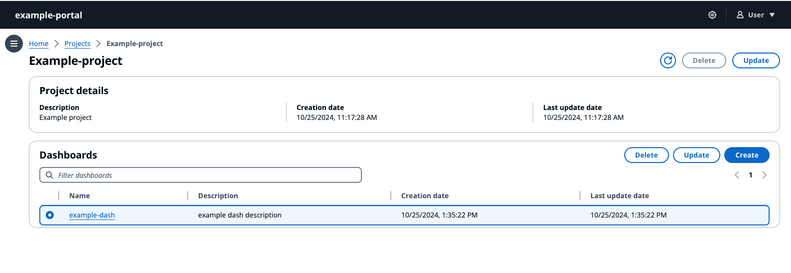

# Delete a dashboard

###### Note

The SiteWise Monitor feature will no longer be open to new customers starting November 7, 2025 . If you would like to use SiteWise Monitor,
sign up prior to that date. Existing customers can continue to use the service as normal. For more information, see
[SiteWise Monitor availability change](../appguide/iotsitewise-monitor-availability-change.md "../appguide/iotsitewise-monitor-availability-change.md").

The **Dashboards** section lists the dashboards in the project. Select a dashboard from the list.

###### Delete a dashboard

1. Select a dashboard to delete.

 2. Select **Delete** to delete the dashboard. This cannot be undone.
