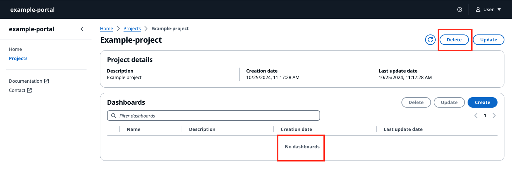

# Delete a project

###### Note

The SiteWise Monitor feature will no longer be open to new customers starting November 7, 2025 . If you would like to use SiteWise Monitor,
sign up prior to that date. Existing customers can continue to use the service as normal. For more information, see
[SiteWise Monitor availability change](../appguide/iotsitewise-monitor-availability-change.md "../appguide/iotsitewise-monitor-availability-change.md").

###### Delete project

1. You can only delete the project after all the dashboards in the project are deleted.
2. Select the **Delete** button on the top right of the **Project** page.
3. Confirm again that you want to delete the project.
4. Select **Delete** to delete the project.

