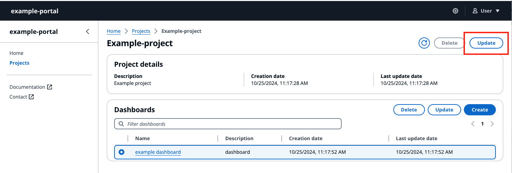

# Update a project

###### Note

The SiteWise Monitor feature is no longer available to new customers. Existing customers can continue to use the service as normal. For more information, see
[SiteWise Monitor availability change](../appguide/iotsitewise-monitor-availability-change.md "../appguide/iotsitewise-monitor-availability-change.md").

###### Edit project

1. Choose the **Update** button on the top right hand corner of the **Project** page, to edit project details.
2. Change the name of the project by editing **Project name**.
3. Change the description of the project by editing the **Description** details.
4. Select **Update** to save your changes.

