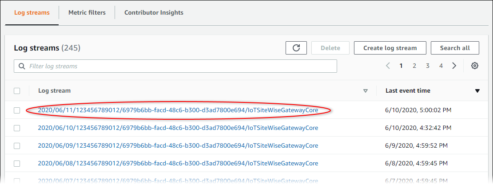
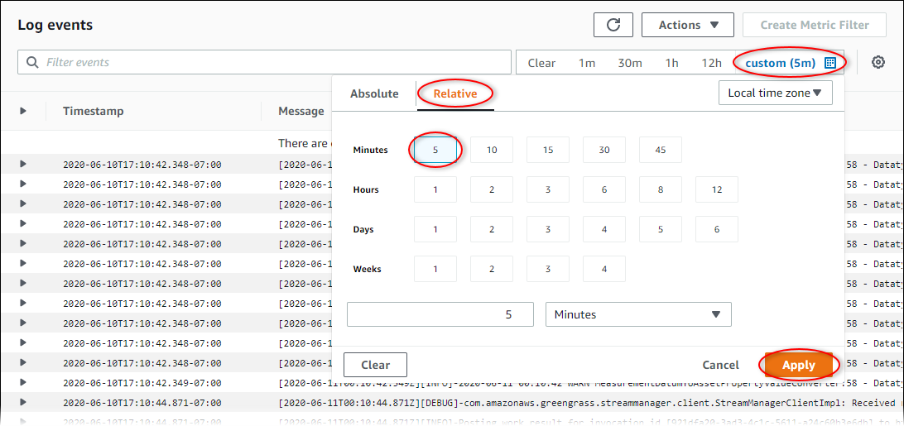

# Use Amazon CloudWatch Logs

You can configure your SiteWise Edge gateway to send logs to CloudWatch Logs. For more information, see [Enable logging for CloudWatch Logs](../../../greengrass/v2/developerguide/monitor-logs.md#enable-cloudwatch-logs "../../../greengrass/v2/developerguide/monitor-logs.md#enable-cloudwatch-logs")
in the _AWS IoT Greengrass Version 2 Developer Guide_.

###### To configure and access CloudWatch Logs (Console)

1.  Navigate to the [CloudWatch
    console](https://console.aws.amazon.com/cloudwatch/ "https://console.aws.amazon.com/cloudwatch/").
2.  In the navigation pane, choose **Log groups**.
3.  You can find the AWS IoT SiteWise component logs in the following log groups:

        * `/aws/greengrass/UserComponent/`region`/aws.iot.SiteWiseEdgeCollectorOpcua`
         – The logs for the SiteWise Edge gateway's component that collects data from the
         SiteWise Edge gateway's OPC UA sources.
        * `/aws/greengrass/UserComponent/`region`/aws.iot.SiteWiseEdgePublisher`
         – The logs for the SiteWise Edge gateway's component that publishes OPC UA data
         streams to AWS IoT SiteWise.

    Choose the log group for the function to debug.

4.  Choose a log stream that has a name that ends with the name of your AWS IoT Greengrass group. By
    default, CloudWatch displays the most recent log stream first.

 5. To show logs from the last 5 minutes, do the following:

    1. Choose **custom** in the upper-right corner.
    2. Choose **Relative**.
    3. Choose **5** minutes.
    4. Choose **Apply**.

 6. (Optional) To see fewer logs, you can choose **1m** from the
upper-right corner. 7. Scroll to the bottom of the log entries to show the most recent logs.
