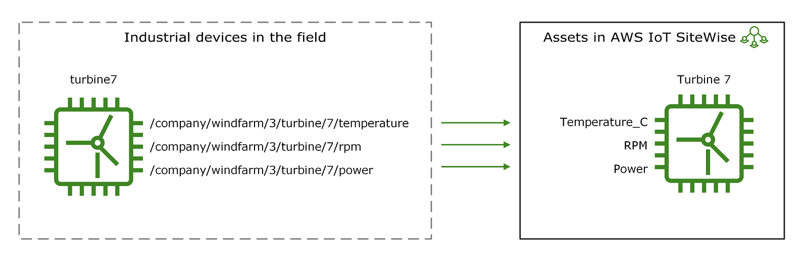
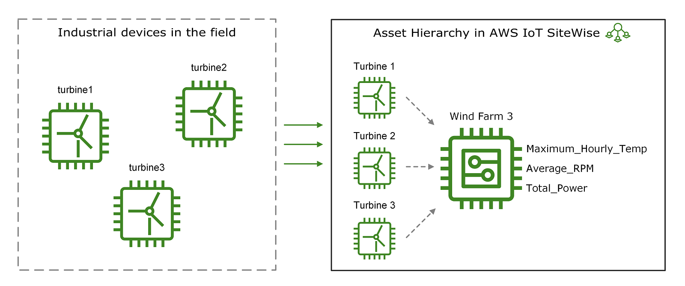

# Model industrial assets

## Assets overview

You can create virtual representations of your industrial operation with AWS IoT SiteWise assets. An
**asset** represents a device, a piece of equipment, or a process that uploads one or
more data streams to the AWS Cloud. For example, an asset device can be a wind turbine that sends air temperature,
propeller rotation speed, and power output time-series measurements to asset properties in AWS IoT SiteWise.

## Property aliases identify equipment data streams

Each data stream corresponds to unique property alias. For example, the alias
`/company/windfarm/3/turbine/7/temperature` uniquely identifies the temperature data stream coming from turbine #7 in wind
farm #3. You can configure AWS IoT SiteWise assets to transform incoming measurement data using
mathematical expressions, such as to convert temperature data from Celsius to Fahrenheit.

## Asset hierarchies represent equipment relationships

An asset can also represent a logical grouping of devices, such as an entire wind farm. You can associate assets
with other assets to create asset hierarchies that represent complex industrial operations. Assets can access the
data within their associated child assets. By doing so, you can use AWS IoT SiteWise expressions to calculate aggregate
metrics, such as the net power output of a wind farm.

## Asset models standardize equipment representation

You must create every asset from an **asset model**. Asset
models are declarative structures that standardize the format of your assets. Asset models
enforce consistent information across multiple assets of the same type so that you can process
data in assets that represent groups of devices. For example, a manufacturing plant might have an asset model for CNC machines that defines properties such as temperature, downtime, and production rate. In the preceding diagram, you use the same
asset model for all three turbines because they share a common set of properties.

## Modeling options for industrial equipment

When designing your industrial asset representation, consider these options:

- **Asset models** represent specific types of equipment or processes. You must create each physical asset from an asset model. For example, a chemical processing plant might have separate asset models for reactors, mixers, and storage tanks.
- **Component models** define reusable sub-assemblies that you can include in asset models or other component models. For example, you could include a temperature sensor component model in multiple equipment asset models across a factory.
- **Asset model interfaces** apply standards across different asset models. For example, a "Rotating Equipment" interface could define standard properties for vibration, temperature, and RPM that apply to pumps, turbines, and motors, despite each having its own unique asset model.

## Creating and managing assets

After you define your asset models, you can create your industrial assets. To create an
asset, select an `ACTIVE` asset model to create an asset from that model. Then, you
can populate asset-specific information such as data stream aliases and attributes. In the
preceding diagram, you create three turbine assets from one asset model and then associate data
stream aliases like `/company/windfarm/3/turbine/7/temperature` for each turbine.

You can also update and delete existing assets, asset models, and component models. When you update an asset
model, every asset based on that asset model reflects any changes that you make to the
underlying model. When you update a component model, this applies to every asset based on
every asset model that references the component model.

## Managing complex asset models

Your asset models may be very complex, for example when modeling a complicated piece of equipment
that has many subcomponents. To help keep such asset models organized and maintainable, you
can use custom composite models to group related properties or to re-use shared components. For more information,
see [Custom composite models (components)](custom-composite-models.md "custom-composite-models.md").

###### Topics
