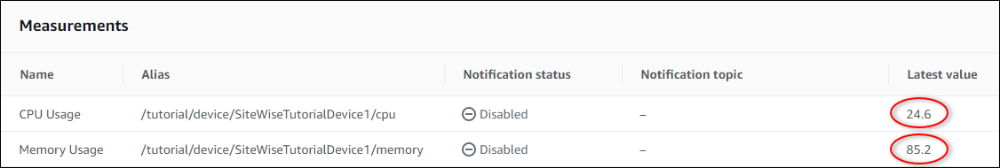

# Ingest data to AWS IoT SiteWise from AWS IoT things

Learn how to ingest data to AWS IoT SiteWise from a fleet of AWS IoT things by using device shadows in
this tutorial. _Device shadows_ are JSON objects that store
current state information for an AWS IoT device. For more information, see [Device shadow
service](../../../iot/latest/developerguide/iot-device-shadows.md "../../../iot/latest/developerguide/iot-device-shadows.md") in the _AWS IoT Developer Guide_.

After you complete this tutorial, you can set up an operation in AWS IoT SiteWise based on AWS IoT
things. By using AWS IoT things, you can integrate your operation with other useful features of
AWS IoT. For example, you can configure AWS IoT features to do the following tasks:

- Configure additional rules to stream data to [AWS IoT Events](../../../iotevents/latest/developerguide.md "../../../iotevents/latest/developerguide.md"), [Amazon DynamoDB](../../../dynamodb.md "../../../dynamodb.md"), and other AWS
  services. For more information, see [Rules](../../../iot/latest/developerguide/iot-rules.md "../../../iot/latest/developerguide/iot-rules.md") in the
  _AWS IoT Developer Guide_.
- Index, search, and aggregate your device data with the AWS IoT fleet indexing service. For
  more information, see [Fleet indexing service](../../../iot/latest/developerguide/iot-indexing.md "../../../iot/latest/developerguide/iot-indexing.md") in the
  _AWS IoT Developer Guide_.
- Audit and secure your devices with AWS IoT Device Defender. For more information, see [AWS IoT Device Defender](../../../iot-device-defender/latest/devguide/what-is-device-defender.md "../../../iot-device-defender/latest/devguide/what-is-device-defender.md") in
  the _AWS IoT Developer Guide_.
  In this tutorial, you learn how to ingest data from AWS IoT things' device shadows to assets
  in AWS IoT SiteWise. To do so, you create one or more AWS IoT things and run a script that updates each
  thing's device shadow with CPU and memory usage data. You use CPU and memory usage data in this
  tutorial to imitate realistic sensor data. Then, you create a rule with an AWS IoT SiteWise action that
  sends this data to an asset in AWS IoT SiteWise every time a thing's device shadow updates. For more
  information, see [Ingest data to AWS IoT SiteWise using AWS IoT Core rules](iot-rules.md "iot-rules.md").

###### Topics

- [Prerequisites](#rule-ingestion-tutorial-prerequisites "#rule-ingestion-tutorial-prerequisites")
- [Step 1: Create an AWS IoT policy](#ingestion-tutorial-create-iot-policy "#ingestion-tutorial-create-iot-policy")
- [Step 2: Create and configure an AWS IoT
  thing](#rule-tutorial-create-iot-thing "#rule-tutorial-create-iot-thing")
- [Step 3: Create a device asset
  model](#rule-tutorial-create-device-model "#rule-tutorial-create-device-model")
- [Step 4: Create a device fleet asset
  model](#rule-tutorial-create-fleet-model "#rule-tutorial-create-fleet-model")
- [Step 5: Create and configure a device
  asset](#rule-tutorial-create-device-assets "#rule-tutorial-create-device-assets")
- [Step 6: Create and configure a device fleet
  asset](#rule-tutorial-create-fleet-asset "#rule-tutorial-create-fleet-asset")
- [Step 7: Create a rule in AWS IoT Core to send
  data to device assets](#rule-tutorial-create-iot-rule "#rule-tutorial-create-iot-rule")
- [Step 8: Run the device client script](#rule-tutorial-run-script "#rule-tutorial-run-script")
- [Step 9: Clean up resources after the
  tutorial](#rule-tutorial-clean-up-resources "#rule-tutorial-clean-up-resources")

## Prerequisites

To complete this tutorial, you need the following:

- An AWS account. If you don't have one, see [Set up an AWS account](getting-started.md#set-up-aws-account "getting-started.md#set-up-aws-account").
- A development computer running Windows, macOS,
  Linux, or Unix to access the AWS Management Console. For more
  information, see [Getting Started with the AWS Management Console](../../../awsconsolehelpdocs/latest/gsg/getting-started.md "../../../awsconsolehelpdocs/latest/gsg/getting-started.md").
- An AWS Identity and Access Management (IAM) user with administrator permissions.
- Python 3 installed on your development computer or installed on the
  device that you want to register as an AWS IoT thing.

## Step 1: Create an AWS IoT policy

In this procedure, create an AWS IoT policy that allows your AWS IoT things to access the
resources used in this tutorial.

Console
Use the following procedure to create an AWS IoT policy using the AWS IoT Core
console:

###### To create an AWS IoT policy

1. Sign in to the [AWS Management Console](../../../awsconsolehelpdocs/latest/gsg/what-is.md "../../../awsconsolehelpdocs/latest/gsg/what-is.md").
2. Review the [AWS
   Regions](../../../general/latest/gr/iot-sitewise.md "../../../general/latest/gr/iot-sitewise.md") where AWS IoT SiteWise is supported. Switch to one of these supported
   Regions, if necessary.
3. Navigate to the [AWS IoT console](https://console.aws.amazon.com/iot/ "https://console.aws.amazon.com/iot/"). If a **Connect device**
   button appears, choose it.
4. In the left navigation pane, choose **Security** and then
   choose **Policies**.
5. Choose **Create**.
6. Enter a name for the AWS IoT policy (for example,
   `SiteWiseTutorialDevicePolicy`).
7. Under **Policy document**, choose **JSON** to
   enter the following policy in JSON form. Replace `region`
   and `account-id` with your Region and account ID, such as
   `us-east-1` and `123456789012`.

JSONJSON

```
`{
 "Version":"2012-10-17",
 "Statement": [
 {
 "Effect": "Allow",
 "Action": "iot:Connect",
 "Resource": "arn:aws:iot:`us-east-1`:`123456789012`:client/`SiteWiseTutorialDevice`*"
 },
 {
 "Effect": "Allow",
 "Action": "iot:Publish",
 "Resource": [
 "arn:aws:iot:`us-east-1`:`123456789012`:topic/$aws/things/${iot:Connection.Thing.ThingName}/shadow/update",
 "arn:aws:iot:`us-east-1`:`123456789012`:topic/$aws/things/${iot:Connection.Thing.ThingName}/shadow/delete",
 "arn:aws:iot:`us-east-1`:`123456789012`:topic/$aws/things/${iot:Connection.Thing.ThingName}/shadow/get"
 ]
 },
 {
 "Effect": "Allow",
 "Action": "iot:Receive",
 "Resource": [
 "arn:aws:iot:`us-east-1`:`123456789012`:topic/$aws/things/${iot:Connection.Thing.ThingName}/shadow/update/accepted",
 "arn:aws:iot:`us-east-1`:`123456789012`:topic/$aws/things/${iot:Connection.Thing.ThingName}/shadow/delete/accepted",
 "arn:aws:iot:`us-east-1`:`123456789012`:topic/$aws/things/${iot:Connection.Thing.ThingName}/shadow/get/accepted",
 "arn:aws:iot:`us-east-1`:`123456789012`:topic/$aws/things/${iot:Connection.Thing.ThingName}/shadow/update/rejected",
 "arn:aws:iot:`us-east-1`:`123456789012`:topic/$aws/things/${iot:Connection.Thing.ThingName}/shadow/delete/rejected"
 ]
 },
 {
 "Effect": "Allow",
 "Action": "iot:Subscribe",
 "Resource": [
 "arn:aws:iot:`us-east-1`:`123456789012`:topicfilter/$aws/things/${iot:Connection.Thing.ThingName}/shadow/update/accepted",
 "arn:aws:iot:`us-east-1`:`123456789012`:topicfilter/$aws/things/${iot:Connection.Thing.ThingName}/shadow/delete/accepted",
 "arn:aws:iot:`us-east-1`:`123456789012`:topicfilter/$aws/things/${iot:Connection.Thing.ThingName}/shadow/get/accepted",
 "arn:aws:iot:`us-east-1`:`123456789012`:topicfilter/$aws/things/${iot:Connection.Thing.ThingName}/shadow/update/rejected",
 "arn:aws:iot:`us-east-1`:`123456789012`:topicfilter/$aws/things/${iot:Connection.Thing.ThingName}/shadow/delete/rejected"
 ]
 },
 {
 "Effect": "Allow",
 "Action": [
 "iot:GetThingShadow",
 "iot:UpdateThingShadow",
 "iot:DeleteThingShadow"
 ],
 "Resource": "arn:aws:iot:`us-east-1`:`123456789012`:thing/`SiteWiseTutorialDevice`*"

 }
 ]
}`

```

8. Choose **Create**.

AWS CLI

###### Important

This policy uses wildcards to stay within AWS IoT SiteWise CLI size limits. For more
restrictive permissions with explicit topic paths, create the policy through the AWS IoT SiteWise console instead. For more information, see the IoT policy example provided on the
tab.

Use the following AWS CLI command to create an IoT policy:

```
aws iot create-policy \
  --policy-name "SiteWiseTutorialDevicePolicy" \
  --policy-document '{
    "Version": "2012-10-17",
    "Statement": [
      {
        "Effect": "Allow",
        "Action": "iot:Connect",
        "Resource": "arn:aws:iot:`region`:`account-id`:client/SiteWiseTutorialDevice*"
      },
      {
        "Effect": "Allow",
        "Action": ["iot:Publish", "iot:Receive"],
        "Resource": [
          "arn:aws:iot:`region`:`account-id`:topic/$aws/things/${iot:Connection.Thing.ThingName}/shadow/*"
        ]
      },
      {
        "Effect": "Allow",
        "Action": "iot:Subscribe",
        "Resource": [
          "arn:aws:iot:`region`:`account-id`:topicfilter/$aws/things/${iot:Connection.Thing.ThingName}/shadow/*"
        ]
      },
      {
        "Effect": "Allow",
        "Action": [
          "iot:GetThingShadow",
          "iot:UpdateThingShadow",
          "iot:DeleteThingShadow"
        ],
        "Resource": "arn:aws:iot:`region`:`account-id`:thing/SiteWiseTutorialDevice*"
      }
    ]
  }'
```

To verify that your policy was created successfully, use the following
command:

```
aws iot get-policy --policy-name "SiteWiseTutorialDevicePolicy"
```

This policy enables your AWS IoT devices to establish connections and communicate with
device shadows using MQTT messages. For more information about MQTT messages, see [What is MQTT?](https://aws.amazon.com/what-is/mqtt/ "https://aws.amazon.com/what-is/mqtt/"). To interact with device shadows,
your AWS IoT things publish and receive MQTT messages on topics that start with
`$aws/things/`thing-name`/shadow/`. This policy
incorporates a thing policy variable known as `${iot:Connection.Thing.ThingName}`.
This variable substitutes the connected thing's name in each topic. The
`iot:Connect` statement sets limitations on which devices can establish
connections, ensuring that the thing policy variable can only substitute names starting with
`SiteWiseTutorialDevice`.

For more information, see [Thing policy variables](../../../iot/latest/developerguide/iot-policy-variables.md "../../../iot/latest/developerguide/iot-policy-variables.md") in
the _AWS IoT Developer Guide_.

###### Note

This policy applies to things whose names start with `SiteWiseTutorialDevice`. To use a
different name for your things, you must update the policy accordingly.

## Step 2: Create and configure an AWS IoT

thing

In this procedure, you create and configure an AWS IoT thing. You can designate your
development computer as an AWS IoT thing. As you progress, remember that the principles you're
learning here can be applied to actual projects. You have the flexibility to make and set up
AWS IoT things on any device capable of running an AWS IoT SDK, including AWS IoT Greengrass and FreeRTOS. For
more information, see [AWS IoT SDKs](../../../iot/latest/developerguide/iot-sdks.md "../../../iot/latest/developerguide/iot-sdks.md") in the
_AWS IoT Developer Guide_.

Console

###### To create and configure an AWS IoT thing

1. Open a command line and run the following command to create a directory for this
   tutorial.

```
mkdir iot-sitewise-rule-tutorial
cd iot-sitewise-rule-tutorial
```

2. Run the following command to create a directory for your thing's
   certificates.

```
mkdir device1
```

If you're creating additional things, increment the number in the directory name
accordingly to keep track of which certificates belong to which thing. 3. Navigate to the [AWS IoT console](https://console.aws.amazon.com/iot/ "https://console.aws.amazon.com/iot/"). 4. In the left navigation pane, choose **All devices** in the
**Manage** section. Then choose
**Things**. 5. If a **You don't have any things yet** dialog box appears,
choose **Create a thing**. Otherwise, choose **Create
things**. 6. On the **Creating things** page, choose **Create a
single thing** and then choose **Next**. 7. On the **Specify thing properties** page, enter a name for your
AWS IoT thing (for example, `SiteWiseTutorialDevice1`) and then choose
**Next**. If you're creating additional things, increment the
number in the thing name accordingly.

###### Important

The thing name must match the name used in the policy that you created in
_Step 1: Creating an AWS IoT policy_. Otherwise, your device
can't connect to AWS IoT. 8. On the **Configure device certificate -
_optional_** page, choose **Auto-generate a
new certificate (recommended)**, then choose **Next**.
Certificates enable AWS IoT to securely identify your devices. 9. On the **Attach policies to certificate -
_optional_** page, select the policy you created in
_Step 1: Creating an AWS IoT policy_ and choose **Create
thing**. 10. On the **Download certificates and keys** dialog box, do the
following:

    1. Choose the **Download** links to download your thing's
     certificate, public key, and private key. Save all three files to the directory
     that you created for your thing's certificates (for example,
     `iot-sitewise-rule-tutorial/device1`).


    ###### Important

    This is the only time that you can download your thing's certificate and
     keys, which you need for your device to successfully connect to AWS IoT.
    2. Choose the **Download** link to download a root CA
     certificate. Save the root CA certificate to the
     `iot-sitewise-rule-tutorial`. We recommend downloading Amazon Root CA
     1.

11. Choose **Done**.

AWS CLI
Follow these steps to create and configure an AWS IoT thing using the AWS CLI:

1. Open a command line and run the following command to create a directory for this
   tutorial:

```
mkdir iot-sitewise-rule-tutorial
```

2. Navigate to the tutorial directory:

```
cd iot-sitewise-rule-tutorial
```

3. Run the following command to create a directory for your thing's
   certificates:

```
mkdir device1
```

If you're creating additional things, increment the number in the directory name
accordingly to keep track of which certificates belong to which thing. 4. Create an AWS IoT thing:

```
aws iot create-thing --thing-name "SiteWiseTutorialDevice1"
```

###### Important

The thing name must match the name pattern used in the policy that you created
in Step 1. Otherwise, your device can't connect to AWS IoT. 5. Create a certificate and save the files. Note the certificate ARN from the
output - you'll need it in the next steps:

```
aws iot create-keys-and-certificate \
    --set-as-active \
    --certificate-pem-outfile "device1/device.pem.crt" \
    --public-key-outfile "device1/public.pem.key" \
    --private-key-outfile "device1/private.pem.key"
```

6. Attach the policy you created in Step 1 to the certificate:

```
aws iot attach-policy \
    --policy-name "SiteWiseTutorialDevicePolicy" \
    --target "`certificate-arn`"
```

7. Attach the certificate to the thing:

```
aws iot attach-thing-principal \
    --thing-name "SiteWiseTutorialDevice1" \
    --principal "`certificate-arn`"
```

8. Download the Amazon root CA certificate:

```
curl https://www.amazontrust.com/repository/AmazonRootCA1.pem > AmazonRootCA1.pem
```

This certificate is required for your device to successfully connect to
AWS IoT.

###### Important

Store your certificates and keys securely. You cannot download these credentials
again after creating them.

You have now registered an AWS IoT thing on your computer. Take one of the following next
steps:

- Continue to _Step 3: Creating a device asset model_ without
  creating additional AWS IoT things. You can complete this tutorial with only one
  thing.
- Repeat the steps in this section on another computer or device to create more AWS IoT
  things. For this tutorial, we recommend that you follow this option so that you can ingest
  unique CPU and memory usage data from multiple devices.
- Repeat the steps in this section on the same device (your computer) to create more
  AWS IoT things. Each AWS IoT thing receives similar CPU and memory usage data from your
  computer, so use this approach to demonstrate ingesting non-unique data from multiple
  devices.

## Step 3: Create a device asset

model

In this procedure, you create an asset model in AWS IoT SiteWise to represent your devices that stream
CPU and memory usage data. To process data in assets that represent groups of devices, asset
models enforce consistent information across multiple assets of the same type. For more
information, see [Model industrial assets](industrial-asset-models.md "industrial-asset-models.md").

###### To create an asset model that represents a device

1. Navigate to the [AWS IoT SiteWise console](https://console.aws.amazon.com/iotsitewise/ "https://console.aws.amazon.com/iotsitewise/").
2. In the left navigation pane, choose **Models**.
3. Choose **Create asset model**.
4. Under **Model details**, enter a name for your model. For example,
   `SiteWise Tutorial Device Model`.
5. Under **Measurement definitions**, do the following:
   1. In **Name**, enter `CPU Usage`.
   2. In **Unit**, enter `%`.
   3. Leave the **Data type** as **Double**.Measurement properties represent a device's raw data streams. For more information, see
      [Define data streams from equipment (measurements)](measurements.md "measurements.md").

6. Choose **Add new measurement** to add a second measurement
   property.
7. In the second row under **Measurement definitions**, do the
   following:
   1. In **Name**, enter `Memory Usage`.
   2. In **Unit**, enter `%`.
   3. Leave the **Data type** as **Double**.

8. Under **Metric definitions**, do the following:
   1. In **Name**, enter `Average CPU Usage`.
   2. In **Formula**, enter `avg(CPU Usage)`. Choose
      **CPU Usage** from the autocomplete list when it
      appears.
   3. In **Time interval**, enter `5
 minutes`.Metric properties define aggregation calculations that process all input data points
      over an interval and output a single data point per interval. This metric property
      calculates each device's average CPU usage every 5 minutes. For more information, see [Aggregate data from properties and other assets (metrics)](metrics.md "metrics.md").

9. Choose **Add new metric** to add a second metric property.
10. In the second row under **Metric definitions**, do the
    following:
    1. In **Name**, enter `Average Memory
Usage`.
    2. In **Formula**, enter `avg(Memory Usage)`.
       Choose **Memory Usage** from the autocomplete list when
       it appears.
    3. In **Time interval**, enter `5
 minutes`.This metric property calculates each device's average memory usage every 5
       minutes.

11. (Optional) Add other additional metrics that you're interested in calculating per
    device. Some interesting functions include `min` and `max`. For more
    information, see [Use formula expressions](formula-expressions.md "formula-expressions.md").
    In _Step 4: Creating a device fleet asset model_, you create a parent
    asset that can calculate metrics using data from your entire fleet of devices.
12. Choose **Create model**.

## Step 4: Create a device fleet asset

model

In this procedure, you craft an asset model in AWS IoT SiteWise to symbolize your collection of
devices. Within this asset model, you establish a structure that allows you to link numerous
device assets to one overarching fleet asset. Following that, you outline metrics in the fleet
asset model to consolidate data from all connected device assets. This approach provides you
with comprehensive insights into the collective performance of your entire fleet.

###### To create an asset model that represents a device fleet

1. Navigate to the [AWS IoT SiteWise console](https://console.aws.amazon.com/iotsitewise/ "https://console.aws.amazon.com/iotsitewise/").
2. In the left navigation pane, choose **Models**.
3. Choose **Create asset model**.
4. Under **Model details**, enter a name for your model. For example,
   `SiteWise Tutorial Device Fleet Model`.
5. Under **Hierarchy definitions**, do the following:
   1. In **Hierarchy name**, enter
      `Device`.
   2. In **Hierarchy model**, choose your device asset model
      (`SiteWise Tutorial Device Model`).A hierarchy defines a relationship between a parent (fleet) asset model and a child
      (device) asset model. Parent assets can access child assets' property data. When you
      create assets later, you need to associate child assets to parent assets according to a
      hierarchy definition in the parent asset model. For more information, see [Asset hierarchies represent equipment relationships](industrial-asset-models.md#asset-hierarchies "industrial-asset-models.md#asset-hierarchies").

6. Under **Metric definitions**, do the following:
   1. In **Name**, enter `Average CPU
Usage`.
   2. In **Formula**, enter `avg(Device | Average CPU
Usage)`. When the autocomplete list appears, choose
      **Device** to choose a hierarchy, then choose
      **Average CPU Usage** to choose the metric from
      the device asset that you created earlier.
   3. In **Time interval**, enter `5
 minutes`.This metric property calculates the average CPU usage of all device assets associated
      to a fleet asset through the `Device` hierarchy.

7. Choose **Add new metric** to add a second metric property.
8. In the second row under **Metric definitions**, do the
   following:
   1. In **Name**, enter `Average Memory
Usage`.
   2. In **Formula**, enter `avg(Device | Average Memory
Usage)`. When the autocomplete list appears, choose
      **Device** to choose a hierarchy, then choose
      **Average Memory Usage** to choose the metric from
      the device asset that you created earlier.
   3. In **Time interval**, enter `5
 minutes`.This metric property calculates the average memory usage of all device assets
      associated to a fleet asset through the `Device` hierarchy.

9. (Optional) Add other additional metrics that you're interested in calculating across
   your fleet of devices.
10. Choose **Create model**.

## Step 5: Create and configure a device

asset

In this procedure, you generate a device asset that's based on your device asset model.
Then, you define property aliases for each measurement property. A _property alias_ is a unique string that identifies an asset property. Later, you
can identify a property for data upload by using the aliases instead of the asset ID and
property ID. For more information, see [Manage data streams for AWS IoT SiteWise](manage-data-streams.md "manage-data-streams.md").

###### To create a device asset and define property aliases

1. Navigate to the [AWS IoT SiteWise console](https://console.aws.amazon.com/iotsitewise/ "https://console.aws.amazon.com/iotsitewise/").
2. In the left navigation pane, choose **Assets**.
3. Choose **Create asset**.
4. Under **Model information**, choose your device asset model,
   `SiteWise Tutorial Device Model`.
5. Under **Asset information**, enter a name for your asset. For
   example, `SiteWise Tutorial Device 1`.
6. Choose **Create asset**.
7. For your new device asset, choose **Edit**.
8. Under **Measurements**:
   1. Under **CPU Usage**, enter `/tutorial/device/SiteWiseTutorialDevice1/cpu` as the property alias. You include the AWS IoT thing's name in the property alias, so that you can ingest data from all of your devices using a single AWS IoT rule.
   2. Under **Memory Usage**, enter `/tutorial/device/SiteWiseTutorialDevice1/memory` as the property alias.

9. Choose **Save**.

If you created multiple AWS IoT things earlier, repeat steps 3 through 10 for each device,
and increment the number in the asset name and property aliases accordingly. For example, the
second device asset's name should be `SiteWise Tutorial Device 2`, and its property
aliases should be `/tutorial/device/SiteWiseTutorialDevice2/cpu`, and
`/tutorial/device/SiteWiseTutorialDevice2/memory`.

## Step 6: Create and configure a device fleet

asset

In this procedure, you form a device fleet asset derived from your device fleet asset
model. Then, you link your individual device assets to the fleet asset. This association
enables the metric properties of the fleet asset to compile and analyze data from multiple
devices. This data provides you with a consolidated view of the collective performance of the
entire fleet.

###### To create a device fleet asset and associate device assets

1. Navigate to the [AWS IoT SiteWise console](https://console.aws.amazon.com/iotsitewise/ "https://console.aws.amazon.com/iotsitewise/").
2. In the left navigation pane, choose **Assets**.
3. Choose **Create asset**.
4. Under **Model information**, choose your device fleet asset model,
   `SiteWise Tutorial Device Fleet Model`.
5. Under **Asset information**, enter a name for your asset. For
   example, `SiteWise Tutorial Device Fleet 1`.
6. Choose **Create asset**.
7. For your new device fleet asset, choose **Edit**.
8. Under **Assets associated to this asset**, choose **Add
   associated asset** and do the following:
   1. Under **Hierarchy**, choose
      **Device**. This hierarchy identifies the
      hierarchical relationship between device and device fleet assets. You defined this
      hierarchy in the device fleet asset model earlier in this tutorial.
   2. Under **Asset**, choose your device asset,
      **SiteWise Tutorial Device 1**.

9. (Optional) If you created multiple device assets earlier, repeat steps 8 through 10
   for each device asset that you created.
10. Choose **Save**.

You should now see your device assets organized as a hierarchy.

## Step 7: Create a rule in AWS IoT Core to send

data to device assets

In this procedure, you establish a rule in AWS IoT Core. The rule is designed to interpret
notification messages from device shadows and transmit the data to your device assets in
AWS IoT SiteWise. Each time your device's shadow updates, AWS IoT sends an MQTT message. You can create a
rule that takes action when device shadows change based on the MQTT message. In this case, the
aim is to handle the update message, extract the property values, and transmit them to your
device assets in AWS IoT SiteWise.

###### To create a rule with an AWS IoT SiteWise action

1. Navigate to the [AWS IoT console](https://console.aws.amazon.com/iot/ "https://console.aws.amazon.com/iot/").
2. In the left navigation pane, choose **Message routing** and then
   choose **Rules**.
3. Choose **Create rule**.
4. Enter a name and description for your rule and the choose
   **Next**.
5. Enter the following SQL statement and the choose **Next**.

```
SELECT
  *
FROM
  '$aws/things/+/shadow/update/accepted'
WHERE
  startsWith(topic(3), "SiteWiseTutorialDevice")
```

This rule query statement works because the device shadow service publishes shadow
updates to
`$aws/things/`thingName`/shadow/update/accepted`.
For more information about device shadows, see [Device shadow service](../../../iot/latest/developerguide/iot-device-shadows.md "../../../iot/latest/developerguide/iot-device-shadows.md") in
the _AWS IoT Developer Guide_.

In the `WHERE` clause, this rule query statement uses the
`topic(3)` function to get the thing name from the third segment of the
topic. Then, the statement filters out devices that have names that don't match those of
the tutorial devices. For more information about AWS IoT SQL, see [AWS IoT SQL
reference](../../../iot/latest/developerguide/iot-sql-reference.md "../../../iot/latest/developerguide/iot-sql-reference.md") in the _AWS IoT Developer Guide_. 6. Under **Rule actions**, choose **Send message data to asset
properties in AWS IoT SiteWise** and do the following:

    1. Choose **By property alias**.
    2. In **Property alias**, enter
     `/tutorial/device/${topic(3)}/cpu`.


    The `${...}` syntax is a substitution template. AWS IoT evaluates the
     contents within the braces. This substitution template pulls the thing name from the
     topic to create an alias unique to each thing. For more information, see [Substitution templates](../../../iot/latest/developerguide/iot-substitution-templates.md "../../../iot/latest/developerguide/iot-substitution-templates.md") in the *AWS IoT Developer Guide*.


    ###### Note

    Because an expression in a substitution template is evaluated separately from the
     `SELECT` statement, you can't use a substitution template to reference an
     alias created using an `AS` clause. You can reference only information present
     in the original payload, in addition to supported functions and operators.
    3. In **Entry ID - *optional***, enter
     `${concat(topic(3), "-cpu-",
     floor(state.reported.timestamp))}`.


    Entry IDs uniquely identify each value entry attempt. If an entry returns an
     error, you can find the entry ID in the error output to troubleshoot the issue. The
     substitution template in this entry ID combines the thing name and the device's
     reported timestamp. For example, the resulting entry ID might look like
     `SiteWiseTutorialDevice1-cpu-1579808494`.
    4. In **Time in seconds**, enter
     `${floor(state.reported.timestamp)}`.


    This substitution template calculates the time in seconds from the device's
     reported timestamp. In this tutorial, devices report timestamp in seconds in Unix
     epoch time as a floating point number.
    5. In **Offset in nanos - *optional***, enter
     `${floor((state.reported.timestamp % 1) * 1E9)}`.


    This substitution template calculates the nanosecond offset from the time in
     seconds by converting the decimal portion of the device's reported timestamp.


    ###### Note

    AWS IoT SiteWise requires that your data has a current timestamp in Unix epoch time. If
     your devices don't report time accurately, you can get the current time from the
     AWS IoT rules engine with [timestamp()](../../../iot/latest/developerguide/iot-sql-functions.md#iot-function-timestamp "../../../iot/latest/developerguide/iot-sql-functions.md#iot-function-timestamp"). This function reports time in milliseconds, so you must
     update your rule action's time parameters to the following values:


    	* In **Time in seconds**, enter
    	 `${floor(timestamp() / 1E3)}`.
    	* In **Offset in nanos**, enter `${(timestamp() %
    	 1E3) * 1E6}`.
    6. In **Data type**, choose **Double**.


    This data type must match the data type of the asset property you defined in the
     asset model.
    7. In **Value**, enter `${state.reported.cpu}`.
     In substitution templates, you use the `.` operator to retrieve a value
     from within a JSON structure.
    8. Choose **Add entry** to add a new entry for the memory usage
     property, and complete the following steps again for that property:


    	1. Choose **By property alias**.
    	2. In **Property alias**, enter
    	 `/tutorial/device/${topic(3)}/memory`.
    	3. In **Entry ID - *optional***, enter
    	 `${concat(topic(3), "-memory-",
    	 floor(state.reported.timestamp))}`.
    	4. In **Time in seconds**, enter
    	 `${floor(state.reported.timestamp)}`.
    	5. In **Offset in nanos - *optional***, enter
    	 `${floor((state.reported.timestamp % 1) * 1E9)}`.
    	6. In **Data type**, choose **Double**.
    	7. In **Value**, enter
    	 `${state.reported.memory}`.
    9. Under **IAM Role**, choose **Create new role**
     to create an IAM role for this rule action. This role allows AWS IoT to push data to
     properties in your device fleet asset and its asset hierarchy.
    10. Enter a role name and choose **Create**.

7. (Optional) Configure an error action that you can use to troubleshoot your rule. For
   more information, see [Troubleshoot a rule (AWS IoT SiteWise)](troubleshoot-rule.md#rule-tutorial-troubleshoot-rule "troubleshoot-rule.md#rule-tutorial-troubleshoot-rule").
8. Choose **Next**.
9. Review the settings and choose **Create** to create the rule.

## Step 8: Run the device client script

For this tutorial, you aren't using an actual device to report data. Instead, you run a
script to update your AWS IoT thing's device shadow with CPU and memory usage to imitate real
sensor data. To run the script, you must first install required Python
packages. In this procedure, you install the required Python packages and then
run the device client script.

###### To configure and run the device client script

1. Navigate to the [AWS IoT console](https://console.aws.amazon.com/iot/ "https://console.aws.amazon.com/iot/").
2. At the bottom of the left navigation pane, choose
   **Settings**.
3. Save your custom endpoint for use with the device client script. You use this endpoint
   to interact with your thing's shadows. This endpoint is unique to your account in the
   current Region.

Your custom endpoint should look like the following example.

```
`identifier`.iot.`region`.amazonaws.com
```

4. Open a command line and run the following command to navigate to the tutorial
   directory you created earlier.

```
cd iot-sitewise-rule-tutorial
```

5. Run the following command to install the AWS IoT Device SDK for Python.

```
pip3 install AWSIoTPythonSDK
```

For more information, see [AWS IoT Device SDK for Python](../../../iot/latest/developerguide/iot-sdks.md#iot-python-sdk "../../../iot/latest/developerguide/iot-sdks.md#iot-python-sdk") in
the _AWS IoT Developer Guide_ 6. Run the following command to install psutil, a cross-platform process and system
utilities library.

```
pip3 install psutil
```

For more information, see [psutil](https://pypi.org/project/psutil/ "https://pypi.org/project/psutil/")
in the _Python Package Index_. 7. Create a file called `thing_performance.py` in the
`iot-sitewise-rule-tutorial` directory and then copy the following Python code into
the file.

```
import AWSIoTPythonSDK.MQTTLib as AWSIoTPyMQTT

import json
import psutil
import argparse
import logging
import time


# Configures the argument parser for this program.
def configureParser():
    parser = argparse.ArgumentParser()
    parser.add_argument(
        "-e",
        "--endpoint",
        action="store",
        required=True,
        dest="host",
        help="Your AWS IoT custom endpoint",
    )
    parser.add_argument(
        "-r",
        "--rootCA",
        action="store",
        required=True,
        dest="rootCAPath",
        help="Root CA file path",
    )
    parser.add_argument(
        "-c",
        "--cert",
        action="store",
        required=True,
        dest="certificatePath",
        help="Certificate file path",
    )
    parser.add_argument(
        "-k",
        "--key",
        action="store",
        required=True,
        dest="privateKeyPath",
        help="Private key file path",
    )
    parser.add_argument(
        "-p",
        "--port",
        action="store",
        dest="port",
        type=int,
        default=8883,
        help="Port number override",
    )
    parser.add_argument(
        "-n",
        "--thingName",
        action="store",
        required=True,
        dest="thingName",
        help="Targeted thing name",
    )
    parser.add_argument(
        "-d",
        "--requestDelay",
        action="store",
        dest="requestDelay",
        type=float,
        default=1,
        help="Time between requests (in seconds)",
    )
    parser.add_argument(
        "-v",
        "--enableLogging",
        action="store_true",
        dest="enableLogging",
        help="Enable logging for the AWS IoT Device SDK for Python",
    )
    return parser


# An MQTT shadow client that uploads device performance data to AWS IoT at a regular interval.
class PerformanceShadowClient:
    def __init__(
        self,
        thingName,
        host,
        port,
        rootCAPath,
        privateKeyPath,
        certificatePath,
        requestDelay,
    ):
        self.thingName = thingName
        self.host = host
        self.port = port
        self.rootCAPath = rootCAPath
        self.privateKeyPath = privateKeyPath
        self.certificatePath = certificatePath
        self.requestDelay = requestDelay

    # Updates this thing's shadow with system performance data at a regular interval.
    def run(self):
        print("Connecting MQTT client for {}...".format(self.thingName))
        mqttClient = self.configureMQTTClient()
        mqttClient.connect()
        print("MQTT client for {} connected".format(self.thingName))
        deviceShadowHandler = mqttClient.createShadowHandlerWithName(
            self.thingName, True
        )

        print("Running performance shadow client for {}...\n".format(self.thingName))
        while True:
            performance = self.readPerformance()
            print("[{}]".format(self.thingName))
            print("CPU:\t{}%".format(performance["cpu"]))
            print("Memory:\t{}%\n".format(performance["memory"]))
            payload = {"state": {"reported": performance}}
            deviceShadowHandler.shadowUpdate(
                json.dumps(payload), self.shadowUpdateCallback, 5
            )
            time.sleep(args.requestDelay)

    # Configures the MQTT shadow client for this thing.
    def configureMQTTClient(self):
        mqttClient = AWSIoTPyMQTT.AWSIoTMQTTShadowClient(self.thingName)
        mqttClient.configureEndpoint(self.host, self.port)
        mqttClient.configureCredentials(
            self.rootCAPath, self.privateKeyPath, self.certificatePath
        )
        mqttClient.configureAutoReconnectBackoffTime(1, 32, 20)
        mqttClient.configureConnectDisconnectTimeout(10)
        mqttClient.configureMQTTOperationTimeout(5)
        return mqttClient

    # Returns the local device's CPU usage, memory usage, and timestamp.
    def readPerformance(self):
        cpu = psutil.cpu_percent()
        memory = psutil.virtual_memory().percent
        timestamp = time.time()
        return {"cpu": cpu, "memory": memory, "timestamp": timestamp}

    # Prints the result of a shadow update call.
    def shadowUpdateCallback(self, payload, responseStatus, token):
        print("[{}]".format(self.thingName))
        print("Update request {} {}\n".format(token, responseStatus))


# Configures debug logging for the AWS IoT Device SDK for Python.
def configureLogging():
    logger = logging.getLogger("AWSIoTPythonSDK.core")
    logger.setLevel(logging.DEBUG)
    streamHandler = logging.StreamHandler()
    formatter = logging.Formatter(
        "%(asctime)s - %(name)s - %(levelname)s - %(message)s"
    )
    streamHandler.setFormatter(formatter)
    logger.addHandler(streamHandler)


# Runs the performance shadow client with user arguments.
if __name__ == "__main__":
    parser = configureParser()
    args = parser.parse_args()
    if args.enableLogging:
        configureLogging()
    thingClient = PerformanceShadowClient(
        args.thingName,
        args.host,
        args.port,
        args.rootCAPath,
        args.privateKeyPath,
        args.certificatePath,
        args.requestDelay,
    )
    thingClient.run()

```

8.  Run `thing_performance.py` from the command line with the following
    parameters:

        * `-n`, `--thingName` – Your thing name, such as
         `SiteWiseTutorialDevice1`.
        * `-e`, `--endpoint` – Your custom AWS IoT endpoint that
         you saved earlier in this procedure.
        * `-r`, `--rootCA` – The path to your AWS IoT root CA
         certificate.
        * `-c`, `--cert` – The path to your AWS IoT thing
         certificate.
        * `-k`, `--key` – The path to your AWS IoT thing
         certificate private key.
        * `-d`, `--requestDelay` – (Optional) The time in
         seconds to wait between each device shadow update. Defaults to 1 second.
        * `-v`, `--enableLogging` – (Optional) If this
         parameter is present, the script prints debug messages from the AWS IoT Device SDK for Python.

    Your command should look similar to the following example.

```
python3 thing_performance.py \
  --thingName SiteWiseTutorialDevice1 \
  --endpoint `identifier`.iot.`region`.amazonaws.com \
  --rootCA AmazonRootCA1.pem \
  --cert device1/`thing-id`-certificate.pem.crt \
  --key device1/`thing-id`-private.pem.key
```

If you're running the script for additional AWS IoT things, update the thing name and
certificate directory accordingly. 9. Try opening and closing programs on your device to see how the CPU and memory usages
change. The script prints each CPU and memory usage reading. If the script uploads data to
the device shadow service successfully, the script's output should look like the following
example.

```
[SiteWiseTutorialDevice1]
CPU:    24.6%
Memory: 85.2%

[SiteWiseTutorialDevice1]
Update request e6686e44-fca0-44db-aa48-3ca81726f3e3 accepted
```

10. Follow these steps to verify that the script is updating the device shadow:
    1.  Navigate to the [AWS IoT console](https://console.aws.amazon.com/iot/ "https://console.aws.amazon.com/iot/").
    2.  In the left navigation pane, choose **All devices** and then
        choose **Things**.
    3.  Choose your thing, **SiteWiseTutorialDevice**.
    4.  Choose the **Device Shadows** tab, choose **Classic
        Shadow**, and verify that the **Shadow state** looks like
        the following example.

    ```
    {
      "reported": {
        "cpu": 24.6,
        "memory": 85.2,
        "timestamp": 1579567542.2835066
      }
    }
    ```

    If your thing's shadow state is empty or doesn't look like the previous example,
    check that the script is running and successfully connected to AWS IoT. If the script
    continues to time out when connecting to AWS IoT, check that your [thing policy](#ingestion-tutorial-create-iot-policy "#ingestion-tutorial-create-iot-policy") is configured
    according to this tutorial.

11. Follow these steps to verify that the rule action is sending data to AWS IoT SiteWise:
    1.  Navigate to the [AWS IoT SiteWise console](https://console.aws.amazon.com/iotsitewise/ "https://console.aws.amazon.com/iotsitewise/").
    2.  In the left navigation pane, choose **Assets**.
    3.  Choose the arrow next to your device fleet asset (**SiteWise Tutorial Device Fleet 1**) to expand its asset hierarchy, and then choose your device asset
        (**SiteWise Tutorial Device 1**).
    4.  Choose **Measurements**.
    5.  Verify that the **Latest value** cells have values for the
        **CPU Usage** and **Memory
        Usage** properties.

     6. If the **CPU Usage** and **Memory
    Usage** properties don't have the latest values, refresh the
    page. If values don't appear after a few minutes, see [Troubleshoot a rule (AWS IoT SiteWise)](troubleshoot-rule.md#rule-tutorial-troubleshoot-rule "troubleshoot-rule.md#rule-tutorial-troubleshoot-rule").

You have completed this tutorial. If you want to explore live visualizations of your data,
you can configure a portal in AWS IoT SiteWise Monitor. For more information, see [Monitor data with AWS IoT SiteWise Monitor](monitor-data.md "monitor-data.md"). Otherwise, you can press
**CTRL+C** in your command prompt to stop the device client script. It's
unlikely the Python program will send enough messages to incur charges, but it's a best
practice to stop the program when you're done.

## Step 9: Clean up resources after the

tutorial

###### Note

The resources created in this tutorial are required for the [Integrate data into SiteWise Edge](integrate_sitewise_edge_mqtt.md "integrate_sitewise_edge_mqtt.md") tutorial. Do not clean up the resources in this step if you plan on completing it.

After you complete the tutorial about ingesting data from AWS IoT things, clean up your
resources to avoid incurring additional charges.

###### To delete hierarchical assets in AWS IoT SiteWise

1. Navigate to the [AWS IoT SiteWise console](https://console.aws.amazon.com/iotsitewise/ "https://console.aws.amazon.com/iotsitewise/")
2. In the left navigation pane, choose **Assets**.
3. When you delete assets in AWS IoT SiteWise, you must first disassociate them.

Complete the following steps to disassociate your device assets from your device fleet
asset:

    1. Choose your device fleet asset (**SiteWise Tutorial Device Fleet 1**).
    2. Choose **Edit**.
    3. Under **Assets associated to this asset**, choose
     **Disassociate** for each device asset associated to this device
     fleet asset.
    4. Choose **Save**.


    You should now see your device assets no longer organized as a hierarchy.

4. Choose your device asset (**SiteWise Tutorial Device 1**).
5. Choose **Delete**.
6. In the confirmation dialog, enter `Delete` and then choose
   **Delete**.
7. Repeat steps 4 through 6 for each device asset and the device fleet asset
   (**SiteWise Tutorial Device Fleet 1**).

###### To delete hierarchical asset models in AWS IoT SiteWise

1. Navigate to the [AWS IoT SiteWise console](https://console.aws.amazon.com/iotsitewise/ "https://console.aws.amazon.com/iotsitewise/").
2. If you haven't already, delete your device and device fleet assets. For more
   information, see [the previous
   procedure](#rule-tutorial-delete-assets "#rule-tutorial-delete-assets"). You can't delete a model if you have assets that were created from that
   model.
3. In the left navigation pane, choose **Models**.
4. Choose your device fleet asset model (**SiteWise Tutorial Device Fleet Model**).

When deleting hierarchical asset models, start by deleting the parent asset model
first. 5. Choose **Delete**. 6. In the confirmation dialog, enter `Delete` and then choose
**Delete**. 7. Repeat steps 4 through 6 for your device asset model
(**SiteWise Tutorial Device Model**).

###### To disable or delete a rule in AWS IoT Core

1. Navigate to the [AWS IoT console](https://console.aws.amazon.com/iot/ "https://console.aws.amazon.com/iot/").
2. In the left navigation pane, choose **Message routing** and then
   choose **Rules**.
3. Select your rule and choose **Delete**.
4. In the confirmation dialog, enter the name of the rule and then choose
   **Delete**.
