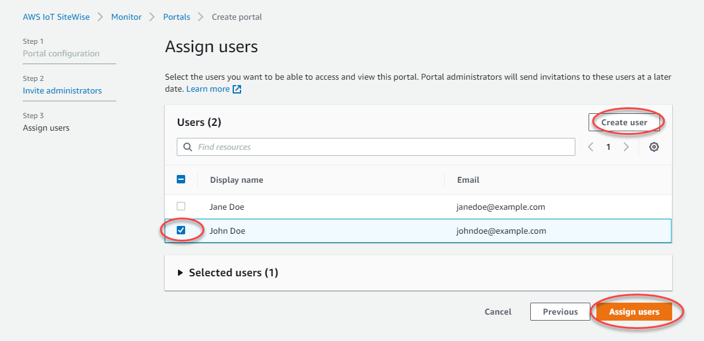
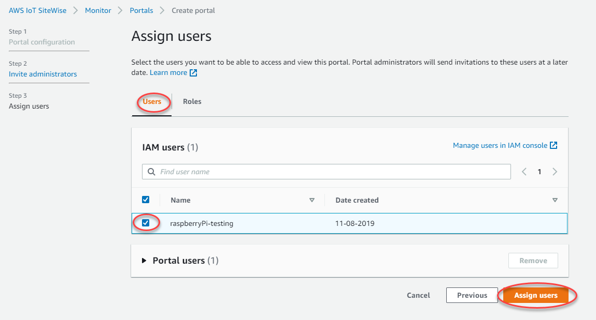
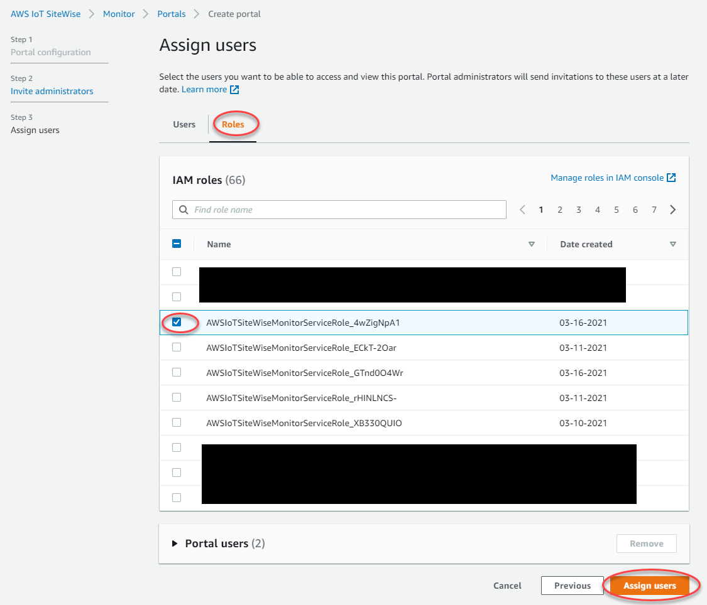

# Add portal users in SiteWise Monitor

###### Note

The SiteWise Monitor feature will no longer be open to new customers starting November 7, 2025 . If you would like to use SiteWise Monitor,
sign up prior to that date. Existing customers can continue to use the service as normal. For more information, see
[SiteWise Monitor availability change](../appguide/iotsitewise-monitor-availability-change.md "../appguide/iotsitewise-monitor-availability-change.md").

You control which users have access to your portals. In each portal, the portal
administrators create one or more projects and assign portal users as owners or viewers for
each project. Each project owner can invite additional portal users to own or view the
project.

Based on the user authentication service, choose one of the following options:

IAM Identity Center
If you want to add a user to the **Users** list, complete the
following steps.

###### To add portal users

1. Choose users from the **Users** list to add to the portal.
   This adds the users to the **Portal users** list. If you're using
   SiteWise Monitor for the first time, you don't need to add your portal administrator as a
   portal user.

###### Note

If you use IAM Identity Center as your identity store, and you're signed in to your AWS Organizations
management account, you can choose **Create user** to create an IAM Identity Center user. IAM Identity Center sends the
new user an email for them to set their password. You can then assign the user to the portal as a user. For more information, see
[Manage identities in IAM Identity Center](../../../singlesignon/latest/userguide/manage-your-identity-source-sso.md "../../../singlesignon/latest/userguide/manage-your-identity-source-sso.md"). 2. If you add a user that you don't want to have access to the portal, clear the
check box for that user. 3. When you're finished selecting users, choose **Assign
users**.

IAM
If you see the user or role that you want to add in the **IAM
users** or **IAM roles** list, complete the following
steps.

###### To add portal users

1.  Do the following options:

        * Choose **IAM users** to add an IAM user as a portal
         user.
        * Choose **IAM roles** to add an IAM role as a portal
         user.

    If you're using SiteWise Monitor for the first time, you don't need to add your portal
    administrator as a portal user.

2.  Select the check boxes for the users or roles that you want as portal users.
    This adds the users or roles to the **Portal users** list.
3.  If you add a user that you don't want to have access to the portal, clear the
    check box for that user.
4.  When you're finished selecting users, choose **Assign
    users**.

###### Important

Users or roles must have the `iotsitewise:DescribePortal`
permission to sign in to the portal.

Congratulations! You successfully created a portal, assigned portal administrators, and
assigned users who can use that portal when invited to do so. Your portal administrators can
now create projects and add assets to those projects. Then, your project owners can create
dashboards to visualize the data for each project's assets.

You can change the list of portal users later. For more information, see [Add or remove portal users in AWS IoT SiteWise](portal-change-users.md "portal-change-users.md").

If you need to make changes to the portal, see [Administer your SiteWise Monitor portals](administer-portals.md "administer-portals.md").

To get started in the portal, see [Getting started](../appguide/getting-started.md "../appguide/getting-started.md")
in the _SiteWise Monitor Application Guide_.
