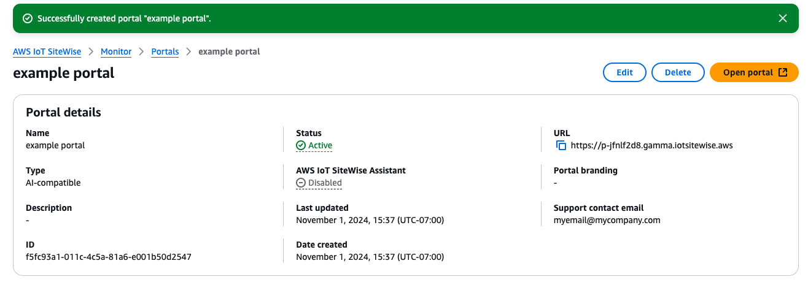

# Configure your portal

###### Note

The SiteWise Monitor feature is no longer available to new customers. Existing customers can continue to use the service as normal. For more information, see
[SiteWise Monitor availability change](../appguide/iotsitewise-monitor-availability-change.md "../appguide/iotsitewise-monitor-availability-change.md").

Your users use portals to view your data. You can customize a portal's name,
description, branding, user authentication, support
contact email, and permissions.

###### Steps to configure a portal:

1.  Enter a name for your portal.
2.  (Optional) Enter a description for your portal. If you have multiple portals, use
    meaningful descriptions to help you keep track of what each portal contains.
3.  (Optional) Upload an image to display your brand in the portal. Choose a square, PNG
    image. If you upload a non-square image, the portal scales the image down to a
    square.
4.  Enter an email address in the **Support contact email** box for support issues.
5.  In the **User authentication** box, choose the following option:
    - Choose **IAM Identity Center** if your portal users sign in to this portal
      with their corporate user names and passwords.

    If you haven't enabled IAM Identity Center in your account, do the following:

        1. Choose **Create user**.
        2. On the **Create user** page, to create the first portal,
         enter the user's email address, first name, and last name, and then choose
         **Create user**.###### Note

    Support for IAM credentials is coming soon.

6.  Choose from one of the following options in the **Service access** section:
    - Choose **Create and use a new service role**. By default,
      SiteWise Monitor automatically creates a service role for each portal. This role allows your
      portal users to access your AWS IoT SiteWise resources. For more information, see [Use service roles for AWS IoT SiteWise Monitor](monitor-service-role.md "monitor-service-role.md").
    - Choose **Use an existing service role**, and then choose the
      target role.

7.  Choose to enable the AWS IoT SiteWise Assistant for this portal. The AWS IoT SiteWise Assistant provides fast data analysis, real-time insights, and guided recommendations.

###### Note

Enabling the AWS IoT SiteWise Assistant will incur charges. To use enterprise level knowledge solutions and guidance, you must
have a dataset associated with Amazon Kendra index. 8. (Optional) Add tags for your portal. For more information, see [Tag your AWS IoT SiteWise resources](tag-resources.md "tag-resources.md"). 9. Choose **Create portal**. AWS IoT SiteWise will create your portal.

###### Note

If you close the console, you can finish the setup process by adding
administrators and users. For more information, see [Add or remove portal administrators](portal-change-admins-ai.md "portal-change-admins-ai.md"). If you don't
want to keep this portal, delete it so it doesn't use resources. For more information,
see [Delete a portal](portal-delete-portal-ai.md "portal-delete-portal-ai.md").
A message appears when your portal is created.

Once a portal is created, it is listed in the **Portals** section.
The **Portal details** section lists the name, description, ID, URL, status, last updated and created dates, portal branding and support email for each portal.

The **Status** column can be one of the following values.

- **CREATING** ‐ AWS IoT SiteWise is processing your request to create the portal.
  This process can take several minutes to complete.
- **UPDATING** ‐ AWS IoT SiteWise is processing your request to update the portal.
  This process can take several minutes to complete.
- **PENDING** ‐ AWS IoT SiteWise is waiting for the DNS record propagation to finish.
  This process can take several minutes to complete. You can delete the portal
  while the status is **PENDING**.
- **DELETING** ‐ AWS IoT SiteWise is processing your request to delete the portal.
  This process can take several minutes to complete.
- **ACTIVE** ‐ When the portal becomes active, your portal users can access it.
- **FAILED** ‐ AWS IoT SiteWise couldn't process your request to create, update, or delete the portal.
  If you enabled AWS IoT SiteWise to send logs to Amazon CloudWatch Logs, you can use these logs to troubleshoot issues.
  For more information, see [Monitoring AWS IoT SiteWise with CloudWatch Logs](monitor-cloudwatch-logs.md "monitor-cloudwatch-logs.md").
