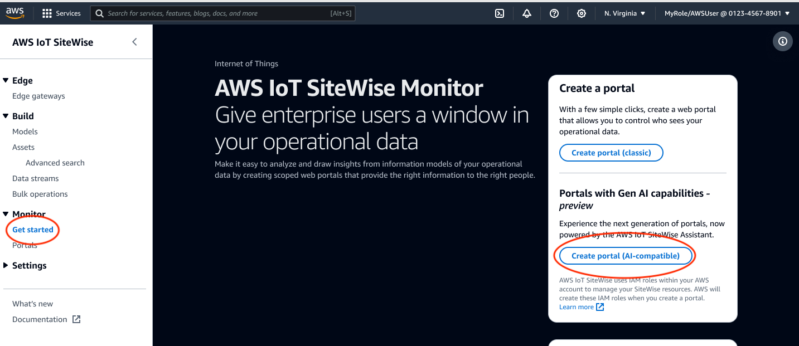

# Create a portal

###### Note

The SiteWise Monitor feature will no longer be open to new customers starting November 7, 2025 . If you would like to use SiteWise Monitor,
sign up prior to that date. Existing customers can continue to use the service as normal. For more information, see
[SiteWise Monitor availability change](../appguide/iotsitewise-monitor-availability-change.md "../appguide/iotsitewise-monitor-availability-change.md").

You create a SiteWise Monitor portal in the AWS IoT SiteWise console.

###### To create a portal

1. Sign in to the [AWS IoT SiteWise console](https://console.aws.amazon.com/iotsitewise/ "https://console.aws.amazon.com/iotsitewise/").
2. In the navigation pane, choose **Monitor**, **Get
   started**.
3. Choose **Create portal (AI-aware)**.

Next, you must provide some basic information to configure your portal.
