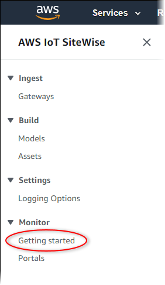
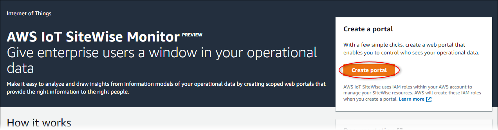

# Create a portal in SiteWise Monitor

###### Note

The SiteWise Monitor feature is no longer available to new customers. Existing customers can continue to use the service as normal. For more information, see
[SiteWise Monitor availability change](../appguide/iotsitewise-monitor-availability-change.md "../appguide/iotsitewise-monitor-availability-change.md").

You create a SiteWise Monitor portal in the AWS IoT SiteWise console.

###### To create a portal

1. Sign in to the [AWS IoT SiteWise console](https://console.aws.amazon.com/iotsitewise/ "https://console.aws.amazon.com/iotsitewise/").
2. In the navigation pane, choose **Monitor**, **Getting
   started**.

 3. Choose **Create Portal**.

Next, you must provide some basic information to configure your portal.
