# Visualize and share wind farm data in SiteWise Monitor

This tutorial explains how to use AWS IoT SiteWise Monitor to visualize and share industrial data through
managed web applications, known as portals. Each _portal_
encompasses projects, providing you with the flexibility to choose which data is accessible
within each project. Then, specify people in your organization that can access each portal. Your
users sign in to portals using
AWS IAM Identity Center
accounts, so you can use your existing identity store or a store managed by
AWS.

You, and your users with sufficient permissions, can create dashboards in each project to
visualize your industrial data in meaningful ways. Then, your users can view these dashboards to
quickly gain insights into your data and monitor your operation. You can configure
administrative or read-only permissions to each project for every user in your company. For more
information, see [Monitor data with AWS IoT SiteWise Monitor](monitor-data.md "monitor-data.md").

Throughout the tutorial, you enhance the AWS IoT SiteWise demo, providing a sample dataset for a wind
farm. You configure a portal in SiteWise Monitor, create a project, and dashboards to visualize the wind
farm data. The tutorial also covers the creation of additional users, along with the assignment
of permissions to own or view the project and its associated dashboards.

###### Note

When you use SiteWise Monitor, you're charged per user that signs in to a portal (per month). In
this tutorial, you create three users, but you only need to sign in with one user. After you
complete this tutorial, you incur charges for one user. For more information, see
[AWS IoT SiteWise Pricing](https://aws.amazon.com/iot-sitewise/pricing/ "https://aws.amazon.com/iot-sitewise/pricing/").

###### Topics

- [Prerequisites](#monitor-tutorial-prerequisites "#monitor-tutorial-prerequisites")
- [Step 1: Create a portal in SiteWise Monitor](#monitor-tutorial-create-portal "#monitor-tutorial-create-portal")
- [Step 2: Sign in to a portal](#monitor-tutorial-sign-in-portal "#monitor-tutorial-sign-in-portal")
- [Step 3: Create a wind farm project](#monitor-tutorial-create-project "#monitor-tutorial-create-project")
- [Step 4: Create a dashboard to visualize
  wind farm data](#monitor-tutorial-create-dashboard "#monitor-tutorial-create-dashboard")
- [Step 5: Explore the portal](#monitor-tutorial-explore-portal "#monitor-tutorial-explore-portal")
- [Step 6: Clean up resources after the
  tutorial](#monitor-tutorial-clean-up-resources "#monitor-tutorial-clean-up-resources")

## Prerequisites

To complete this tutorial, you need the following:

- An AWS account. If you don't have one, see [Set up an AWS account](getting-started.md#set-up-aws-account "getting-started.md#set-up-aws-account").
- A development computer running Windows, macOS,
  Linux, or Unix to access the AWS Management Console. For more
  information, see
  [What is the
  AWS Management Console?](../../../awsconsolehelpdocs/latest/gsg/what-is.md "../../../awsconsolehelpdocs/latest/gsg/what-is.md").
- An AWS Identity and Access Management (IAM) user with administrator permissions.
- A running AWS IoT SiteWise wind farm demo. When you set up the demo, it defines models and
  assets in AWS IoT SiteWise and streams data to them to represent a wind farm. For more information,
  see [Use the AWS IoT SiteWise demo](getting-started-demo.md "getting-started-demo.md").
- If you enabled IAM Identity Center in your account, sign in to your AWS Organizations management account. For
  more information, see [AWS Organizations terminology and concepts](../../../organizations/latest/userguide/orgs_getting-started_concepts.md "../../../organizations/latest/userguide/orgs_getting-started_concepts.md"). If you haven't enabled IAM Identity Center, you will
  enable it in this tutorial and set your account as the management account.

If you can't sign in to your AWS Organizations management account, you can partially complete
the tutorial as long as you have an IAM Identity Center user in your organization. In this case, you can
create the portal and dashboards, but you can't create new IAM Identity Center users to assign to
projects.

## Step 1: Create a portal in SiteWise Monitor

In this procedure, you create a portal in AWS IoT SiteWise Monitor. Each _portal_ is a managed web application that you and your users can sign in to with
AWS IAM Identity Center accounts. With IAM Identity Center, you can use your company's existing identity store or create
one managed by AWS. Your company's employees can sign in without creating separate
AWS accounts.

###### To create a portal

1. Sign in to the [AWS IoT SiteWise console](https://console.aws.amazon.com/iotsitewise/ "https://console.aws.amazon.com/iotsitewise/").
2. Review the [AWS IoT SiteWise endpoints and quotas](../../../general/latest/gr/iot-sitewise.md "../../../general/latest/gr/iot-sitewise.md") where AWS IoT SiteWise is supported and switch Regions, if
   needed. You must run the AWS IoT SiteWise demo in the same Region.
3. In the left navigation pane, choose **Portals**.
4. Choose **Create portal**.
5. If you already enabled IAM Identity Center, skip to step 6. Otherwise, complete the following steps
   to enable IAM Identity Center:
   1. On the **Enable AWS IAM Identity Center (SSO)** page, enter your
      **Email address**, **First name**, and
      **Last name** to create an IAM Identity Center user for yourself to be the portal
      administrator. Use an email address you can access so that you can receive an email to
      set a password for your new IAM Identity Center user.

   In a portal, the portal administrator creates projects and assigns users to
   projects. You can create more users later.

   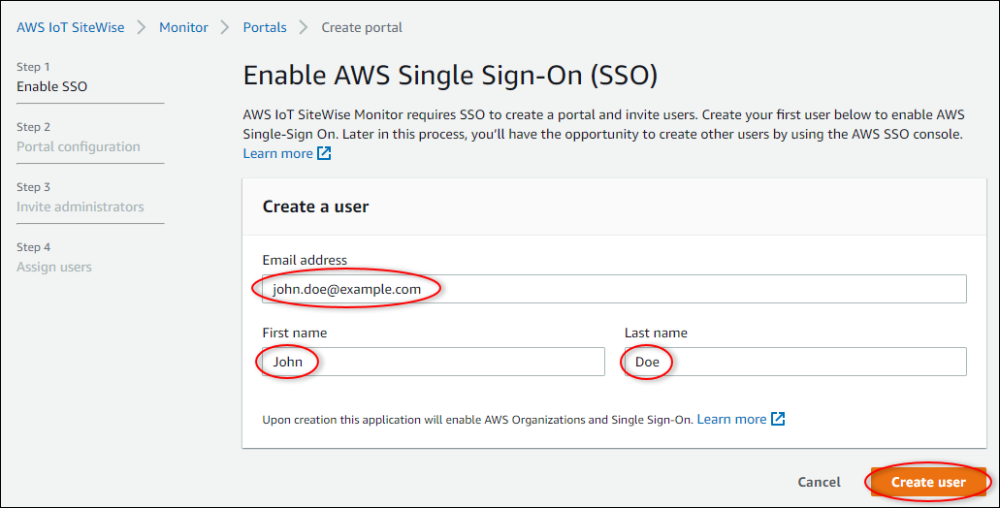 2. Choose **Create user**.

6. On the **Portal configuration** page, complete the following
   steps:
   1. Enter a name for your portal, such as
      `WindFarmPortal`.
   2. (Optional) Enter a description for your portal. If you have multiple portals, use
      meaningful descriptions to keep track of what each portal contains.
   3. (Optional) Upload an image to display in the portal.
   4. Enter an email address that portal users can contact when they have an issue with
      the portal and need help from your company's AWS administrator to resolve it.
   5. Choose **Create portal**.

7. On the **Invite administrators** page, you can assign IAM Identity Center users to
   the portal as administrators. Portal administrators manage permissions and projects within
   a portal. On this page, do the following:
   1. Select a user to be the portal administrator. If you enabled IAM Identity Center earlier in this
      tutorial, select the user that you created.

   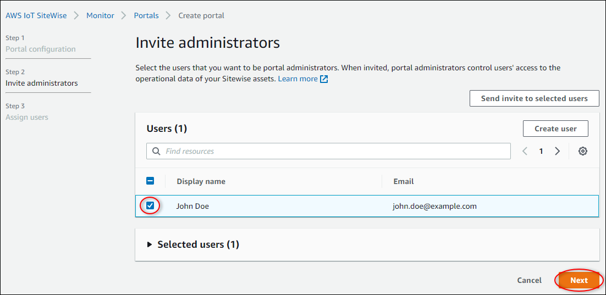 2. (Optional) Choose **Send invite to selected users**. Your email
   client opens, and an invitation appears in the message body. You can customize the
   email before you send it to your portal administrators. You can also send the email to
   your portal administrators later. If you're trying SiteWise Monitor for the first time and will
   be the portal administrator, you don't need to email yourself. 3. Choose **Next**.

8. On the **Assign users** page, you can assign IAM Identity Center users to the
   portal. Portal administrators can later assign these users as project owners or viewers.
   Project owners can create dashboards in projects. Project viewers have read-only access to
   the projects that they're assigned. On this page, you can create IAM Identity Center users to add to the
   portal.

###### Note

If you aren't signed in to your AWS Organizations management account, you can't create IAM Identity Center
users. Choose **Assign users** to create the portal without portal
users, and then skip this step.

On this page, do the following:

    1. Complete the following steps twice to create two IAM Identity Center users:

    	1. Choose **Create user** to open a dialog box where you enter
    	 details for the new user.
    	2. Enter an **Email address**, **First name**,
    	 and **Last name** for the new user. IAM Identity Center sends the user an email
    	 for them to set their password. If you want to sign in to the portal as these
    	 users, choose an email address that you can access. Each email address must be
    	 unique. Your users sign in to the portal using their email address as their
    	 usernames.

    	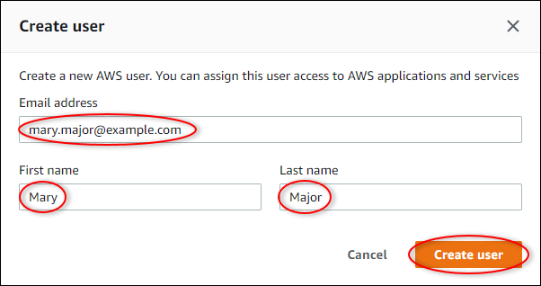
    	3. Choose **Create user**.
    2. Select the two IAM Identity Center users that you created in the previous step.

    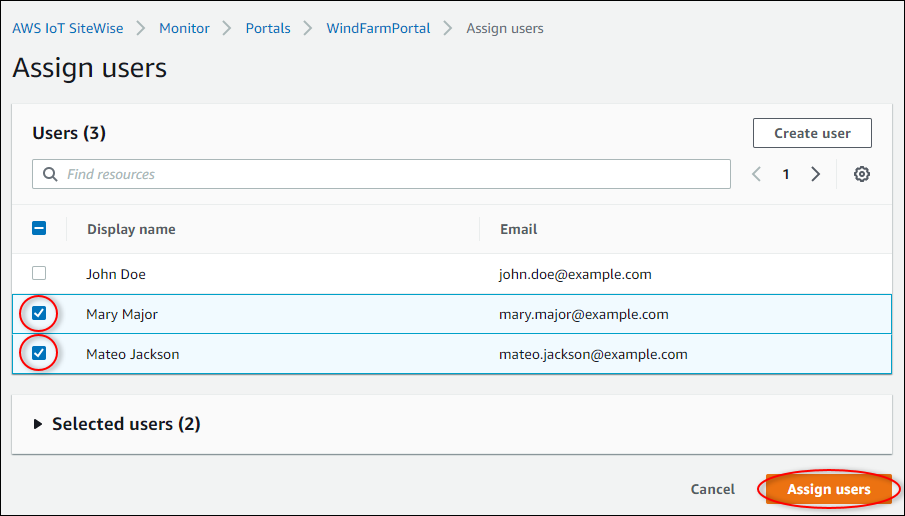
    3. Choose **Assign users** to add these users to the portal.The portals page opens with your new portal listed.

## Step 2: Sign in to a portal

In this procedure, you sign in to your new portal using the AWS IAM Identity Center user that you added
to the portal.

###### To sign in to a portal

1. On the **Portals** page, choose your new portal's
   **Link** to open your portal in a new tab.

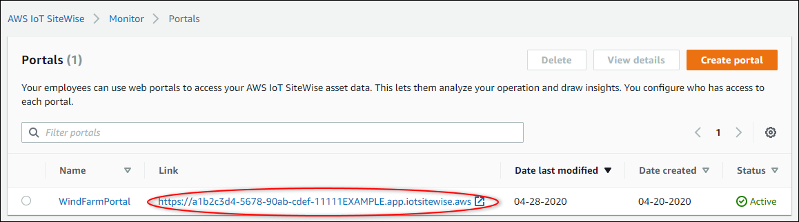 2. If you created your first IAM Identity Center user earlier in the tutorial, use the following steps
to create a password for your user:

    1. Check your email for the subject line **Invitation to join
     AWS IAM Identity Center**.
    2. Open that invitation email and choose **Accept
     invitation**.
    3. In the new window, set a password for your IAM Identity Center user.If you want to sign in later to the portal as the second and third IAM Identity Center users that

you created earlier, you can also complete these steps to set passwords for those
users.

###### Note

If you didn't receive an email, you can generate a password for your user in the
IAM Identity Center console. For more information, see [Reset the IAM Identiy Center user password for an end user](../../../singlesignon/latest/userguide/reset-password-for-user.md "../../../singlesignon/latest/userguide/reset-password-for-user.md") in the _AWS IAM Identity Center User Guide_. 3. Enter your IAM Identity Center **Username** and
**Password**. If you created your IAM Identity Center user earlier
in this tutorial, your **Username** is the email address
of the portal administrator user that you created.

All portal users, including the portal administrator, must sign in with their IAM Identity Center
user credentials. These credentials are typically not the same credentials that you use to
sign in to the AWS Management Console.

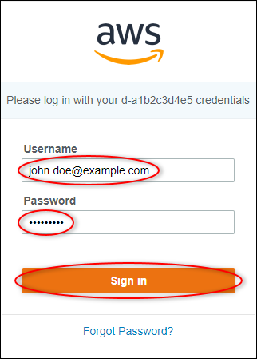 4. Choose **Sign in**.

Your portal opens.

## Step 3: Create a wind farm project

In this procedure, you create a project in your portal. _Projects_ are resources that define a set of permissions, assets, and dashboards,
which you can configure to visualize asset data in that project. With projects, you define who
has access to which subsets of your operation and how those subsets' data is visualized. You
can assign portal users as owners or viewers of each project. Project owners can create
dashboards to visualize data and share the project with other users. Project viewers can view
dashboards but not edit them. For more information about roles in SiteWise Monitor, see [SiteWise Monitor roles](monitor-data.md#monitor-roles "monitor-data.md#monitor-roles").

###### To create a wind farm project

1. In the left navigation pane in your portal, choose the **Assets**
   tab. On the **Assets** page, you can explore all assets available in the
   portal and add assets to projects.
2. In the asset browser, choose **Demo Wind Farm Asset**.
   When you choose an asset, you can explore that asset's live and historical data. You can
   also press **Shift** to select multiple assets and compare their data
   side-by-side.
3. Choose **Add asset to project** in the upper left. Projects contain
   dashboards that your portal users can view to explore your data. Each project has access
   to a subset of your assets in AWS IoT SiteWise. When you add an asset to a project, all users with
   access to that project can also access data for that asset and its children.

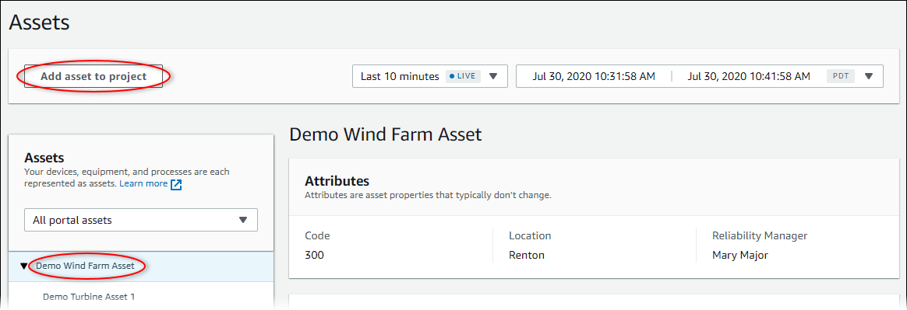 4. In the **Add asset to project** dialog box, choose **Create
new project**, and then choose **Next**.

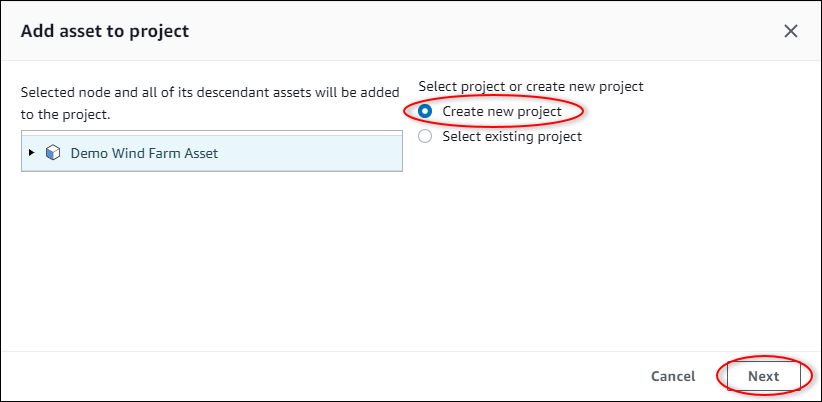 5. In the **Create new project** dialog box, enter a **Project
name** and **Project description** for your project, and then
choose **Add asset to project**.

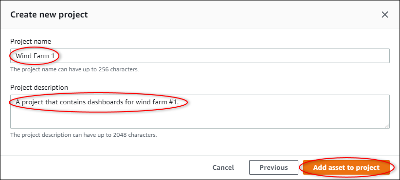

Your new project's page opens. 6. On the project's page, you can add portal users as owners or viewers of this
project.

###### Note

If you aren't signed in to your AWS Organizations management account, you might not have
portal users to assign to this project, so you can skip this step.

On this page, do the following:

    1. Under **Project owners**, choose **Add owners**
     or **Edit users**.

    
    2. Choose the user to add as a project owner (for example, **Mary
     Major**), and then choose the **>>**
     icon.

    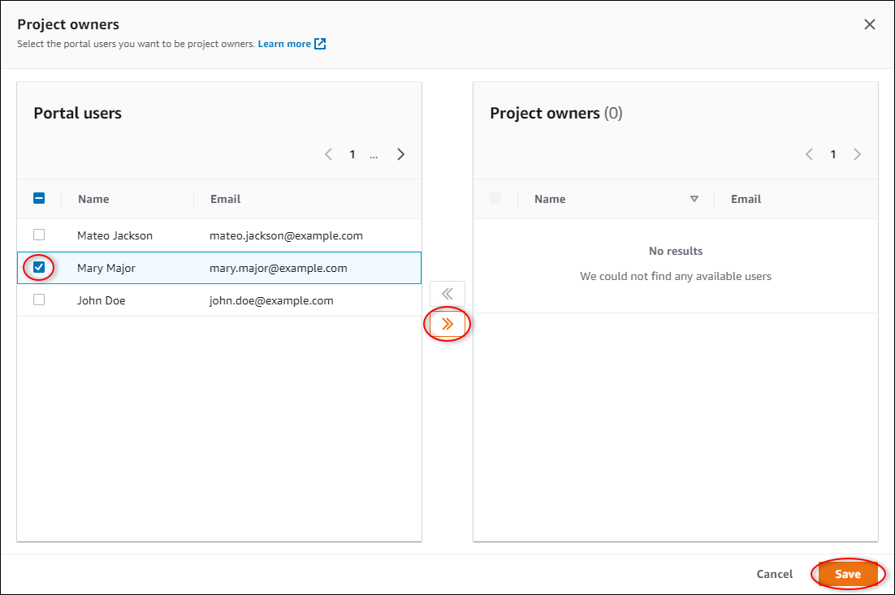
    3. Choose **Save**.

    Your IAM Identity Center user **Mary Major** can sign in to this
     portal to edit the dashboards in this project and share this project with other users
     in this portal.
    4. Under **Project viewers**, choose **Add
     viewers** or **Edit users**.
    5. Choose the user to add as a project viewer (for example, **Mateo
     Jackson**), and then choose the **>>**
     icon.
    6. Choose **Save**.

    Your IAM Identity Center user **Mateo Jackson** can sign in to
     this portal to view, but not edit, the dashboards in the wind farm project.

## Step 4: Create a dashboard to visualize

wind farm data

In this procedure, you create dashboards to visualize the demo wind farm data. Dashboards
contain customizable visualizations of your project's asset data. Each visualization can have
a different type, such as a line chart, bar chart, or key performance indicator (KPI) display.
You can choose the visualization type that works best for your data. Project owners can edit
dashboards, whereas project viewers can only view dashboards to gain insights.

###### To create a dashboard with visualizations

1. On your new project's page, choose **Create dashboard** to create a
   dashboard and open its edit page.

In a dashboard's edit page, you can drag asset properties from the asset hierarchy to
the dashboard to create visualizations. Then, you can edit each visualization's title,
legend titles, type, size, and location in the dashboard. 2. Enter a name your dashboard.

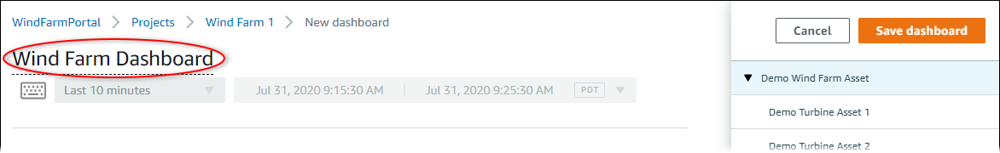 3. Drag **Total Average Power** from the
**Demo Wind Farm Asset** to the dashboard to create a
visualization.

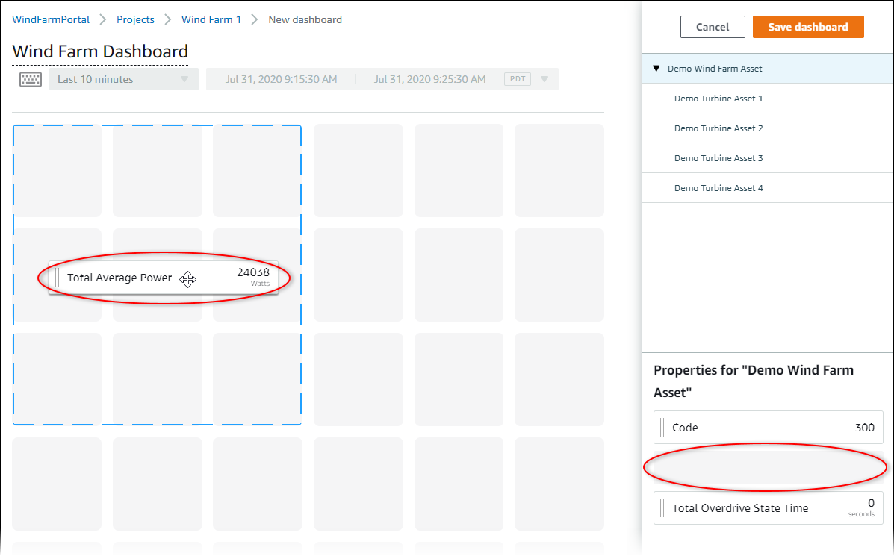 4. Choose **Demo Turbine Asset 1** to show properties for
that asset, and then drag **Wind Speed** to the dashboard
to create a visualization for wind speed.

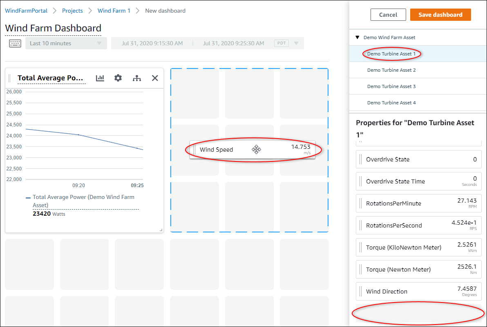 5. Add **Wind Speed** to the new wind speed visualization
for each **Demo Turbine Asset 2**,
**3**, and **4** (in
that order).

Your **Wind Speed** visualization should look similar
to the following screenshot.

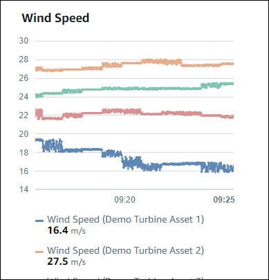 6. Repeat steps 4 and 5 for the wind turbines' **Torque (KiloNewton
Meter)** properties to create a visualization for wind turbine
torque. 7. Choose the visualization type icon for the **Torque (KiloNewton
Meter)** visualization, and then choose the bar chart icon.

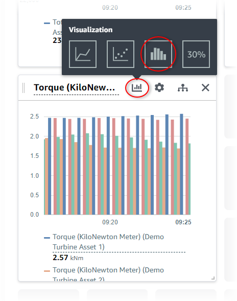 8. Repeat steps 4 and 5 for the wind turbines' **Wind
Direction** properties to create a visualization for wind
direction. 9. Choose the visualization type icon for the **Wind
Direction** visualization, and then choose the KPI chart icon
(**30%**).

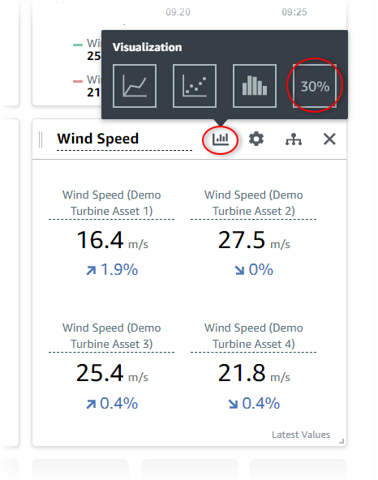 10. (Optional) Make other changes to each visualization's title, legend titles, type,
size, and location as needed. 11. Choose **Save dashboard** in the upper right to save your
dashboard.

Your dashboard should look similar to the following screenshot.

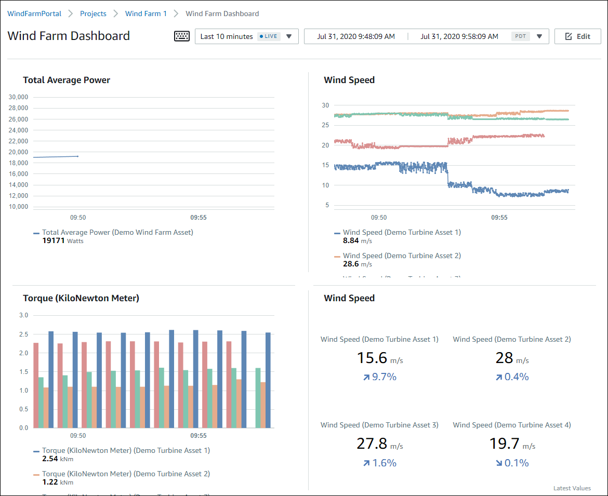 12. (Optional) Create an additional dashboard for each wind turbine asset.

As a best practice, we recommend that you create a dashboard for each asset so that
your project viewers can investigate any issues with each individual asset. You can only
add up to 5 assets to each visualization, so you must create multiple dashboards for your
hierarchical assets in many scenarios.

A dashboard for a demo wind turbine might look similar to the following
screenshot.

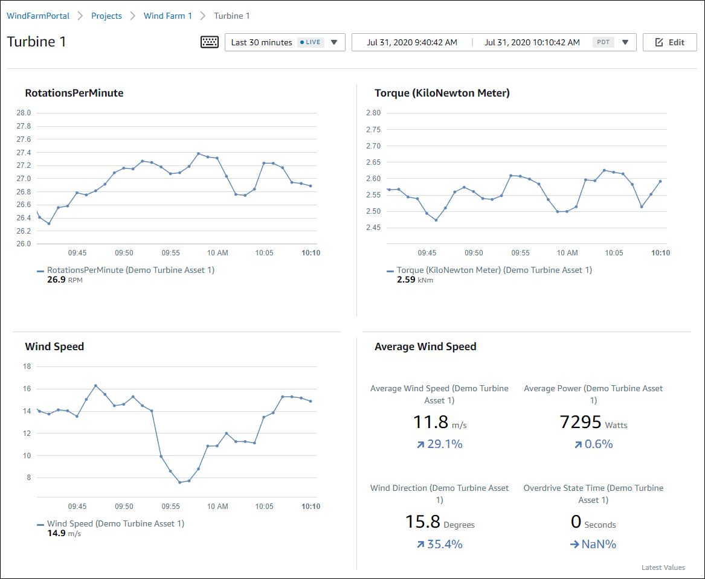 13. (Optional) Change the timeline or select data points on a visualization to explore the
data in your dashboard. For more information, see [Viewing dashboards](../appguide/view-dashboards.md "../appguide/view-dashboards.md") in the
_AWS IoT SiteWise Monitor Application Guide_.

## Step 5: Explore the portal

In this procedure, you can explore the portal as a user with fewer permissions than an
AWS IoT SiteWise portal administrator.

###### To explore the portal and finish the tutorial

- (Optional) If you added other users to the project as owners or viewers, you can sign
  in to the portal as these users. This lets you explore the portal as a user with fewer
  permissions than a portal administrator.

###### Important

You're charged for each user that signs in to a portal. For more information, see
[AWS IoT SiteWise Pricing](https://aws.amazon.com/iot-sitewise/pricing/ "https://aws.amazon.com/iot-sitewise/pricing/").

To explore the portal as other users, do the following:

    1. Choose **Log out** in the bottom left of the portal to exit the
     web application.
    2. Choose **Sign out** in the upper right of the IAM Identity Center application
     portal to sign out of your IAM Identity Center user.
    3. Sign in to the portal as the IAM Identity Center user that you assigned as a project owner or
     project viewer. For more information, see  [Step 2: Sign in to a portal](#monitor-tutorial-sign-in-portal "#monitor-tutorial-sign-in-portal").

You've completed the tutorial. When you finish exploring your demo wind farm in SiteWise Monitor,
follow the next procedure to clean up your resources.

## Step 6: Clean up resources after the

tutorial

After you complete the tutorial, you can clean up your resources. You aren't charged for
AWS IoT SiteWise if users don't sign in to your portal, but you can delete your portal and AWS IAM Identity Center directory
users. Your demo wind farm assets are deleted at the end of the duration that you chose when
you created the demo, or you can delete the demo manually. For more information, see [Delete the AWS IoT SiteWise demo](getting-started-demo.md#delete-getting-started-demo "getting-started-demo.md#delete-getting-started-demo").

Use the following procedures to delete your portal and IAM Identity Center users.

###### To delete a portal

1. Navigate to the [AWS IoT SiteWise console](https://console.aws.amazon.com/iotsitewise/ "https://console.aws.amazon.com/iotsitewise/").
2. In the left navigation pane, choose **Portals**.
3. Choose your portal, **WindFarmPortal**, and then choose
   **Delete**.

When you delete a portal or project, the assets associated to deleted projects aren't
affected.

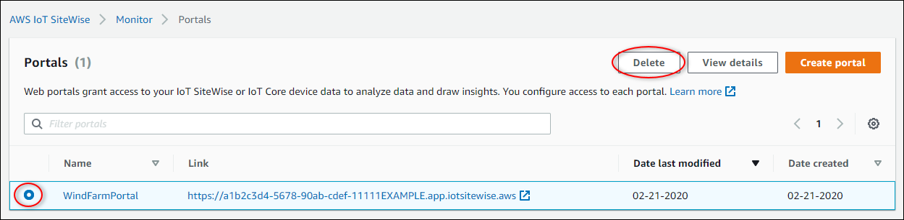 4. In the **Delete portal** dialog box, choose **Remove
administrators and users**.

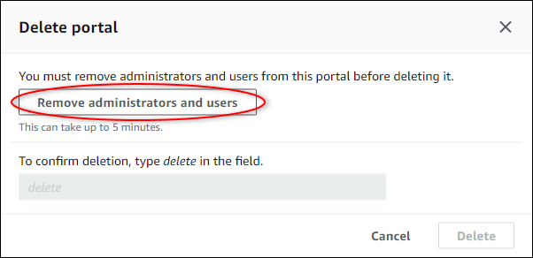 5. Enter `delete` to confirm deletion, and then choose
**Delete**.

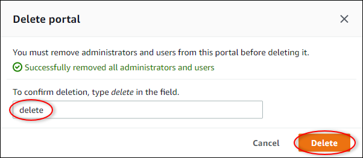

###### To delete IAM Identity Center users

1. Navigate to the [IAM Identity Center
   console](https://console.aws.amazon.com/singlesignon "https://console.aws.amazon.com/singlesignon").
2. In the left navigation pane, choose **Users**.
3. Select the check box for each user to delete, and then choose **Delete
   users**.

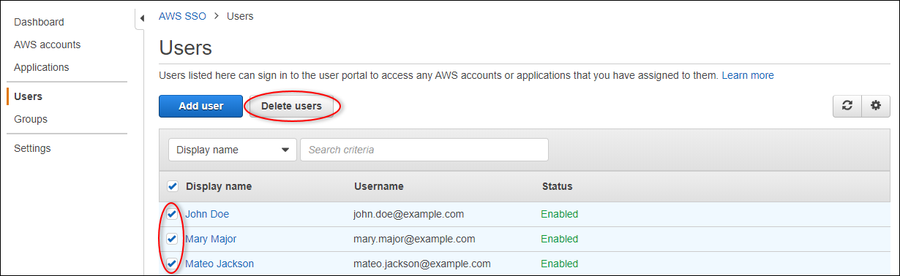 4. In the **Delete users** dialog box, enter
`DELETE`, and then choose **Delete users**.

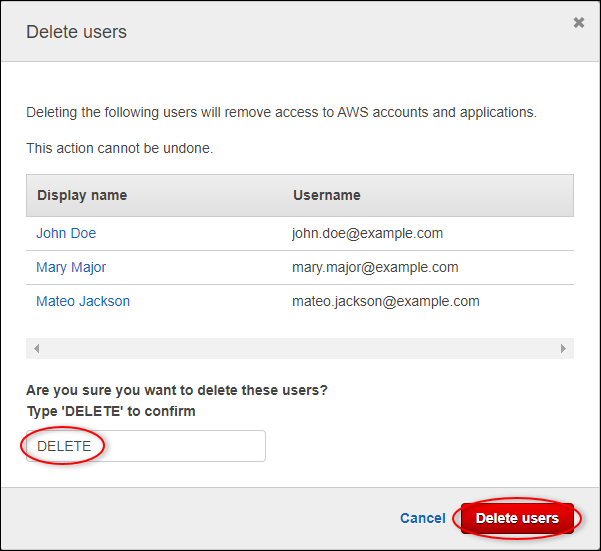
