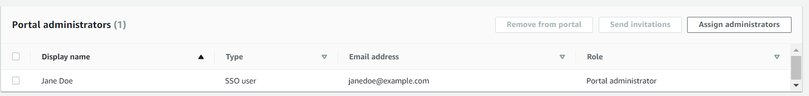
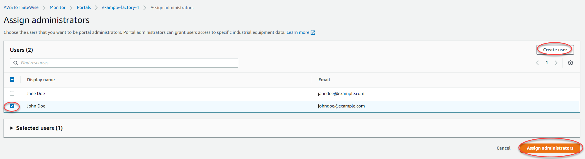
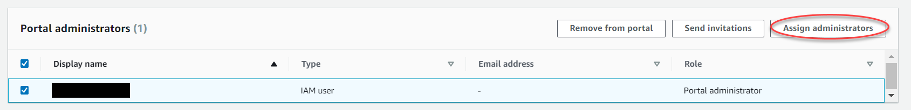
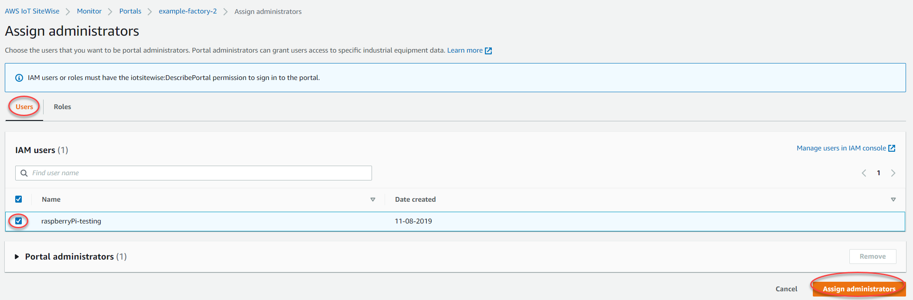
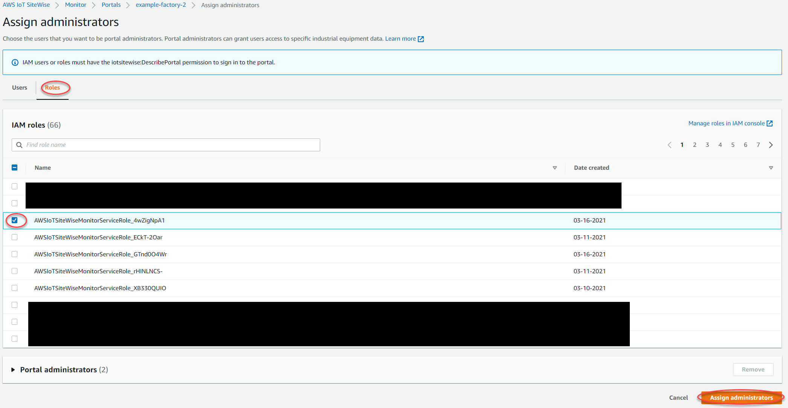

# Add or remove portal administrators in AWS IoT SiteWise

###### Note

The SiteWise Monitor feature will no longer be open to new customers starting November 7, 2025 . If you would like to use SiteWise Monitor,
sign up prior to that date. Existing customers can continue to use the service as normal. For more information, see
[SiteWise Monitor availability change](../appguide/iotsitewise-monitor-availability-change.md "../appguide/iotsitewise-monitor-availability-change.md").

In a few steps, you can add or remove users as administrators for a portal. Based on the
user authentication service, choose one of the following options.

IAM Identity Center

###### To add portal administrators

1. On the portal details page, in the **Portal administrators**
   section, choose **Assign administrators**.
2. On the **Assign administrators** page, select the check boxes
   for the users to add to the portal as administrators.

###### Note

If you use IAM Identity Center as your identity store, and you're signed in to your AWS Organizations
management account, you can choose **Create user** to create an IAM Identity Center user. IAM Identity Center sends the
new user an email for them to set their password. You can then assign the user to the portal as an administrator. For more information, see
[Manage identities in IAM Identity Center](../../../singlesignon/latest/userguide/manage-your-identity-source-sso.md "../../../singlesignon/latest/userguide/manage-your-identity-source-sso.md"). 3. Choose **Assign administrators**.

###### To remove portal administrators

- On the portal details page, in the **Portal administrators**
  section, select the check box for each user to remove, and then choose
  **Remove from portal**.

###### Note

We recommend that you select at least one portal administrator.

IAM

###### To add portal administrators

1. On the portal details page, in the **Portal administrators**
   section, choose **Assign administrators**.
2. On the **Assign administrators** page, do the following:
   - Choose **IAM users**, if you want to add an IAM user as
     your portal administrator.
   - Choose **IAM roles**, if you want to add an IAM role as
     your portal administrator.

3. Select the check boxes for the users or roles that you want as your portal
   administrators. This adds the users or roles to the **Portal
   administrators** list.
4. Choose **Assign administrators**.

###### Important

Users or roles must have the `iotsitewise:DescribePortal`
permission to sign in to the portal.

###### To remove portal administrators

- On the portal details page, in the **Portal administrators**
  section, select the check box for each user to remove, and then choose
  **Remove from portal**.

###### Note

Leaving a portal without a portal administrator is not recommended.
