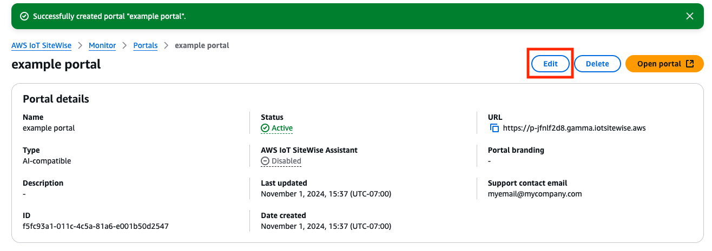

# Edit portal attributes

###### Note

The SiteWise Monitor feature will no longer be open to new customers starting November 7, 2025 . If you would like to use SiteWise Monitor,
sign up prior to that date. Existing customers can continue to use the service as normal. For more information, see
[SiteWise Monitor availability change](../appguide/iotsitewise-monitor-availability-change.md "../appguide/iotsitewise-monitor-availability-change.md").

You can change a portal's name, description, branding, support email, and
service access.

1. On the portal details page, in the **Portal details** section, choose
   **Edit**.

 2. Update the **Name**, **Description**,
**Portal branding**, **Support contact email**,
**AWS IoT SiteWise Assistant**
or **Service access**. 3. When you're finished, choose **Save changes**.
