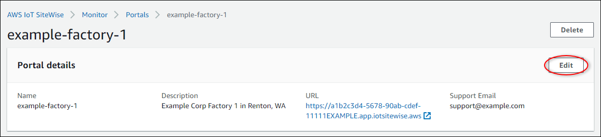

# Change portal details in AWS IoT SiteWise

###### Note

The SiteWise Monitor feature is no longer available to new customers. Existing customers can continue to use the service as normal. For more information, see
[SiteWise Monitor availability change](../appguide/iotsitewise-monitor-availability-change.md "../appguide/iotsitewise-monitor-availability-change.md").

You can change a portal's name, description, branding, support email, and
permissions.

1. On the portal details page, in the **Portal details** section, choose
   **Edit**.

 2. Update the **Name**, **Description**,
**Portal branding**, **Support contact email**, or
**Permissions**. 3. When you're finished, choose **Save**.
