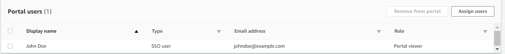
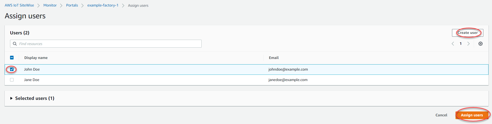
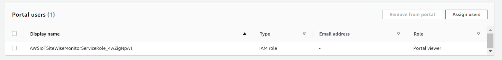
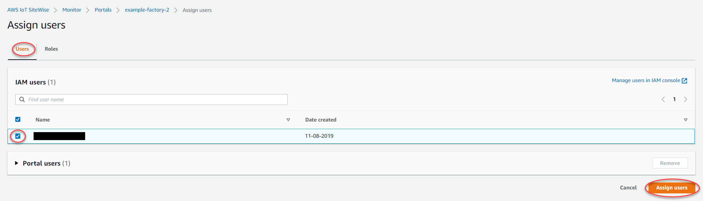
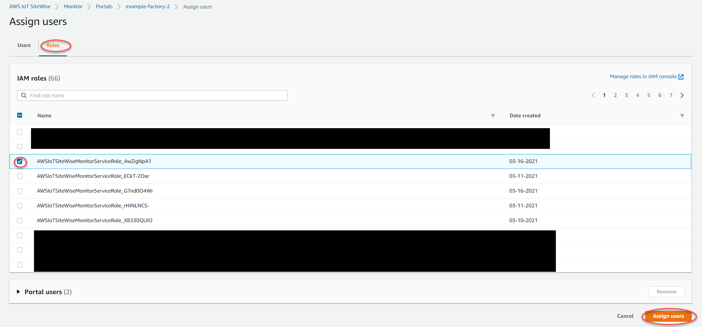

# Add or remove portal users in AWS IoT SiteWise

###### Note

The SiteWise Monitor feature will no longer be open to new customers starting November 7, 2025 . If you would like to use SiteWise Monitor,
sign up prior to that date. Existing customers can continue to use the service as normal. For more information, see
[SiteWise Monitor availability change](../appguide/iotsitewise-monitor-availability-change.md "../appguide/iotsitewise-monitor-availability-change.md").

You choose which users have access to your portals. Portal users appear in the list of
users within a SiteWise Monitor portal. From this list, portal administrators can add project owners,
and project owners can add project viewers.

###### Note

Your portal administrators and portal users might contact you through a portal's support
email if they need you to add or remove a user.

Based on the user authentication service, choose one of the following options.

IAM Identity Center

###### To add portal users

1. On the portal details page, in the **Portal users** section,
   choose **Assign users**.
2. On the **Assign users** page, select the check box for the
   users to add to the portal.

###### Note

If you use IAM Identity Center as your identity store, and you're signed in to your AWS Organizations
management account, you can choose **Create user** to create an IAM Identity Center user. IAM Identity Center sends the
new user an email for them to set their password. You can then assign the user to the portal as a user. For more information, see
[Manage identities in IAM Identity Center](../../../singlesignon/latest/userguide/manage-your-identity-source-sso.md "../../../singlesignon/latest/userguide/manage-your-identity-source-sso.md"). 3. Choose **Assign users**.

###### To remove portal users

- On the portal details page, in the **Portal users** section,
  select the check box for the users to remove from the portal, and then choose
  **Remove from portal**.

IAM

###### To add portal users

1. On the portal details page, in the **Portal users** section,
   choose **Assign users**.
2. On the **Assign users** page, do the following:
   - Choose **IAM users** to add an IAM user as your portal
     user.
   - Choose **IAM roles** to add an IAM role as your portal
     user.

3. Select the check boxes for the users or roles that you want to add as your
   portal users. This adds the users or roles to the **Portal users**
   list.
4. Choose **Assign users**.

###### To remove portal users

- On the portal details page, in the **Portal users** section,
  select the check box for the users to remove from the portal, and then choose
  **Remove from portal**.

###### Important

Users or roles must have the `iotsitewise:DescribePortal`
permission to sign in to the portal.
