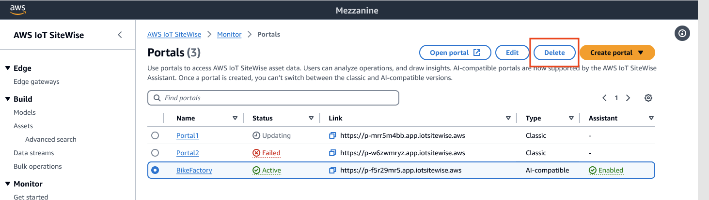

# Delete a portal

You might delete a portal if you created it for testing purposes or if you created a
duplicate of a portal that already exists.

###### Note

You must first manually delete all dashboards and projects in a portal before you can
delete a portal.

1. On the portal details page, choose **Delete**.

###### Important

When you delete a portal, you lose all projects that the portal contains, and all
dashboards in each project. This action can't be undone. Your asset data isn't
affected.

 2. In the **Delete portal** dialog box, choose **Remove admins
and users**.

You must remove the administrators and users from a portal before you can delete it.
If your portal doesn't have administrators or users, the button doesn't appear, and you
can skip to the next step. 3. If you're sure that you want to delete the entire portal, enter
`confirm` in the field to confirm deletion. 4. Choose **Delete**.
